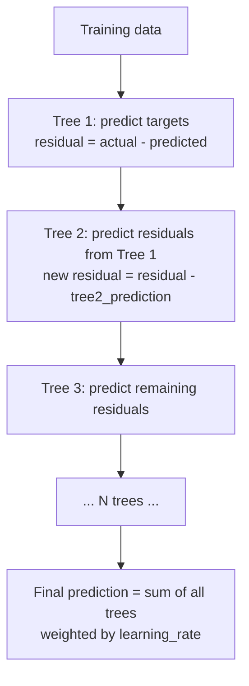

# XGBoost and Gradient Boosting

## The Story 📖

Imagine a talent show judged by a single person. That judge has blind spots — maybe they love flashy performers and overlook technical skill. Now imagine the same show with 100 judges, but with a twist: each new judge specifically focuses on the contestants that the *previous judges got wrong*. The first judge makes mistakes. The second judge corrects them. The third corrects what the second missed. By the 100th judge, it's nearly impossible for a genuinely talented performer to be overlooked.

That is gradient boosting — and XGBoost is its most powerful implementation.

👉 This is why we need **XGBoost** — an ensemble method that builds trees sequentially, each one correcting the errors of the previous, with regularization that prevents overfitting.

---

## What is XGBoost?

**XGBoost** (Extreme Gradient Boosting) is a gradient boosting framework that builds an ensemble of decision trees sequentially. Unlike bagging methods (Random Forest) where trees are built independently and averaged, boosting builds each tree to correct the *residual errors* of all previous trees combined.

Key distinctions from standard gradient boosting:
- **Regularization**: L1 (alpha) and L2 (lambda) penalties on leaf weights — prevents overfitting
- **Handles missing values natively**: learns the best direction to send missing values at each split
- **Parallel tree construction**: feature splits evaluated in parallel within each tree
- **Cache-awareness**: optimized memory access patterns for modern CPUs
- **Pruning**: max_depth limit plus `gamma` (minimum gain to make a split)

---

## Why It Exists — The Problem It Solves

**1. Single trees overfit**
A single deep decision tree memorizes training data — perfect in-sample, terrible out-of-sample.

**2. Shallow trees underfit**
A single shallow tree captures only simple patterns.

**3. Bagging averages independent trees — doesn't learn from mistakes**
Random Forest builds many trees on random subsamples and averages predictions. Each tree is unaware of what the others got wrong.

👉 Without boosting: you choose between overfitting (deep tree) or underfitting (shallow tree). With XGBoost: many shallow trees collaborate, each one learning from previous failures, with regularization keeping the ensemble from overfitting.

---

## How It Works — Step by Step



### The Gradient in Gradient Boosting

At each step, XGBoost fits a new tree to minimize a **loss function** using gradient descent — but in function space, not parameter space. The "gradient" is the direction in which adding a new tree most reduces the loss.

For regression with MSE loss, the gradient at each point is simply the residual (actual − predicted). The next tree learns to predict these residuals, reducing overall error.

### Key Hyperparameters

| Parameter | What It Controls | Typical Range |
|---|---|---|
| `n_estimators` | Number of trees | 100–1000 |
| `max_depth` | Maximum tree depth | 3–8 |
| `learning_rate` | Step size per tree (shrinkage) | 0.01–0.3 |
| `subsample` | Fraction of rows per tree | 0.6–0.9 |
| `colsample_bytree` | Fraction of features per tree | 0.6–0.9 |
| `reg_alpha` | L1 regularization on leaf weights | 0–1 |
| `reg_lambda` | L2 regularization on leaf weights | 0.5–5 |
| `scale_pos_weight` | Class imbalance correction | `neg / pos` ratio |
| `gamma` | Minimum gain required to make a split | 0–5 |

**The fundamental tradeoff:** `n_estimators` × `learning_rate` ≈ constant for a given accuracy. More trees with smaller learning rate = more robust but slower to train. Use early stopping to find optimal `n_estimators` automatically.

---

## The Math / Technical Side (Simplified)

XGBoost minimizes a regularized objective:

```
Obj = Σ L(y_i, ŷ_i) + Σ Ω(f_k)
```

Where:
- `L` = loss function (log loss for classification, MSE for regression)
- `Ω(f_k) = γT + ½λ||w||²` = regularization on tree `k` (T = number of leaves, w = leaf weights)
- `γ` penalizes number of leaves (simpler trees preferred)
- `λ` penalizes large leaf weights (L2 regularization)

Taylor expansion of the loss allows XGBoost to compute the optimal leaf weight analytically — no iterative optimization needed per tree.

---

## LightGBM and CatBoost: The Modern Alternatives

| | XGBoost | LightGBM | CatBoost |
|---|---|---|---|
| **Tree growth** | Level-wise | Leaf-wise (faster) | Symmetric (ordered boosting) |
| **Speed on large data** | Moderate | Fastest | Moderate |
| **Categorical features** | Manual encoding needed | Manual encoding needed | Native handling |
| **GPU support** | Yes | Yes | Yes |
| **Overfitting risk** | Low (regularized) | Medium (leaf-wise) | Low (ordered boosting) |
| **Best for** | General tabular data | Large datasets, speed | Datasets with many categoricals |

**Leaf-wise growth** (LightGBM): instead of growing all leaves at a given depth equally, grow the leaf with the highest loss reduction. Faster convergence but can overfit on small datasets — use `min_child_samples` to control.

---

## Where You'll See This in Real AI Systems

- **Kaggle competitions**: XGBoost and LightGBM win the majority of structured data competitions
- **Fraud detection**: fast inference, handles imbalanced classes with `scale_pos_weight`
- **Click-through rate prediction**: ad systems at Google, Meta use gradient boosting
- **Risk scoring**: credit scoring, insurance underwriting — interpretable feature importance
- **Feature selection**: XGBoost feature importance (gain) used to filter features before neural network training

---

## Common Mistakes to Avoid ⚠️

- **Setting learning_rate too high**: use 0.01–0.1 with early stopping, not 0.3
- **Not using early stopping**: always set `early_stopping_rounds` to find optimal n_estimators
- **Ignoring subsample and colsample_bytree**: both prevent overfitting and improve generalization
- **Using gain for feature importance in all cases**: `gain` is biased toward high-cardinality features; `permutation importance` is more reliable for model interpretation
- **Skipping cross-validation**: a single train/val split gives noisy hyperparameter estimates

## Connection to Other Concepts 🔗

- Relates to **Decision Trees** (`03_Decision_Trees`) — XGBoost trees are shallow decision trees
- Relates to **Random Forests** (`04_Random_Forests`) — both are ensembles; bagging vs boosting is the key difference
- Relates to **Anomaly Detection** (`12_Anomaly_Detection`) — `scale_pos_weight` handles imbalanced classes
- Relates to **Data Preprocessing** (`02_ML_Foundations/11_Data_Preprocessing`) — XGBoost handles missing values natively; scaling not required

---

✅ **What you just learned:** XGBoost builds trees sequentially, each correcting the residuals of previous trees, with L1/L2 regularization and native missing-value handling that makes it the dominant algorithm for structured tabular data.

🔨 **Build this now:** Train an XGBoost classifier on the Titanic dataset. Use `early_stopping_rounds=50`, tune `max_depth` and `learning_rate` with cross-validation, then compare feature importance using `weight` vs `gain`.

➡️ **Next step:** [Time Series Analysis](../10_Time_Series_Analysis/Theory.md)


---

## 📝 Practice Questions

- 📝 [Q17 · xgboost-boosting](../../ai_practice_questions_100.md#q17--interview--xgboost-boosting)


---

## 📂 Navigation

**In this folder:**
| File | |
|---|---|
| 📄 **Theory.md** | ← you are here |
| [📄 Cheatsheet.md](./Cheatsheet.md) | Quick reference |
| [📄 Interview_QA.md](./Interview_QA.md) | Interview prep |

⬅️ **Prev:** [Naive Bayes](../08_Naive_Bayes/Theory.md) &nbsp;&nbsp;&nbsp; ➡️ **Next:** [Time Series Analysis](../10_Time_Series_Analysis/Theory.md)
