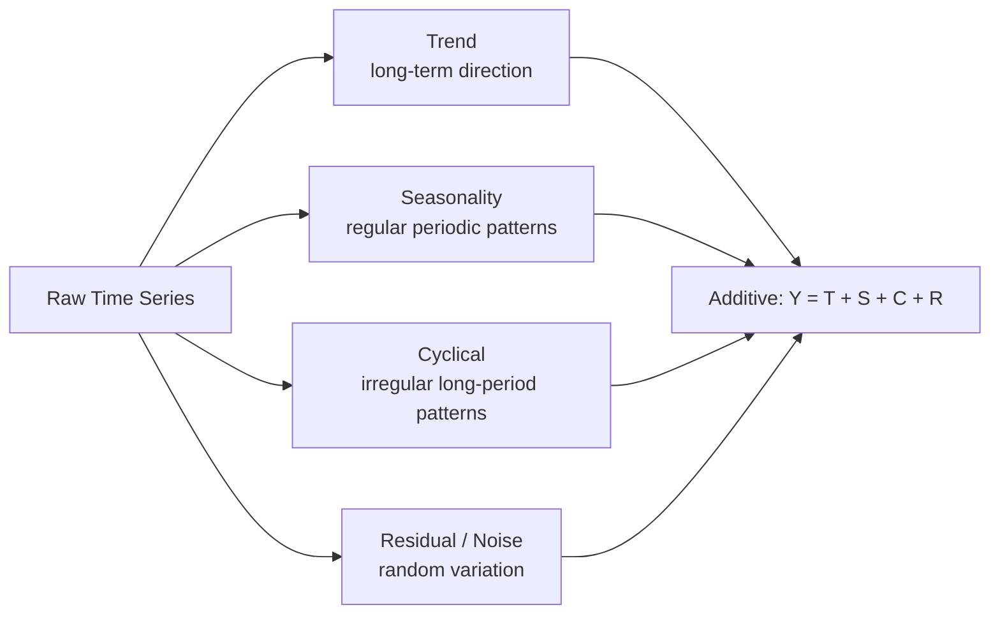
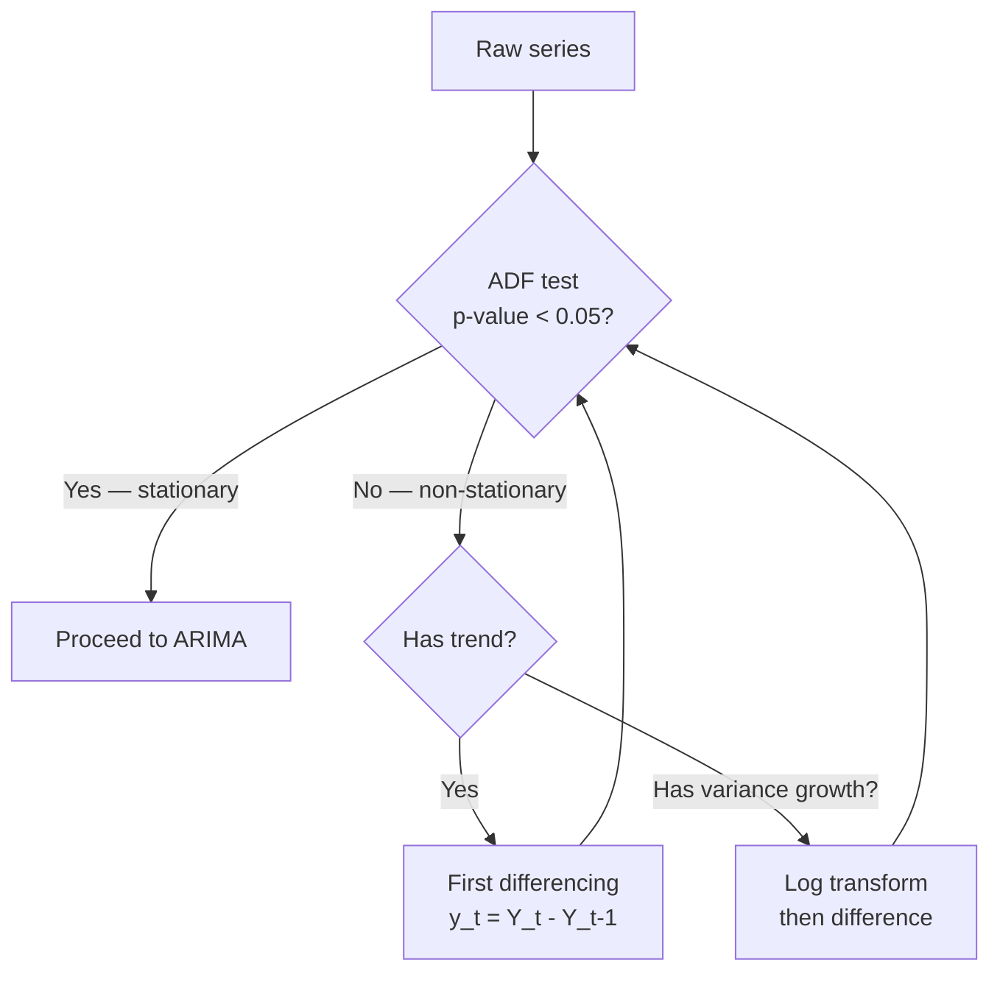
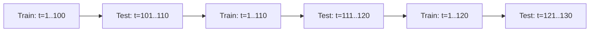

# Time Series Analysis

## The Story 📖

You have a dataset of daily stock prices for the past 5 years. A junior engineer shuffles the rows randomly and trains a Random Forest on it. The model achieves 72% accuracy on the test set. Impressive — until you realize the test set contains rows from January while the training set contains rows from February. The model memorized that February prices predict January prices. In the real world, predicting the past from the future is useless.

Time series data has a hidden contract: **order matters**. Today's temperature depends on yesterday's. This month's sales depend on last month's. Breaking that order breaks the model.

👉 This is why we need **Time Series Analysis** — methods specifically designed for ordered temporal data where past observations predict future ones.

---

## What is Time Series Analysis?

A **time series** is a sequence of observations recorded at successive points in time. Unlike standard tabular data where rows are independent, time series rows are dependent — each observation is influenced by preceding ones (**autocorrelation**).

Real-world examples:
- Stock prices, exchange rates, cryptocurrency
- Weather: temperature, rainfall, humidity
- Electricity consumption, demand forecasting
- Website traffic, app usage metrics
- Sales, inventory, supply chain

---

## Why It Exists — The Problem It Solves

**1. Standard ML assumptions are violated**
Standard models assume rows are **i.i.d.** (independent, identically distributed). Time series rows are neither independent nor identically distributed — they have temporal structure.

**2. The future must be predicted from the past**
You cannot shuffle data and cross-validate normally. Test data must always be chronologically after training data.

**3. Patterns repeat across time**
Sales spike every December. Traffic drops every Sunday. Models that understand these **seasonal patterns** make better predictions than those that ignore time.

👉 Without time series methods: models hallucinate by learning from the future. With time series methods: models respect temporal order and capture genuine predictive patterns.

---

## How It Works — Step by Step

### Step 1: Decompose the Signal

Every time series can be decomposed into four components:



**Additive decomposition**: `Y(t) = Trend + Seasonal + Residual` — when seasonal variation is constant in magnitude.

**Multiplicative decomposition**: `Y(t) = Trend × Seasonal × Residual` — when seasonal variation grows with the trend (e.g., retail sales).

### Step 2: Check Stationarity

**Stationarity** means the statistical properties (mean, variance, autocorrelation) do not change over time. ARIMA requires stationarity — a rising trend violates it.



**Augmented Dickey-Fuller (ADF) test**: null hypothesis = series has a unit root (non-stationary). If p-value < 0.05, reject null — series is stationary.

**Differencing**: subtract the previous value from the current. First difference removes linear trends. Second difference removes quadratic trends. The number of differences needed is the `d` parameter in ARIMA.

### Step 3: Read ACF and PACF Plots

**ACF (Autocorrelation Function)**: correlation between the series and its lagged versions. A significant spike at lag k means observation at time t is correlated with observation at time t−k.

**PACF (Partial Autocorrelation Function)**: correlation at lag k after removing the effect of shorter lags.

```
ACF cuts off at lag q → suggests MA(q) process
PACF cuts off at lag p → suggests AR(p) process
Both tail off → suggests ARMA(p,q) process
```

### Step 4: ARIMA(p, d, q)

**ARIMA** = **A**uto**R**egressive **I**ntegrated **M**oving **A**verage

| Parameter | Name | Meaning |
|---|---|---|
| **p** | AR order | How many past values to include as predictors |
| **d** | Differencing | How many times to difference to achieve stationarity |
| **q** | MA order | How many past forecast errors to include |

**AR(p)**: `y_t = c + φ₁y_{t-1} + φ₂y_{t-2} + ... + φ_p y_{t-p} + ε_t`
The current value is a linear combination of the past p values.

**MA(q)**: `y_t = c + ε_t + θ₁ε_{t-1} + ... + θ_q ε_{t-q}`
The current value is a linear combination of the past q error terms.

**ARIMA(p,d,q)** combines both after d-order differencing.

```python
from statsmodels.tsa.arima.model import ARIMA

model = ARIMA(train_series, order=(p, d, q))
result = model.fit()
forecast = result.forecast(steps=30)    # predict next 30 periods
print(result.summary())
```

### Step 5: SARIMA for Seasonal Data

**SARIMA(p,d,q)(P,D,Q,s)** adds seasonal components:
- `(P,D,Q)` = seasonal AR, differencing, MA orders
- `s` = seasonal period (12 for monthly data with yearly seasonality, 7 for daily with weekly)

```python
from statsmodels.tsa.statespace.sarimax import SARIMAX

model = SARIMAX(train, order=(1,1,1), seasonal_order=(1,1,1,12))
result = model.fit()
```

### Step 6: Prophet for Production Forecasting

**Prophet** (by Meta) is designed for business time series. It decomposes the series into trend + seasonality + holidays automatically.

```python
from prophet import Prophet
import pandas as pd

df = pd.DataFrame({"ds": dates, "y": values})  # required column names

model = Prophet(
    yearly_seasonality=True,
    weekly_seasonality=True,
    holidays=holiday_df,
)
model.fit(df)

future = model.make_future_dataframe(periods=365)
forecast = model.predict(future)
model.plot(forecast)
```

Prophet advantages: handles missing data, multiple seasonalities, holidays, and outliers. Does not require stationarity. Better for business forecasting than ARIMA.

---

## The Math / Technical Side (Simplified)

**AR(1) process**: `y_t = φ y_{t-1} + ε_t`
If |φ| < 1: stationary. If |φ| = 1: random walk (non-stationary). If |φ| > 1: explosive.

**ACF at lag k for AR(1)**: `ρ_k = φ^k` — exponential decay

**ADF test statistic**: `Δy_t = α + βt + γy_{t-1} + Σδᵢ Δy_{t-i} + ε_t`
Null hypothesis: γ = 0 (unit root, non-stationary). Reject if ADF statistic < critical value.

**Evaluation metrics:**
- **RMSE**: `√(mean((y_pred − y_true)²))` — penalizes large errors
- **MAE**: `mean(|y_pred − y_true|)` — robust to outliers
- **MAPE**: `mean(|y_pred − y_true| / |y_true|) × 100%` — percentage error; undefined when y_true = 0

---

## Walk-Forward Validation

**Never use k-fold cross-validation on time series.** Shuffling creates leakage — future data trains the model, past data tests it.



**Walk-forward (expanding window)**: train on all data up to t, predict t+1 to t+h, then expand training window and repeat. Each test window is always after the training window.

---

## Where You'll See This in Real AI Systems

- **Demand forecasting**: Amazon, Walmart forecast product demand by SKU, store, and region
- **Energy grid management**: predict electricity demand 24–48 hours ahead for load balancing
- **Anomaly detection in metrics**: detect unusual spikes in API latency, error rates, revenue
- **Financial risk models**: VaR (Value at Risk) models use time series volatility forecasting
- **IoT sensor data**: predictive maintenance from equipment sensor readings over time

---

## Common Mistakes to Avoid ⚠️

- **Shuffling before train/test split**: destroys temporal order, creates leakage
- **Fitting ARIMA on non-stationary data**: always check stationarity (ADF test) first
- **Using MAPE when target can be zero**: division by zero; use RMSE or MAE instead
- **Ignoring seasonality**: an ARIMA model on monthly retail sales without seasonal differencing will underfit badly
- **Treating each time step as independent**: standard ML features (no lags) miss temporal structure entirely

## Connection to Other Concepts 🔗

- Relates to **Anomaly Detection** (`12_Anomaly_Detection`) — temporal anomaly detection uses time series models
- Relates to **XGBoost** (`09_XGBoost_and_Boosting`) — lag features + rolling stats turn time series into tabular format for XGBoost
- Relates to **RNNs / LSTMs** (`../../04_Neural_Networks_and_Deep_Learning/10_RNNs/Theory.md`) — deep learning alternative for time series

---

✅ **What you just learned:** Time series analysis handles ordered temporal data through decomposition, stationarity testing, ARIMA modeling, and walk-forward validation — never shuffling data or using standard k-fold cross-validation.

🔨 **Build this now:** Load a monthly sales dataset, check stationarity with the ADF test, apply differencing if needed, read ACF/PACF to choose p and q, fit ARIMA, and evaluate with walk-forward validation using RMSE.

➡️ **Next step:** [Recommendation Systems](../11_Recommendation_Systems/Theory.md)

---

## 📂 Navigation

**In this folder:**
| File | |
|---|---|
| 📄 **Theory.md** | ← you are here |
| [📄 Cheatsheet.md](./Cheatsheet.md) | Quick reference |
| [📄 Interview_QA.md](./Interview_QA.md) | Interview prep |

⬅️ **Prev:** [XGBoost and Boosting](../09_XGBoost_and_Boosting/Theory.md) &nbsp;&nbsp;&nbsp; ➡️ **Next:** [Recommendation Systems](../11_Recommendation_Systems/Theory.md)
