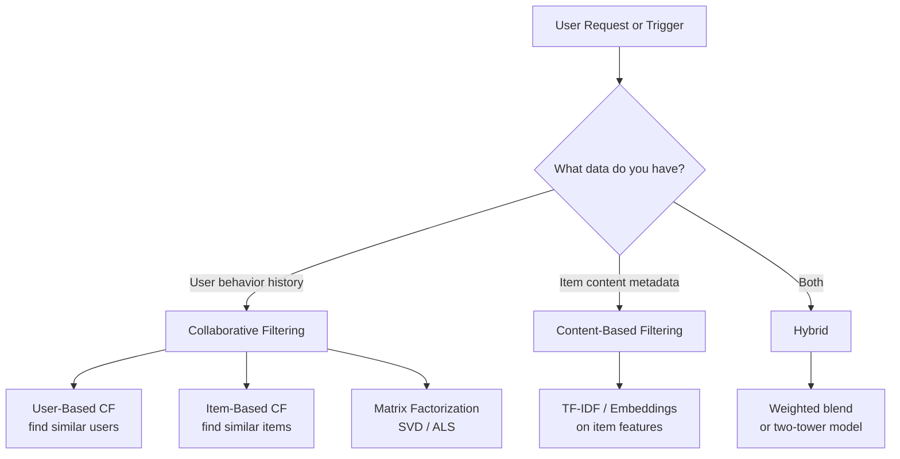
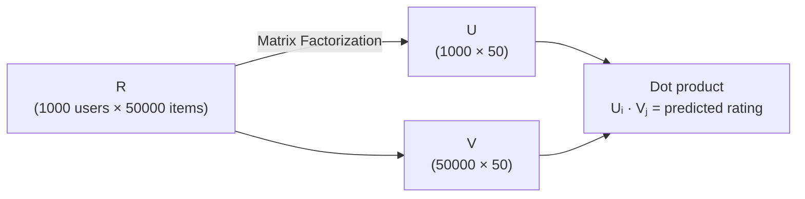
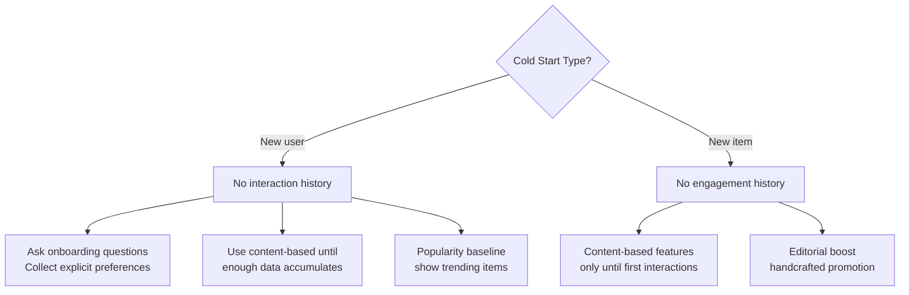
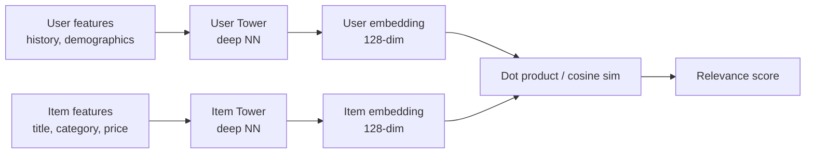

# Recommendation Systems

## The Story 📖

You open Netflix on a Friday night. Without any search, the homepage already has a row called "Because you watched Inception" filled with mind-bending thrillers. Below that: "Popular in Sci-Fi." Below that: "Watch again." None of that is hand-curated by a Netflix employee — it is computed entirely from data about what you and 200 million other users watched, paused, rewound, and abandoned.

This is a **recommendation system**: a model that predicts which items a user will find most relevant, given everything known about that user and all other users.

👉 This is why we need **Recommendation Systems** — to surface the right item at the right time from a catalog too large for any human to manually browse.

---

## 📌 Learning Priority

**Must Learn** — core concepts, needed to understand the rest of this file:
[What is a Recommendation System](#what-is-a-recommendation-system) · [Collaborative Filtering](#step-3-collaborative-filtering) · [Matrix Factorization](#step-4-matrix-factorization)

**Should Learn** — important for real projects and interviews:
[Content-Based Filtering](#step-2-content-based-filtering) · [Cold Start Problem](#step-6-the-cold-start-problem) · [Evaluation Metrics](#the-math--technical-side-simplified)

**Good to Know** — useful in specific situations, not needed daily:
[Two-Tower Model](#modern-deep-learning-approaches) · [Implicit vs Explicit Feedback](#step-5-implicit-vs-explicit-feedback)

**Reference** — skim once, look up when needed:
[Common Mistakes](#common-mistakes-to-avoid-)

---

## What is a Recommendation System?

A **recommendation system** (also called a recommender system) is a model that predicts a user's preference for items they haven't yet seen, based on historical interaction data and/or item properties.

The system takes as input:
- **User data**: past interactions (clicks, purchases, ratings, watch history)
- **Item data**: content features (genre, price, keywords, embeddings)
- **Context**: time of day, device, location, recent session behavior

And outputs:
- A ranked list of items most likely to be relevant to this user right now.

Real-world examples:
- **Netflix / Disney+**: movie and show recommendations
- **Spotify**: Discover Weekly, Daily Mix, song radio
- **Amazon**: "Customers who bought this also bought"
- **YouTube**: home page, "Up next" queue
- **LinkedIn**: jobs you may like, people you may know
- **TikTok / Instagram Reels**: infinite personalized feed

---

## Why It Exists — The Problem It Solves

**1. The catalog is too large**
Netflix has 17,000+ titles. Spotify has 100 million+ tracks. No user can browse the full catalog — they need filtering. Without recommendations, users see a fraction of potentially relevant content and churn.

**2. Users cannot articulate what they want**
You don't know you'd love a slow-burn Korean thriller until you watch one. Recommendations discover latent preferences users can't express themselves.

**3. Explicit ratings are sparse**
Most users never rate anything. The interaction matrix (users × items) is typically 99%+ empty. Recommendation systems must infer preference from implicit signals (views, clicks, listen time) rather than explicit 5-star ratings.

👉 Without recommendations: users see popular-only content, niche items die, and engagement collapses. With recommendations: the long tail of content gets surfaced to users who will love it.

---

## How It Works — Step by Step

### Step 1: Understand the Two Paradigms



### Step 2: Content-Based Filtering

Content-based filtering recommends items **similar to items the user already liked**, based on item features.

**How it works:**
1. Represent each item as a feature vector (TF-IDF on text, one-hot on genre, embeddings)
2. Build a user profile: average the feature vectors of items the user interacted with
3. Score all unseen items by cosine similarity to the user profile
4. Return the top-k highest-scoring items

```python
from sklearn.feature_extraction.text import TfidfVectorizer
from sklearn.metrics.pairwise import cosine_similarity
import pandas as pd

# Items described by text features
items = pd.DataFrame({
    "title": ["Inception", "Interstellar", "The Matrix", "Titanic"],
    "description": [
        "dream heist mind-bending sci-fi",
        "space time travel quantum science",
        "virtual reality dystopian hacker",
        "romance historical tragedy ship"
    ]
})

tfidf = TfidfVectorizer()
item_matrix = tfidf.fit_transform(items["description"])   # shape: (n_items, n_features)

# User liked "Inception" (index 0) → find similar
scores = cosine_similarity(item_matrix[0], item_matrix).flatten()
items["similarity"] = scores
print(items.sort_values("similarity", ascending=False))
# Interstellar and Matrix rank higher than Titanic
```

**Pros**: no cold-start for new items, explainable ("recommended because you watched X"), no need for other users' data.

**Cons**: limited serendipity — only recommends more of the same. If a user only watches action movies, they never discover drama even if they'd love it.

### Step 3: Collaborative Filtering

Collaborative filtering recommends items based on **what similar users liked**, without needing to know anything about item content.

The core insight: *if user A and user B have historically liked the same movies, B will probably like what A liked next*.

**User-based CF:**
1. Find users most similar to the target user (by cosine similarity or Pearson correlation on their rating vectors)
2. Aggregate the top-k similar users' ratings on unseen items
3. Recommend items with the highest aggregated scores

**Item-based CF** (more scalable):
1. Precompute item-item similarity matrix
2. For a target user, look at items they interacted with
3. Find items similar to those, weighted by the user's engagement
4. Return top-k recommendations

```python
import numpy as np
from sklearn.metrics.pairwise import cosine_similarity

# User-item interaction matrix (rows=users, cols=items)
# 0 = not interacted, 1-5 = rating
ratings = np.array([
    [5, 3, 0, 1, 0],   # User 0
    [4, 0, 0, 1, 2],   # User 1
    [1, 1, 0, 5, 0],   # User 2
    [0, 0, 5, 4, 0],   # User 3
    [0, 1, 4, 0, 0],   # User 4
])

# Item-item similarity
item_sim = cosine_similarity(ratings.T)    # shape: (n_items, n_items)

# For user 0, predict unrated items (rating == 0)
user_ratings = ratings[0]                  # [5, 3, 0, 1, 0]
predicted = item_sim.T @ user_ratings      # weighted combination
# Items with high predicted scores are recommended
```

### Step 4: Matrix Factorization

The limitation of basic CF: the full user-item matrix is sparse and high-dimensional. **Matrix Factorization** compresses it into low-dimensional **latent factors** (embeddings).

**SVD / ALS decomposition:**
Decompose the R (users × items) matrix into:
`R ≈ U × Σ × V^T`

Where:
- **U** (users × k): user latent factor matrix — each user is a k-dimensional embedding
- **Σ** (k × k): singular values — importance of each latent dimension
- **V** (items × k): item latent factor matrix — each item is a k-dimensional embedding

The **k latent dimensions** represent learned abstract concepts: in a movie recommender, one dimension might capture "action-ness", another "art-house-ness", but these are learned, not labeled.



```python
# Using Surprise library for matrix factorization
from surprise import SVD, Dataset, Reader
from surprise.model_selection import cross_validate

# Load data
reader = Reader(rating_scale=(1, 5))
data = Dataset.load_from_df(df[["userId", "itemId", "rating"]], reader)

# SVD model (implicit matrix factorization)
model = SVD(n_factors=50, n_epochs=20, lr_all=0.005, reg_all=0.02)
results = cross_validate(model, data, measures=["RMSE", "MAE"], cv=5)
print(f"RMSE: {results['test_rmse'].mean():.4f}")
```

### Step 5: Implicit vs Explicit Feedback

Most real systems have **implicit feedback** (no ratings — just behavior):

| Signal Type | Examples | Challenge |
|---|---|---|
| **Explicit** | 5-star ratings, thumbs up/down | Sparse — most users don't rate |
| **Implicit** | Views, clicks, time spent, purchases | Dense but noisy — a view ≠ a like |

For implicit feedback, the most common approach is **Alternating Least Squares (ALS)** or neural collaborative filtering, where you treat interactions as confidence signals rather than absolute preferences.

### Step 6: The Cold Start Problem

New users or new items have no interaction history — the model has nothing to work from.



**Solutions:**
- **New user**: onboarding flow (pick 5 genres), show popular/trending, collect early signals quickly
- **New item**: content-based features only, editorial boost, A/B test exposure
- **Hybrid**: blend content-based (works without history) and collaborative (works with history), weighted by data availability

---

## The Math / Technical Side (Simplified)

**Cosine Similarity:**
`sim(u, v) = (u · v) / (|u| × |v|)`
Ranges from -1 to 1. Values near 1 mean near-identical preference profiles.

**SVD objective** — minimize reconstruction error:
`min Σ (rᵤᵢ - uᵤᵀvᵢ)² + λ(||uᵤ||² + ||vᵢ||²)`

Where:
- `rᵤᵢ` = actual rating from user u for item i
- `uᵤᵀvᵢ` = predicted rating (dot product of latent factors)
- `λ` = regularization to prevent overfitting

**Evaluation Metrics:**

| Metric | What It Measures |
|---|---|
| **RMSE** | Error on predicted ratings — lower is better |
| **Precision@K** | Of top-K recommended items, fraction that are relevant |
| **Recall@K** | Of all relevant items, fraction appearing in top-K |
| **NDCG@K** | Normalized Discounted Cumulative Gain — rewards relevant items at higher ranks |
| **MAP** | Mean Average Precision — average of precision at each relevant item's rank |

```python
def precision_at_k(recommended, relevant, k):
    top_k = recommended[:k]
    hits = len(set(top_k) & set(relevant))
    return hits / k

def ndcg_at_k(recommended, relevant, k):
    """Higher rank = higher discount denominator."""
    dcg = sum(
        1 / np.log2(rank + 2)
        for rank, item in enumerate(recommended[:k])
        if item in relevant
    )
    ideal_dcg = sum(1 / np.log2(rank + 2) for rank in range(min(k, len(relevant))))
    return dcg / ideal_dcg if ideal_dcg > 0 else 0
```

---

## Modern Deep Learning Approaches

### Two-Tower Model (used at Google, YouTube, Airbnb)



The user and item towers are trained jointly to maximize similarity for positive pairs (user interacted with item) and minimize for negative pairs. At serving time, item embeddings are pre-computed and stored in a vector database — a user query fetches the top-k nearest items in milliseconds using ANN (approximate nearest neighbor) search.

---

## Where You'll See This in Real AI Systems

- **Netflix**: two-stage system — candidate generation (collaborative filtering) → ranking (neural network with 100+ features)
- **Spotify Discover Weekly**: item-based CF on listening sessions, combined with NLP on track metadata
- **Amazon**: item-to-item CF at massive scale — precomputed item similarity powers "frequently bought together"
- **TikTok**: heavy implicit feedback from watch time, completion rate, rewatch, shares — neural CF with real-time updates
- **YouTube**: two-tower deep neural network generating 100s of candidates, re-ranked by a separate engagement model

---

## Common Mistakes to Avoid ⚠️

- **Optimizing for clicks, not satisfaction**: click-through rate is easy to measure but "clickbait" harms long-term retention. Use long-horizon signals like return visits or session depth.
- **Popularity bias**: without correction, recommenders amplify the most popular items, burying the long tail. The long tail is where personalization wins.
- **Ignoring the cold start problem**: shipping a pure collaborative system without a fallback strategy for new users means a broken first experience.
- **Using RMSE as the only metric**: RMSE on ratings says nothing about whether the top-5 recommendations are actually useful. Always evaluate ranking metrics (NDCG, Precision@K).
- **Training/serving skew**: training with all past data but serving with only recent interactions creates a disconnect — users evolve over time.

## Connection to Other Concepts 🔗

- Relates to **Matrix Factorization / SVD** (`01_Math_for_AI/03_Linear_Algebra`) — SVD is the mathematical foundation
- Relates to **Embeddings** (`08_LLM_Applications/04_Embeddings`) — user and item towers produce embeddings; retrieval uses the same ANN search
- Relates to **Vector Databases** (`08_LLM_Applications/05_Vector_Databases`) — item embeddings are stored and queried with ANN at serving time
- Relates to **Neural Networks** (`04_Neural_Networks_and_Deep_Learning/02_MLPs`) — deep learning recommenders are just MLPs with specialized input structure

---

✅ **What you just learned:** Recommendation systems use collaborative filtering (behavior of similar users), content-based filtering (item features), and matrix factorization (latent embeddings) to rank items by predicted relevance, handling sparse data, cold start, and implicit feedback.

🔨 **Build this now:** Load the MovieLens 100K dataset, build an item-based collaborative filter using cosine similarity on the user-item matrix, evaluate with Precision@10 on a chronological train/test split.

➡️ **Next step:** [Anomaly Detection](../12_Anomaly_Detection/Theory.md)

---

## 📂 Navigation

**In this folder:**
| File | |
|---|---|
| 📄 **Theory.md** | ← you are here |
| [📄 Cheatsheet.md](./Cheatsheet.md) | Quick reference |
| [📄 Interview_QA.md](./Interview_QA.md) | Interview prep |

⬅️ **Prev:** [Time Series Analysis](../10_Time_Series_Analysis/Theory.md) &nbsp;&nbsp;&nbsp; ➡️ **Next:** [Anomaly Detection](../12_Anomaly_Detection/Theory.md)
