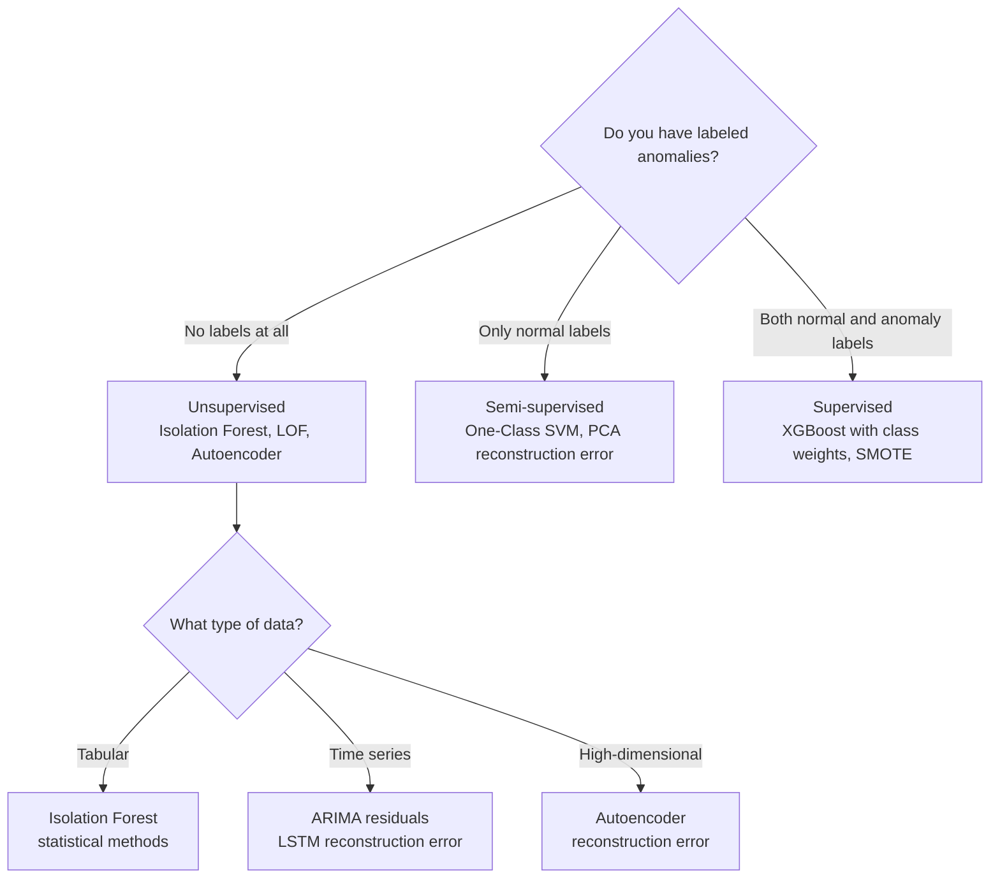
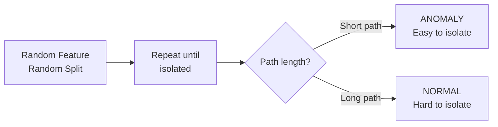

# Anomaly Detection

## The Story 📖

A bank processes 10 million credit card transactions every day. Somewhere in that stream, a fraudster in Romania just charged $3,200 on a card whose owner lives in Ohio and typically buys groceries and gas. The fraud team cannot manually review 10 million transactions. But they need to flag that one transaction — and thousands like it — within seconds of it happening, before the merchant ships the goods.

This is anomaly detection: finding the needle in a haystack, where the needle is a data point that doesn't fit the normal pattern.

The challenge is that you almost never have labeled examples of what "fraud" looks like ahead of time. Fraudsters constantly change their tactics. And the cost of a false negative (missing a real fraud) is very different from the cost of a false positive (blocking a legitimate transaction and angering a customer).

👉 This is why we need **Anomaly Detection** — to identify data points that are statistically inconsistent with the expected pattern, often without labels, and often in real time.

---

## 📌 Learning Priority

**Must Learn** — core concepts, needed to understand the rest of this file:
[What is Anomaly Detection](#what-is-anomaly-detection) · [Isolation Forest](#step-2-isolation-forest) · [Handling Class Imbalance](#step-4-handling-extreme-class-imbalance)

**Should Learn** — important for real projects and interviews:
[Evaluating Anomaly Detection](#step-5-evaluating-anomaly-detection-models) · [Understand the Approaches](#step-1-understand-the-approaches)

**Good to Know** — useful in specific situations, not needed daily:
[Local Outlier Factor](#step-3-local-outlier-factor-lof) · [Autoencoder Approach](#autoencoder-for-high-dimensional-anomaly-detection)

**Reference** — skim once, look up when needed:
[Common Mistakes](#common-mistakes-to-avoid-)

---

## What is Anomaly Detection?

**Anomaly detection** (also called outlier detection) is the task of identifying data points that deviate significantly from the expected behavior of a dataset.

Unlike standard classification, anomaly detection often operates:
- **Without labeled anomalies** (unsupervised or semi-supervised)
- In situations where anomalies are **extremely rare** (1 in 10,000 or fewer)
- Where the definition of "normal" must be **learned from data**, not hand-coded

Types of anomalies:

| Type | Description | Example |
|---|---|---|
| **Point anomaly** | A single observation is abnormal | A single $50,000 transaction from a $200/month spender |
| **Contextual anomaly** | Normal value in the wrong context | 30°C temperature in January in Chicago |
| **Collective anomaly** | A group of observations is abnormal together | Normal individual network packets but DDoS pattern in aggregate |

Real-world applications:
- **Fraud detection**: payments, insurance claims, account takeover
- **Network intrusion detection**: unusual traffic patterns, lateral movement
- **Manufacturing defects**: sensor readings outside normal operating range
- **Medical**: abnormal vital signs, unusual lab results
- **IT operations**: log anomalies, latency spikes, error rate surges

---

## Why It Exists — The Problem It Solves

**1. Labels are expensive or unavailable**
In most anomaly detection scenarios, you don't have a labeled dataset of anomalies — only a large set of normal behavior. There may be no historical examples of the exact type of fraud, failure, or intrusion you need to detect.

**2. Class imbalance is extreme**
Even in supervised settings, fraud rates of 0.1% mean the positive class is 1000:1 outnumbered. Standard classifiers trained on such data learn to always predict "normal" and achieve 99.9% accuracy while detecting zero fraud.

**3. The definition of normal evolves**
What was normal behavior last year may be different today. Anomaly detection systems must adapt to concept drift — the gradual shift in what constitutes normal.

👉 Without anomaly detection: you review 10 million transactions manually, miss almost all fraud, or build a classifier that flags everything as normal. With anomaly detection: outlier scoring pinpoints the few suspicious cases that need human review.

---

## How It Works — Step by Step

### Step 1: Understand the Approaches



### Step 2: Isolation Forest

**Isolation Forest** is the most widely used unsupervised anomaly detection algorithm. The core insight: anomalies are rare and different — they are easier to isolate from the rest of the data than normal points.

**How it works:**
1. Build a random tree by selecting a random feature and a random split threshold
2. Keep splitting until each data point is isolated in its own leaf
3. Anomalies get isolated in **fewer splits** (shorter path length) because they sit far from the bulk of the data
4. Normal points require many splits to isolate (longer path length)
5. Build an ensemble of such trees; average the path lengths
6. Anomaly score = inverse of average path length (short path = anomaly)

```python
from sklearn.ensemble import IsolationForest
import numpy as np

# Fit on normal data (unlabeled)
clf = IsolationForest(
    n_estimators=100,        # number of trees
    contamination=0.01,      # expected fraction of anomalies (1%)
    random_state=42,
)
clf.fit(X_train)

# Score: -1 = anomaly, 1 = normal
predictions = clf.predict(X_test)
scores = clf.decision_function(X_test)   # lower score = more anomalous

anomalies = X_test[predictions == -1]
print(f"Detected {len(anomalies)} anomalies out of {len(X_test)} samples")
```



### Step 3: Local Outlier Factor (LOF)

**LOF** is a density-based method. The intuition: a point is anomalous if it is in a region of much lower density than its neighbors.

LOF compares the **local density** of a point to the local densities of its k nearest neighbors. If the point's density is much lower than its neighbors' densities, it is anomalous.

```python
from sklearn.neighbors import LocalOutlierFactor

lof = LocalOutlierFactor(
    n_neighbors=20,         # number of neighbors to consider
    contamination=0.01,     # fraction expected to be anomalies
)

# LOF is transductive — predict on same data used to fit
# For new data, use novelty=True
lof = LocalOutlierFactor(n_neighbors=20, novelty=True)
lof.fit(X_train)
scores = lof.decision_function(X_test)    # lower = more anomalous
predictions = lof.predict(X_test)         # -1 = anomaly, 1 = normal
```

**When to use LOF**: when anomalies are contextual — dense clusters of normal points with occasional sparse outliers nearby. LOF catches local anomalies that Isolation Forest might miss.

### Step 4: Handling Extreme Class Imbalance

When you do have labels but the positive (anomaly) class is tiny, standard classifiers fail:

```
Class 0: 99,000 normal transactions
Class 1:  1,000 fraud transactions

A model that always predicts 0 gets 99% accuracy but detects ZERO fraud.
```

**Solutions:**

**SMOTE (Synthetic Minority Over-sampling Technique)**:
Creates synthetic positive examples by interpolating between existing positives in feature space.

```python
from imblearn.over_sampling import SMOTE
from sklearn.ensemble import RandomForestClassifier
from sklearn.metrics import classification_report

# Oversample the minority class
sm = SMOTE(sampling_strategy=0.1, random_state=42)  # bring minority to 10% of majority
X_resampled, y_resampled = sm.fit_resample(X_train, y_train)

# Now train with balanced-ish data
clf = RandomForestClassifier(class_weight="balanced", random_state=42)
clf.fit(X_resampled, y_resampled)

print(classification_report(y_test, clf.predict(X_test)))
```

**`class_weight="balanced"`** in sklearn — automatically upweights the minority class in the loss function:
```python
# In XGBoost: scale_pos_weight
from xgboost import XGBClassifier

clf = XGBClassifier(
    scale_pos_weight=99,    # sum(negative) / sum(positive) = 99000 / 1000
    eval_metric="aucpr",    # use PR-AUC not AUC for imbalanced data
)
```

### Step 5: Evaluating Anomaly Detection Models

**Never use accuracy for imbalanced data.** A model that predicts all-normal achieves 99% accuracy and misses every anomaly.

The correct evaluation framework:

```python
from sklearn.metrics import (
    precision_score, recall_score, f1_score,
    average_precision_score, roc_auc_score,
    confusion_matrix
)

# Core metrics
print(f"Precision: {precision_score(y_true, y_pred):.4f}")   # of flagged, % correct
print(f"Recall:    {recall_score(y_true, y_pred):.4f}")      # of all fraud, % caught
print(f"F1:        {f1_score(y_true, y_pred):.4f}")          # harmonic mean

# AUC metrics (use probabilities, not binary predictions)
print(f"ROC-AUC:   {roc_auc_score(y_true, y_prob):.4f}")
print(f"PR-AUC:    {average_precision_score(y_true, y_prob):.4f}")  # better for imbalanced
```

**The precision-recall tradeoff:**
- High precision = few false alarms (better for customer experience)
- High recall = fewer missed anomalies (better for fraud losses)
- The business context determines which to optimize

---

## The Math / Technical Side (Simplified)

**Isolation Forest anomaly score:**
`s(x, n) = 2^(-E(h(x)) / c(n))`

Where:
- `E(h(x))` = average path length across all trees for point x
- `c(n)` = average path length for a binary search tree of n points (normalization)
- Score near 1 = anomaly, score near 0 = normal, score near 0.5 = uncertain

**LOF score:**
`LOF_k(p) = mean(lrd_k(o) / lrd_k(p))` for o in k-nearest-neighbors of p

Where `lrd_k(p)` is the local reachability density of point p. LOF > 1 means lower density than neighbors → anomalous.

**PR-AUC vs ROC-AUC for imbalanced data:**
ROC-AUC can be misleadingly high for imbalanced datasets because it considers the true negative rate (which is naturally high when normals are 99%). PR-AUC focuses only on the minority class: it measures how well the model ranks true positives ahead of false positives across all thresholds.

---

## Autoencoder for High-Dimensional Anomaly Detection

For image, text, or high-dimensional data, **autoencoders** learn a compressed representation of normal data. Anomalies reconstruct poorly — high reconstruction error signals an anomaly.

```python
import torch
import torch.nn as nn

class Autoencoder(nn.Module):
    def __init__(self, input_dim, hidden_dim=32):
        super().__init__()
        self.encoder = nn.Sequential(
            nn.Linear(input_dim, 64), nn.ReLU(),
            nn.Linear(64, hidden_dim), nn.ReLU()
        )
        self.decoder = nn.Sequential(
            nn.Linear(hidden_dim, 64), nn.ReLU(),
            nn.Linear(64, input_dim)
        )

    def forward(self, x):
        z = self.encoder(x)
        return self.decoder(z)

# Train on NORMAL data only
# At inference: reconstruction_error = ||x - autoencoder(x)||²
# High error → anomaly
```

---

## Where You'll See This in Real AI Systems

- **Payment fraud**: Visa and Mastercard use real-time scoring on every transaction — Isolation Forest and neural networks flag suspicious patterns for human review or auto-decline
- **Network security**: SIEM systems use LOF and isolation forests on network traffic features to detect intrusions
- **IoT / manufacturing**: sensor reading anomalies trigger maintenance alerts before equipment fails
- **Cloud infrastructure**: ML-based anomaly detection on time series metrics (latency, error rate, CPU) powers PagerDuty and Datadog's smart alerting
- **Healthcare**: outlier detection on EHR data flags patients at risk of sepsis before symptoms become critical

---

## Common Mistakes to Avoid ⚠️

- **Using accuracy as the metric**: always use precision, recall, F1, or PR-AUC for imbalanced problems
- **Setting contamination wrong**: Isolation Forest's `contamination` parameter must reflect realistic anomaly rates — setting it too high flags too many normals as anomalies
- **Applying SMOTE to test data**: SMOTE synthetically creates training examples — never apply it to the test set
- **Not tuning the decision threshold**: the default 0.5 threshold is wrong for imbalanced data; tune on the validation set using F1 or business-specific cost functions
- **Ignoring temporal leakage**: for time-ordered anomaly detection, split chronologically; don't let future information leak into training

## Connection to Other Concepts 🔗

- Relates to **Unsupervised Learning** (`02_Machine_Learning_Foundations/04_Unsupervised_Learning`) — Isolation Forest and LOF are unsupervised methods
- Relates to **XGBoost** (`03_Classical_ML_Algorithms/09_XGBoost_and_Boosting`) — when labels exist, XGBoost with `scale_pos_weight` is a strong supervised anomaly detector
- Relates to **Time Series Analysis** (`03_Classical_ML_Algorithms/10_Time_Series_Analysis`) — temporal anomaly detection uses time series residuals
- Relates to **Model Evaluation** (`02_Machine_Learning_Foundations/05_Model_Evaluation`) — imbalanced evaluation metrics are critical here

---

✅ **What you just learned:** Anomaly detection identifies rare deviations from normal behavior using unsupervised methods (Isolation Forest, LOF), handles extreme class imbalance with SMOTE and class weighting, and must be evaluated with precision/recall and PR-AUC rather than accuracy.

🔨 **Build this now:** Load the credit card fraud dataset (available on Kaggle), train an Isolation Forest with `contamination=0.002`, evaluate with classification_report and PR-AUC, then compare to XGBoost with `scale_pos_weight`.

➡️ **Next step:** [Neural Networks](../../04_Neural_Networks_and_Deep_Learning/01_Perceptron/Theory.md)

---

## 📂 Navigation

**In this folder:**
| File | |
|---|---|
| 📄 **Theory.md** | ← you are here |
| [📄 Cheatsheet.md](./Cheatsheet.md) | Quick reference |
| [📄 Interview_QA.md](./Interview_QA.md) | Interview prep |

⬅️ **Prev:** [Recommendation Systems](../11_Recommendation_Systems/Theory.md) &nbsp;&nbsp;&nbsp; ➡️ **Next:** [Neural Networks — Perceptron](../../04_Neural_Networks_and_Deep_Learning/01_Perceptron/Theory.md)
