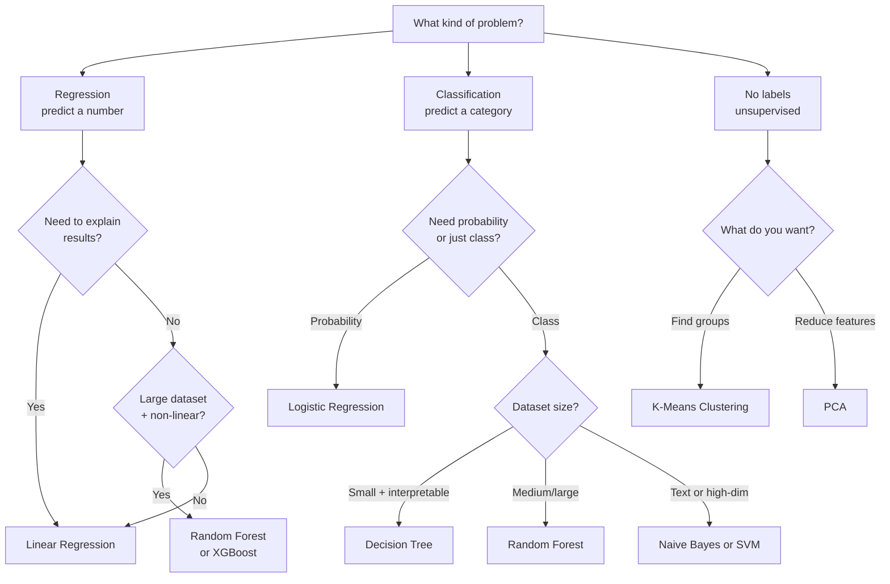

# Algorithm Comparison Guide

## Side-by-Side Comparison

| Algorithm | Type | Interpretable? | Best Dataset Size | Training Speed | Handles Non-Linearity? | Best For |
|---|---|---|---|---|---|---|
| **Linear Regression** | Regression | Yes — see the equation | Any (fast on large) | Very fast | No | Predicting numbers with linear relationships |
| **Logistic Regression** | Classification | Yes — coefficients are readable | Any | Very fast | No (without feature engineering) | Binary classification, probability scores needed |
| **Decision Tree** | Both | Yes — rules are visible | Small–Medium | Fast | Yes | Interpretable rule-based decisions |
| **Random Forest** | Both | Partial (feature importance) | Medium–Large | Moderate | Yes | High accuracy on tabular data |
| **SVM** | Classification | No | Small–Medium | Slow on large data | Yes (with kernel) | High-dimensional data, text, clear margin |
| **K-Means** | Clustering | Partial (centroid values) | Any | Fast | No (uses distance) | Customer segmentation, finding natural groups |
| **PCA** | Dim. Reduction | No | Any | Fast | No | Visualization, noise reduction, compression |
| **Naive Bayes** | Classification | Partial | Small–Large | Very fast | No | Text classification, spam detection, fast baseline |

---

## Decision Flowchart: How to Pick an Algorithm

---

## Strengths and Weaknesses Summary

| Algorithm | Key Strength | Key Weakness |
|---|---|---|
| Linear Regression | Fast, interpretable, great baseline | Cannot model curves or interactions |
| Logistic Regression | Outputs probabilities, regularizable | Linear decision boundary |
| Decision Tree | Fully interpretable, handles mixed types | Overfits easily without depth limit |
| Random Forest | High accuracy, robust, feature importance | Slow to predict, black-box output |
| SVM | Effective in high dimensions, kernel trick | Slow on large datasets, hard to tune |
| K-Means | Simple, fast, scalable | Requires specifying K, assumes spherical clusters |
| PCA | Dimensionality reduction, noise filtering | Components are not directly interpretable |
| Naive Bayes | Extremely fast, works well on text | Assumes feature independence (often violated) |

---

## Quick Selection Guide

| Your Situation | Recommended Start |
|---|---|
| First model ever / baseline | Logistic regression (classification) or Linear regression (regression) |
| Tabular data, need accuracy | Random forest — then try XGBoost |
| Need to explain the decision | Decision tree (then random forest for better accuracy) |
| Text classification | Naive Bayes first, then logistic regression with TF-IDF |
| Customer segmentation | K-Means |
| Too many features, need fewer | PCA |
| High-dimensional, small dataset | SVM |
