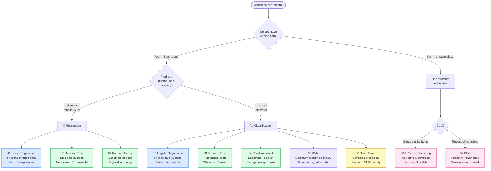

# 🌲 Classical ML Algorithms

⬅️ [02 ML Foundations](../02_Machine_Learning_Foundations/Readme.md) &nbsp;|&nbsp; [🏠 Home](../00_Learning_Guide/Readme.md) &nbsp;|&nbsp; [04 Neural Networks ➡️](../04_Neural_Networks_and_Deep_Learning/Readme.md)

> The eight algorithms that still power the majority of production ML today — interpretable, fast, and often better than deep learning for structured data.

**[▶ Start here → Linear Regression Theory](./01_Linear_Regression/Theory.md)**

---

## At a Glance

| | |
|---|---|
| 📚 Topics | 8 topics |
| ⏱️ Est. Time | 5–6 hours |
| 📋 Prerequisites | [02 ML Foundations](../02_Machine_Learning_Foundations/Readme.md) |
| 🔓 Unlocks | [04 Neural Networks](../04_Neural_Networks_and_Deep_Learning/Readme.md) |

---

## What's in This Section

---

## Topics

| # | Topic | What You'll Learn | Files |
|---|---|---|---|
| 01 | [Linear Regression](./01_Linear_Regression/Theory.md) | Fit a line through data to predict continuous values — the foundation of all regression | [📖 Theory](./01_Linear_Regression/Theory.md) · [⚡ Cheatsheet](./01_Linear_Regression/Cheatsheet.md) · [🎯 Interview Q&A](./01_Linear_Regression/Interview_QA.md) · [📐 Math](./01_Linear_Regression/Math_Intuition.md) · [💻 Code](./01_Linear_Regression/Code_Example.md) |
| 02 | [Logistic Regression](./02_Logistic_Regression/Theory.md) | Predict probabilities for classification — despite the name, this is a classifier, not a regressor | [📖 Theory](./02_Logistic_Regression/Theory.md) · [⚡ Cheatsheet](./02_Logistic_Regression/Cheatsheet.md) · [🎯 Interview Q&A](./02_Logistic_Regression/Interview_QA.md) · [📐 Math](./02_Logistic_Regression/Math_Intuition.md) · [💻 Code](./02_Logistic_Regression/Code_Example.md) |
| 03 | [Decision Trees](./03_Decision_Trees/Theory.md) | Build interpretable if-then-else rule trees — the backbone of every ensemble method | [📖 Theory](./03_Decision_Trees/Theory.md) · [⚡ Cheatsheet](./03_Decision_Trees/Cheatsheet.md) · [🎯 Interview Q&A](./03_Decision_Trees/Interview_QA.md) · [💻 Code](./03_Decision_Trees/Code_Example.md) |
| 04 | [Random Forests](./04_Random_Forests/Theory.md) | Combine hundreds of trees to get robust, high-accuracy predictions on tabular data | [📖 Theory](./04_Random_Forests/Theory.md) · [⚡ Cheatsheet](./04_Random_Forests/Cheatsheet.md) · [🎯 Interview Q&A](./04_Random_Forests/Interview_QA.md) · [💻 Code](./04_Random_Forests/Code_Example.md) |
| 05 | [Support Vector Machines](./05_SVM/Theory.md) | Find the maximum-margin boundary between classes — especially powerful for high-dimensional data | [📖 Theory](./05_SVM/Theory.md) · [⚡ Cheatsheet](./05_SVM/Cheatsheet.md) · [🎯 Interview Q&A](./05_SVM/Interview_QA.md) · [📐 Math](./05_SVM/Math_Intuition.md) |
| 06 | [K-Means Clustering](./06_K_Means_Clustering/Theory.md) | Partition unlabeled data into K natural groups by minimizing distance to cluster centers | [📖 Theory](./06_K_Means_Clustering/Theory.md) · [⚡ Cheatsheet](./06_K_Means_Clustering/Cheatsheet.md) · [🎯 Interview Q&A](./06_K_Means_Clustering/Interview_QA.md) · [💻 Code](./06_K_Means_Clustering/Code_Example.md) |
| 07 | [PCA](./07_PCA_Dimensionality_Reduction/Theory.md) | Compress high-dimensional data into fewer dimensions while preserving maximum variance | [📖 Theory](./07_PCA_Dimensionality_Reduction/Theory.md) · [⚡ Cheatsheet](./07_PCA_Dimensionality_Reduction/Cheatsheet.md) · [🎯 Interview Q&A](./07_PCA_Dimensionality_Reduction/Interview_QA.md) · [📐 Math](./07_PCA_Dimensionality_Reduction/Math_Intuition.md) · [💻 Code](./07_PCA_Dimensionality_Reduction/Code_Example.md) |
| 08 | [Naive Bayes](./08_Naive_Bayes/Theory.md) | Apply Bayes' theorem with a strong independence assumption — blazing fast text classification | [📖 Theory](./08_Naive_Bayes/Theory.md) · [⚡ Cheatsheet](./08_Naive_Bayes/Cheatsheet.md) · [🎯 Interview Q&A](./08_Naive_Bayes/Interview_QA.md) · [💻 Code](./08_Naive_Bayes/Code_Example.md) |

> See [Algorithm Comparison](./Algorithm_Comparison.md) for a side-by-side breakdown of all 8 algorithms with a decision guide for choosing the right one.

---

## Key Concepts at a Glance

| Concept | Why It Matters in AI |
|---|---|
| Classical does not mean obsolete | Random forests and gradient boosting consistently outperform neural networks on tabular data; for structured data under ~50k rows, start here before reaching for deep learning |
| Interpretability is a feature, not a consolation prize | In healthcare, finance, and law you must explain *why* a decision was made — decision trees and logistic regression give you that; neural networks do not |
| Supervised vs unsupervised is the first fork | Labeled data → supervised algorithms (01–05, 08) to predict labels; no labels → unsupervised (06–07) to discover structure in the data itself |
| Ensemble methods beat single models | Random Forests combine hundreds of decorrelated trees — each tree is weak, but together they cancel out each other's errors, the principle behind all boosting and bagging |
| Dimensionality is the enemy of performance | As features grow, data becomes sparse and distances lose meaning; PCA compresses features, SVMs handle high dimensions with the kernel trick, Naive Bayes sidesteps it with conditional independence |

---

## 📂 Navigation

⬅️ **Prev:** [02 Machine Learning Foundations](../02_Machine_Learning_Foundations/Readme.md) &nbsp;&nbsp; ➡️ **Next:** [04 Neural Networks and Deep Learning](../04_Neural_Networks_and_Deep_Learning/Readme.md)
