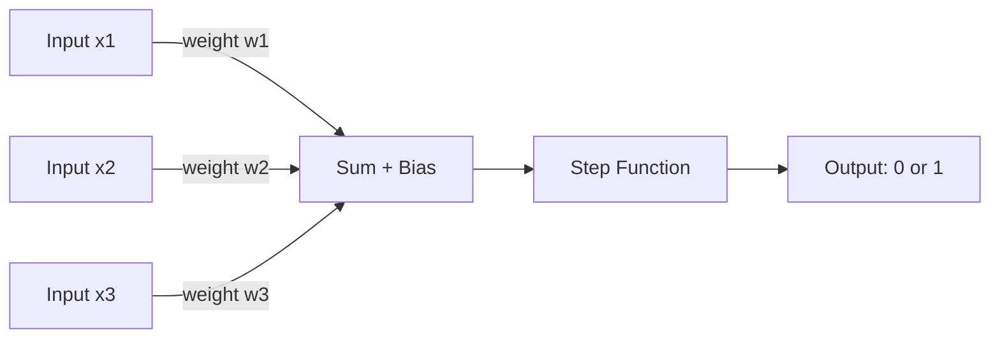
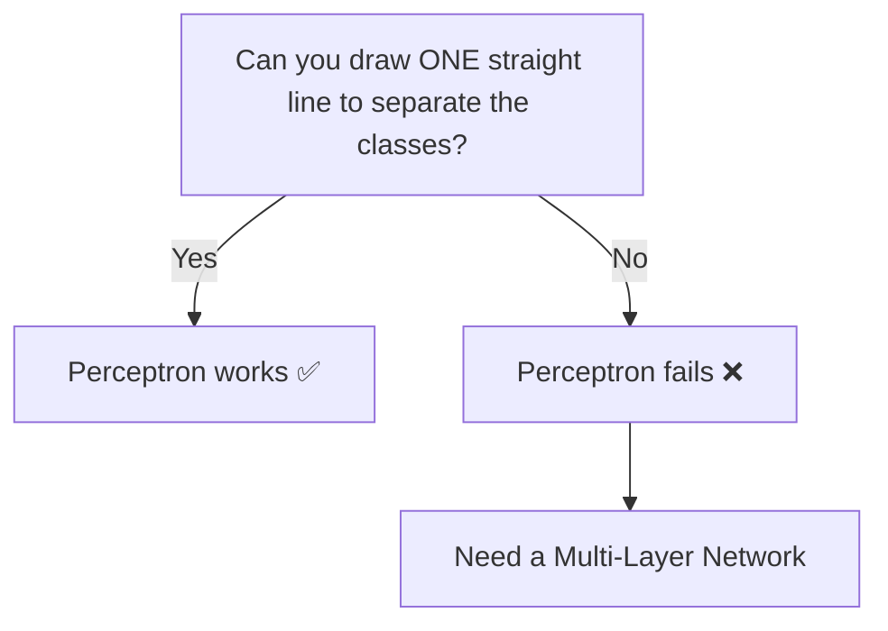

# Perceptron — Theory

Your teacher grades homework by checking three things: did you answer all questions, did you show your working, is the answer correct. She scores each, adds them up, and if the total is high enough — you pass. That's a perceptron.

👉 This is why we need **the Perceptron** — the single simplest unit that takes inputs, weighs their importance, and makes a yes/no decision.

---

## 📌 Learning Priority

**Must Learn** — core concepts, needed to understand the rest of this file:
[What is a Perceptron](#what-is-a-perceptron) · [The Parts](#the-parts) · [Linear Separability](#linear-separability)

**Should Learn** — important for real projects and interviews:
[The Math](#the-math) · [The XOR Problem](#the-xor-problem)

**Good to Know** — useful in specific situations, not needed daily:
[How Weights Are Learned](#how-weights-are-learned)

---

## What is a Perceptron?

A perceptron is one artificial neuron — the atom of every neural network. It:
1. Takes numbers as input
2. Multiplies each input by a weight (how important is this input?)
3. Sums them with a bias, then outputs 0 or 1

---

## The Parts



**Inputs (x)** — raw data (pixel values, test scores, temperatures).

**Weights (w)** — how much each input matters. High weight = high importance.

**Bias (b)** — a constant added to shift the decision threshold. Without bias, the boundary always passes through the origin.

**Step Function** — if the weighted sum ≥ 0, output 1; otherwise output 0.

---

## The Math

```
output = step(w1*x1 + w2*x2 + ... + wn*xn + b)
```

**Example:**
- Inputs: x1=1, x2=1, x3=0 — Weights: w1=0.2, w2=0.3, w3=0.8 — Bias: b = -0.5
- Sum = 0.2 + 0.3 + 0 − 0.5 = 0.0 → step(0.0) = 1 → Pass!

---

## Linear Separability

A perceptron can only solve problems where a single straight line separates the two classes (**linearly separable**).



---

## The XOR Problem

XOR ("one or the other but not both") cannot be solved by a perceptron — its four points cannot be split by any single line. This famously halted AI research in the 1970s until multi-layer networks were developed.

| x1 | x2 | XOR |
|----|----|-----|
| 0  | 0  | 0   |
| 0  | 1  | 1   |
| 1  | 0  | 1   |
| 1  | 1  | 0   |

---

## How Weights Are Learned

Start with random weights. Show the perceptron an example. If wrong, nudge the weights. Repeat thousands of times — this is the **Perceptron Learning Rule**:

`new_weight = old_weight + learning_rate × (correct - predicted) × input`

The perceptron is guaranteed to converge if the data is linearly separable.

---

✅ **What you just learned:** A perceptron multiplies inputs by weights, sums them with a bias, and uses a step function to make a binary decision — but only works for linearly separable problems.

🔨 **Build this now:** Draw two inputs (x1, x2), one output. Assign random weights. Try inputs (0,0), (0,1), (1,0), (1,1) for an AND gate. Manually compute the weighted sum and check if threshold 0.5 gives correct AND outputs (only (1,1) → 1).

➡️ **Next step:** Multi-Layer Perceptrons (MLPs) — `./02_MLPs/Theory.md`

---

## 🛠️ Practice Project

Apply what you just learned → **[B3: Neural Net from Scratch](../../22_Capstone_Projects/03_Neural_Net_from_Scratch/03_GUIDE.md)**
> This project uses: building a perceptron layer in numpy, forward pass, weight initialization


---

## 📝 Practice Questions

- 📝 [Q18 · perceptron](../../ai_practice_questions_100.md#q18--thinking--perceptron)


---

## 📂 Navigation

**In this folder:**
| File | |
|---|---|
| 📄 **Theory.md** | ← you are here |
| [📄 Cheatsheet.md](./Cheatsheet.md) | Quick reference |
| [📄 Interview_QA.md](./Interview_QA.md) | Interview prep |

⬅️ **Prev:** [08 Naive Bayes](../../03_Classical_ML_Algorithms/08_Naive_Bayes/Theory.md) &nbsp;&nbsp;&nbsp; ➡️ **Next:** [02 MLPs](../02_MLPs/Theory.md)
