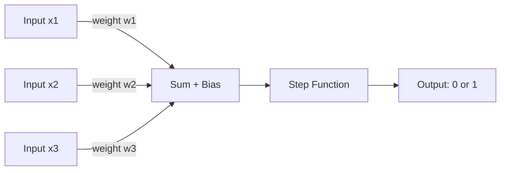
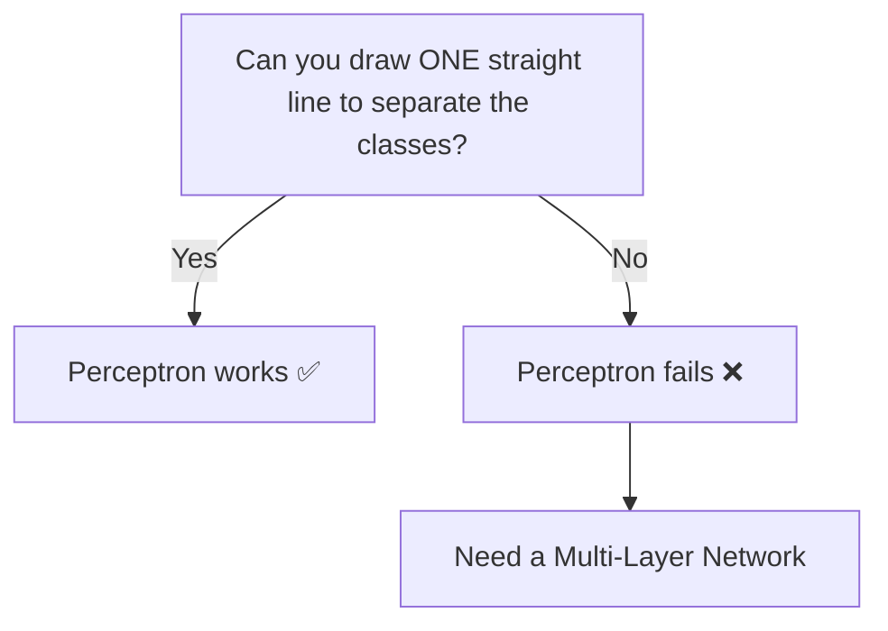

# Perceptron — Theory

Your teacher is grading homework. She doesn't read every single word. She checks three things: did you answer all questions, did you show your working, and is the answer correct. She gives each thing a score, adds them up, and if the total is high enough — you pass. If not — you fail.

That's it. That's a perceptron.

👉 This is why we need **the Perceptron** — it is the single, simplest unit that can take inputs, weigh their importance, and make a yes/no decision.

---

## What is a Perceptron?

A perceptron is one artificial neuron. It is the atom of every neural network.

It does three things:
1. Takes some numbers as input
2. Multiplies each input by a weight (how important is this input?)
3. Adds them up, compares to a threshold, and outputs 0 or 1

---

## The Parts



**Inputs (x)** — the raw data. Could be pixel values, test scores, temperatures.

**Weights (w)** — how much we care about each input. A high weight = that input matters a lot.

**Bias (b)** — a constant we add. It shifts the decision threshold. Without bias, the decision boundary always passes through the origin — very limiting.

**Step Function** — if the weighted sum ≥ 0, output 1. Otherwise output 0.

---

## The Math (don't be scared)

```
output = step(w1*x1 + w2*x2 + ... + wn*xn + b)
```

That's it. Multiply, add, compare.

**Example:**
- Inputs: x1=1 (answered all questions), x2=1 (showed working), x3=0 (wrong answer)
- Weights: w1=0.2, w2=0.3, w3=0.8
- Bias: b = -0.5
- Sum = 0.2×1 + 0.3×1 + 0.8×0 + (-0.5) = 0.2 + 0.3 + 0 - 0.5 = 0.0
- step(0.0) = 1 → Pass!

---

## Linear Separability

A perceptron can only solve problems where you can draw a straight line to separate the two classes.

Think of a graph with two groups of dots. If you can draw one straight line between them — a perceptron can solve it. That is called **linearly separable**.



---

## The XOR Problem

XOR means "one or the other but not both."

| x1 | x2 | XOR |
|----|----|-----|
| 0  | 0  | 0   |
| 0  | 1  | 1   |
| 1  | 0  | 1   |
| 1  | 1  | 0   |

Try plotting these four points. You cannot separate the 0s from the 1s with a single straight line. This is the XOR problem — it proved that a single perceptron is limited. It famously stopped AI research in the 1970s until multi-layer networks were developed.

---

## How Weights Are Learned

You start with random weights. You show the perceptron an example. If it gets it wrong, you nudge the weights in the right direction. Repeat thousands of times. This is called the **Perceptron Learning Rule**.

The rule: `new_weight = old_weight + learning_rate × (correct - predicted) × input`

The perceptron is guaranteed to converge — to find the right weights — if the data is linearly separable.

---

✅ **What you just learned:** A perceptron is a single artificial neuron that multiplies inputs by weights, sums them with a bias, and uses a step function to make a binary decision — but it only works for linearly separable problems.

🔨 **Build this now:** Draw on paper: two inputs (x1, x2), one output. Assign random weights. Try the inputs (0,0), (0,1), (1,0), (1,1) for an AND gate. Manually compute the weighted sum for each and check if a threshold of 0.5 gives the right AND outputs (only (1,1) should output 1).

➡️ **Next step:** Multi-Layer Perceptrons (MLPs) — `./02_MLPs/Theory.md`

---

## 📂 Navigation

**In this folder:**
| File | |
|---|---|
| 📄 **Theory.md** | ← you are here |
| [📄 Cheatsheet.md](./Cheatsheet.md) | Quick reference |
| [📄 Interview_QA.md](./Interview_QA.md) | Interview prep |

⬅️ **Prev:** [08 Naive Bayes](../../03_Classical_ML_Algorithms/08_Naive_Bayes/Theory.md) &nbsp;&nbsp;&nbsp; ➡️ **Next:** [02 MLPs](../02_MLPs/Theory.md)
