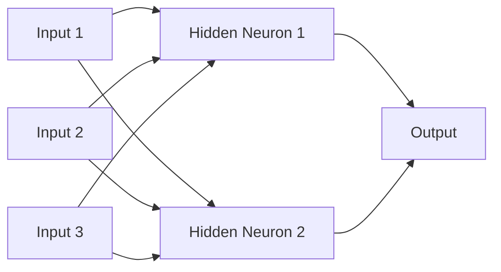
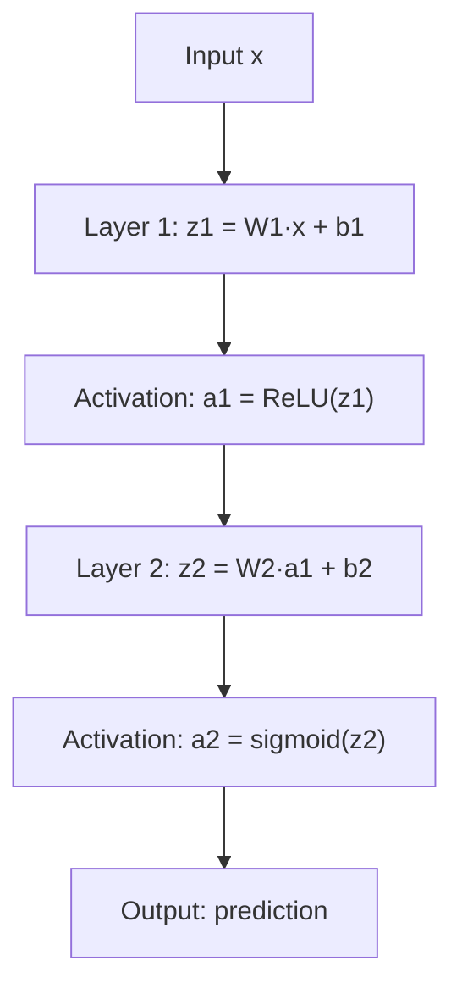

# Multi-Layer Perceptrons (MLPs) — Theory

Imagine you are studying for a big exam. First you collect your notes from every chapter (inputs). Then you summarize each chapter into key points (hidden layer 1 — finding patterns). Then you connect the key points across chapters (hidden layer 2 — finding patterns of patterns). Finally, you write your answers on the exam (output layer).

👉 This is why we need **MLPs** — stacking layers lets the network learn patterns of patterns, breaking through the limits of a single neuron.

---

## What is an MLP?

MLP stands for **Multi-Layer Perceptron**. It is a neural network with:
- An **input layer** — raw data comes in
- One or more **hidden layers** — the network processes and transforms the data
- An **output layer** — the final prediction comes out

Every neuron in one layer connects to every neuron in the next layer. This is called **fully connected** (or dense).

---

## The Architecture



Each arrow has a weight. Each neuron also has a bias. The network learns by adjusting all these weights and biases.

---

## Why Hidden Layers?

A single perceptron draws one straight line. Two layers can draw a shape with corners. Three or more layers can draw almost any shape.

Think of it like this:
- **Layer 1** detects simple patterns: "this edge is present," "this word appears"
- **Layer 2** combines those: "an edge + a curve = a nose"
- **Layer 3** combines those: "a nose + two eyes + a mouth = a face"

Each layer builds on the previous one. This is called **hierarchical feature learning**.

---

## Why Activation Functions Are Essential

Without activation functions, stacking layers does nothing. Here is why.

A layer computes: `output = W × input + b`

If you stack two linear layers:
```
layer2(layer1(x)) = W2 × (W1 × x + b1) + b2 = (W2×W1)×x + (W2×b1 + b2)
```

That is still just one linear transformation. You could replace the whole network with a single layer and get the same result.

Activation functions introduce **non-linearity**. Now the layers cannot collapse into one. The network can learn curved, complex decision boundaries — and solve problems like XOR.

---

## Forward Pass Summary



Each layer: multiply by weights, add bias, apply activation. Repeat.

---

## Fully Connected vs Sparse

In an MLP every input connects to every neuron in the next layer — that is **fully connected**. For images this gets huge fast (a 28×28 image = 784 inputs, each connecting to 128 neurons = 100,352 weights just in layer 1). That is why CNNs were invented — but we will get there in topic 09.

---

## Universal Approximation Theorem

A math fact worth knowing: an MLP with just **one hidden layer** with enough neurons can approximate any continuous function to any desired accuracy. This is the Universal Approximation Theorem. It means MLPs are theoretically powerful enough for almost anything. The challenge is finding the right weights — which is what training does.

---

✅ **What you just learned:** An MLP is a network of stacked layers of neurons, where non-linear activation functions between layers allow it to learn complex, non-linear patterns that a single perceptron never could.

🔨 **Build this now:** Sketch an MLP on paper for this problem: predict if a student passes (yes/no) based on 3 inputs: hours studied, sleep hours, practice tests done. Draw 3 inputs → 4 hidden neurons → 1 output. Label the weights as w11, w12, etc. Count the total number of weights.

➡️ **Next step:** Activation Functions — `./03_Activation_Functions/Theory.md`

---

## 📂 Navigation

**In this folder:**
| File | |
|---|---|
| 📄 **Theory.md** | ← you are here |
| [📄 Cheatsheet.md](./Cheatsheet.md) | Quick reference |
| [📄 Interview_QA.md](./Interview_QA.md) | Interview prep |
| [📄 Code_Example.md](./Code_Example.md) | Python code examples |

⬅️ **Prev:** [01 Perceptron](../01_Perceptron/Theory.md) &nbsp;&nbsp;&nbsp; ➡️ **Next:** [03 Activation Functions](../03_Activation_Functions/Theory.md)
