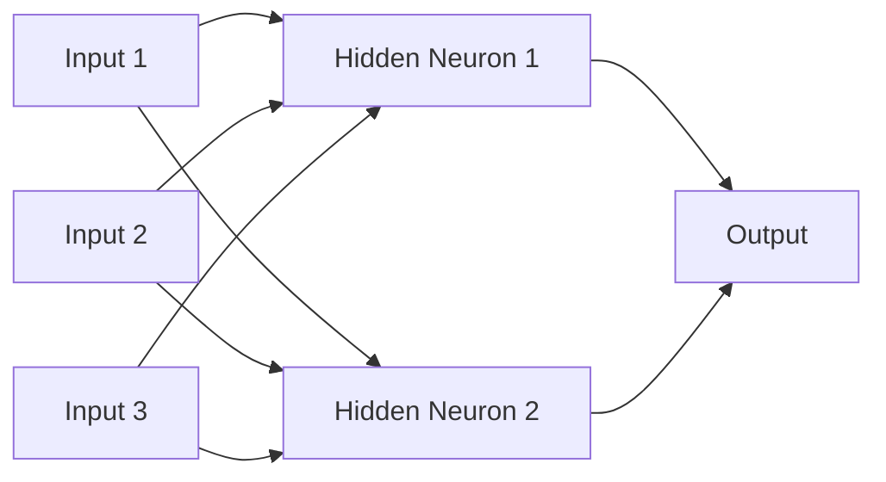
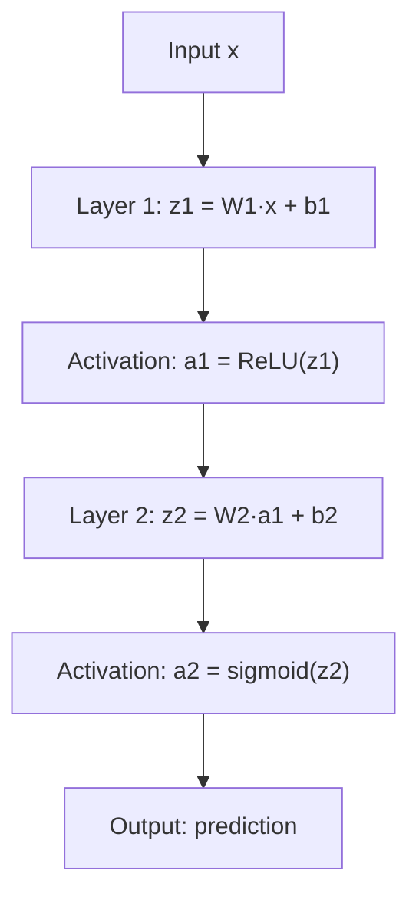

# Multi-Layer Perceptrons (MLPs) — Theory

You study for an exam: collect notes (inputs), summarize each chapter into key points (hidden layer 1), connect those key points across chapters (hidden layer 2), then write your answers (output). Stacking layers lets the network learn patterns of patterns.

👉 This is why we need **MLPs** — stacking layers breaks through the limits of a single neuron.

---

## What is an MLP?

MLP stands for **Multi-Layer Perceptron** — a neural network with:
- An **input layer** — raw data comes in
- One or more **hidden layers** — the network transforms data
- An **output layer** — the final prediction

Every neuron in one layer connects to every neuron in the next: **fully connected** (or dense).

---

## The Architecture



Each arrow has a weight; each neuron has a bias. Training adjusts all of them.

---

## Why Hidden Layers?

A single perceptron draws one straight line. More layers can draw increasingly complex shapes:
- **Layer 1** detects simple patterns: edges, specific words
- **Layer 2** combines those: "edge + curve = nose"
- **Layer 3** combines further: "nose + eyes + mouth = face"

This is **hierarchical feature learning**.

---

## Why Activation Functions Are Essential

Without activation functions, stacking layers does nothing new:

```
layer2(layer1(x)) = W2 × (W1 × x + b1) + b2 = (W2×W1)×x + (W2×b1 + b2)
```

That's still one linear transformation — the whole stack collapses to a single layer. Activation functions introduce **non-linearity**, allowing layers to learn curved, complex boundaries and solve problems like XOR.

---

## Forward Pass Summary



Each layer: multiply by weights, add bias, apply activation. Repeat.

---

## Fully Connected vs Sparse

In an MLP every input connects to every neuron in the next layer. For a 28×28 image: 784 inputs × 128 neurons = 100,352 weights in layer 1 alone. This is why CNNs were invented (topic 09).

---

## Universal Approximation Theorem

An MLP with just **one hidden layer** with enough neurons can approximate any continuous function to any desired accuracy. The challenge is finding the right weights — which is what training does.

---

✅ **What you just learned:** An MLP is a network of stacked layers where non-linear activation functions between layers allow it to learn complex, non-linear patterns a single perceptron never could.

🔨 **Build this now:** Sketch an MLP for predicting if a student passes based on 3 inputs: hours studied, sleep, practice tests. Draw 3 inputs → 4 hidden neurons → 1 output. Label weights w11, w12, etc. Count the total number of weights.

➡️ **Next step:** Activation Functions — `./03_Activation_Functions/Theory.md`

---

## 🛠️ Practice Project

Apply what you just learned → **[B3: Neural Net from Scratch](../../22_Capstone_Projects/03_Neural_Net_from_Scratch/03_GUIDE.md)**
> This project uses: 2-layer MLP built from scratch with numpy — no PyTorch, just matrix math and backprop


---

## 📝 Practice Questions

- 📝 [Q19 · mlp-networks](../../ai_practice_questions_100.md#q19--critical--mlp-networks)


---

## 📂 Navigation

**In this folder:**
| File | |
|---|---|
| 📄 **Theory.md** | ← you are here |
| [📄 Cheatsheet.md](./Cheatsheet.md) | Quick reference |
| [📄 Interview_QA.md](./Interview_QA.md) | Interview prep |
| [📄 Code_Example.md](./Code_Example.md) | Python code examples |

⬅️ **Prev:** [01 Perceptron](../01_Perceptron/Theory.md) &nbsp;&nbsp;&nbsp; ➡️ **Next:** [03 Activation Functions](../03_Activation_Functions/Theory.md)
