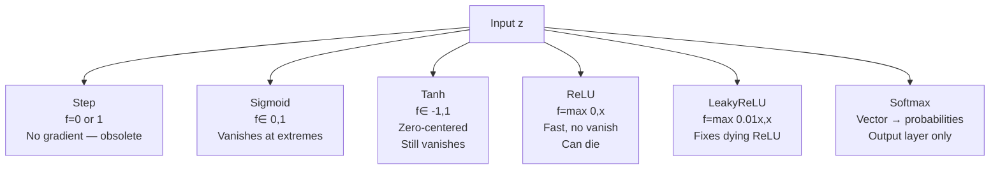
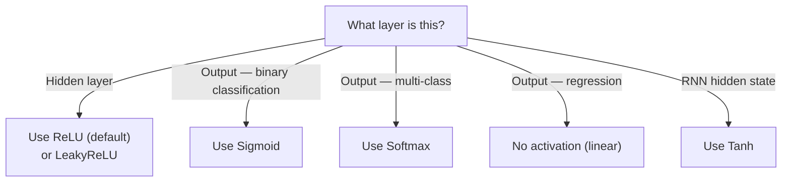

# Activation Functions — Theory

An old-fashioned light switch is either fully off or fully on — that's a step function. A dimmer switch lets you set any level in between. Modern neural networks need dimmers, not switches.

👉 This is why we need **activation functions** — they control how much signal each neuron passes forward, and their non-linearity makes deep learning work.

---

## Why Activation Functions Exist

1. **Non-linearity.** Without them, stacking layers does nothing — every linear combination of linear transformations is still linear. Activation functions allow decision boundaries to bend and curve.
2. **Controlling signal flow.** Given a number in, what number goes out? Amplify, suppress, or clip.
3. **Enabling backpropagation.** Each activation needs a derivative so gradients can flow backward.

---

## The Main Activation Functions

### Step Function (historical)

```
f(x) = 1 if x ≥ 0, else 0
```

Original perceptron activation. Derivative is 0 everywhere — backpropagation cannot work with it. Not used in modern networks.

---

### Sigmoid

```
f(x) = 1 / (1 + e^(-x))
```

Squashes any input to (0, 1). Outputs resemble probabilities.

**Use for:** Output layer of binary classifiers.

**Problem:** At extreme inputs the function flattens — gradient ≈ 0. In deep networks this causes **vanishing gradients** in early layers.

---

### Tanh (Hyperbolic Tangent)

```
f(x) = (e^x - e^(-x)) / (e^x + e^(-x))
```

Like sigmoid but squashes to (−1, 1). Zero-centered, which helps training. Still suffers from vanishing gradients at extremes.

**Use for:** Hidden layers in RNNs.

---

### ReLU (Rectified Linear Unit)

```
f(x) = max(0, x)
```

Positive input passes through unchanged; negative clips to 0. Fast to compute, gradient is 1 for positive inputs — no vanishing gradient on the active side.

**Problem:** **Dying ReLU** — if a neuron's weighted sum is always negative, it always outputs 0 and its gradient is always 0. The neuron stops learning. Fix: LeakyReLU or ELU.



---

### Softmax

```
f(xi) = e^xi / Σ e^xj
```

Converts a vector of scores to probabilities that sum to 1.

**Use for:** Output layer of multi-class classifiers only.

**Example:** Scores [2.0, 1.0, 0.1] → Softmax → [0.66, 0.24, 0.10].

---

## Which Activation Goes Where?



---

✅ **What you just learned:** Activation functions introduce the non-linearity that makes neural networks powerful — ReLU is the default for hidden layers, sigmoid for binary output, softmax for multi-class output.

🔨 **Build this now:** Compute sigmoid(0), sigmoid(5), sigmoid(-5). Then compute ReLU(3), ReLU(-3), ReLU(0). Notice how sigmoid squashes extremes to near 0/1, while ReLU just clips negatives to 0.

➡️ **Next step:** Loss Functions — `./04_Loss_Functions/Theory.md`

---

## 🛠️ Practice Project

Apply what you just learned → **[B3: Neural Net from Scratch](../../20_Projects/00_Beginner_Projects/03_Neural_Net_from_Scratch/Project_Guide.md)**
> This project uses: implementing ReLU activation from scratch, seeing how it enables learning non-linear patterns


---

## 📝 Practice Questions

- 📝 [Q20 · activation-functions](../../ai_practice_questions_100.md#q20--interview--activation-functions)


---

## 📂 Navigation

**In this folder:**
| File | |
|---|---|
| 📄 **Theory.md** | ← you are here |
| [📄 Cheatsheet.md](./Cheatsheet.md) | Quick reference |
| [📄 Interview_QA.md](./Interview_QA.md) | Interview prep |
| [📄 Comparison.md](./Comparison.md) | Activation functions comparison |

⬅️ **Prev:** [02 MLPs](../02_MLPs/Theory.md) &nbsp;&nbsp;&nbsp; ➡️ **Next:** [04 Loss Functions](../04_Loss_Functions/Theory.md)
