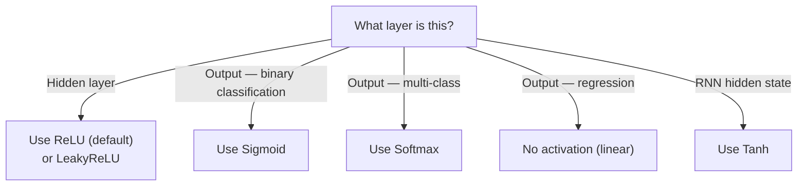

# Activation Functions — Theory

Imagine controlling the lights in your house. An old-fashioned light switch has two settings: completely off or completely on. Either the light is burning at full brightness, or it is off. That is a step function. Now imagine a dimmer switch — you can set it to 5%, 50%, 73%, or any value in between. Modern neural networks need dimmers, not switches.

👉 This is why we need **activation functions** — they control how much signal each neuron passes forward, and their non-linearity is what makes deep learning actually work.

---

## Why Activation Functions Exist

Three reasons:

**1. Non-linearity.** Without activation functions, stacking layers does nothing new. Every linear combination of linear transformations is still linear. Activation functions break this — they allow the network to bend, curve, and shape its decision boundaries.

**2. Controlling signal flow.** An activation function decides: "given this number coming in, what number should I send out?" It can amplify, suppress, or clip the signal.

**3. Enabling backpropagation.** For training to work, each activation function needs a derivative. The derivative tells us: "how does a small change in input affect the output?" Without that, gradients cannot flow backward.

---

## The Main Activation Functions

### Step Function (historical)

```
f(x) = 1 if x ≥ 0, else 0
```

The original. Used in the perceptron. Hard on/off. Derivative is 0 everywhere, so backpropagation cannot work with it. Not used in modern networks.

---

### Sigmoid

```
f(x) = 1 / (1 + e^(-x))
```

Squashes any number into the range (0, 1). Outputs look like probabilities.

**Looks like:** A smooth S-curve from 0 to 1.

**Use it for:** The output layer of a binary classifier (is it a cat or not?).

**Problem:** For very large or very small inputs, the function becomes almost flat. The derivative (gradient) becomes nearly 0. When this happens in many layers, gradients vanish before they reach the early layers. This is the **vanishing gradient problem**.

---

### Tanh (Hyperbolic Tangent)

```
f(x) = (e^x - e^(-x)) / (e^x + e^(-x))
```

Like sigmoid but squashes to (-1, 1) instead of (0, 1). Zero-centered, which helps training.

**Use it for:** Hidden layers in RNNs (still common there). Generally outperforms sigmoid in hidden layers.

**Problem:** Still suffers from vanishing gradients at extreme values.

---

### ReLU (Rectified Linear Unit)

```
f(x) = max(0, x)
```

If the input is positive, output it unchanged. If negative, output 0.

**Looks like:** A hockey stick shape. Flat at 0 on the left, straight line on the right.

**Why it is dominant:** Extremely fast to compute. Gradient is 1 for positive inputs — no vanishing gradient on the active side. Practically, deep networks train much faster with ReLU.

**Problem:** **Dying ReLU.** If a neuron's weighted sum is always negative, it always outputs 0 and its gradient is always 0. The neuron stops learning entirely — it is "dead." Solutions: LeakyReLU or ELU.

---

### Softmax

```
f(xi) = e^xi / Σ e^xj
```

Takes a vector of numbers and converts them to probabilities that sum to 1.

**Use it for:** Output layer of multi-class classification only.

**Example:** Scores [2.0, 1.0, 0.1] → Softmax → [0.66, 0.24, 0.10]. The model is 66% confident it is class 0.

---

## Which Activation Goes Where?



---

✅ **What you just learned:** Activation functions introduce the non-linearity that makes neural networks powerful — ReLU is the default for hidden layers, sigmoid is for binary output, and softmax is for multi-class output.

🔨 **Build this now:** Open a calculator (or Python) and compute sigmoid(0), sigmoid(5), sigmoid(-5). Then compute ReLU(3), ReLU(-3), ReLU(0). Notice how sigmoid squashes extreme values to near 0 and 1, while ReLU just clips negatives to 0.

➡️ **Next step:** Loss Functions — `./04_Loss_Functions/Theory.md`

---

## 📂 Navigation

**In this folder:**
| File | |
|---|---|
| 📄 **Theory.md** | ← you are here |
| [📄 Cheatsheet.md](./Cheatsheet.md) | Quick reference |
| [📄 Interview_QA.md](./Interview_QA.md) | Interview prep |
| [📄 Comparison.md](./Comparison.md) | Activation functions comparison |

⬅️ **Prev:** [02 MLPs](../02_MLPs/Theory.md) &nbsp;&nbsp;&nbsp; ➡️ **Next:** [04 Loss Functions](../04_Loss_Functions/Theory.md)
