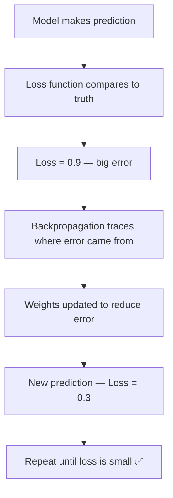

# Loss Functions — Theory

Your GPS is routing you to a destination. You make a small wrong turn — it calmly says "recalculating" and suggests a gentle correction. You make a massive wrong turn and end up on a motorway going the wrong direction — it urgently recalculates, gives a sharp correction, and even adds extra time to your ETA. The size of the correction depends on how wrong you are.

👉 This is why we need **loss functions** — they measure exactly how wrong the model's predictions are, so the network knows how strongly to correct itself.

---

## What is a Loss Function?

A loss function takes two things:
1. What the model predicted
2. What the correct answer actually is

It outputs a single number: **the loss**. Higher loss = more wrong. Lower loss = more right.

During training, the goal is simple: make the loss as small as possible.

---

## The Two Main Families

### Regression Loss (predicting a number)

**MSE — Mean Squared Error**

```
MSE = (1/n) × Σ (predicted - actual)²
```

You take every prediction, subtract the real answer, square it (making it positive and punishing large errors harder), and average them all.

**Why square it?**
- A prediction that is 10 off gets penalized 100 (10²)
- A prediction that is 2 off gets penalized 4 (2²)
- Large errors get punished much more than small ones

**Example:**
- Predicted: 80, Actual: 75 → error = 5, squared = 25
- Predicted: 60, Actual: 75 → error = -15, squared = 225

The model hates big errors more than many small ones.

**When to use:** Predicting house prices, temperatures, stock values — any continuous output.

---

### Classification Loss (picking a category)

**Binary Cross-Entropy (Log Loss)**

```
BCE = -( y × log(p) + (1-y) × log(1-p) )
```

Where y is the true label (0 or 1) and p is the predicted probability.

**The intuition:** If the true label is 1 and you predicted 0.99, loss is tiny. If you predicted 0.01 (totally wrong), loss is massive — because log(0.01) is a very large negative number.

**When to use:** Any binary classification — spam/not spam, cancer/no cancer.

---

**Categorical Cross-Entropy**

```
CE = -Σ y_i × log(p_i)
```

For multiple classes. Only the true class contributes to the loss (because all other y_i are 0). It simplifies to: `-log(probability assigned to correct class)`.

If the model is 90% confident in the right answer, loss is small. If it is only 10% confident, loss is huge.

**When to use:** Any multi-class classification — image recognition, language models.

---

## How Loss Guides Training



---

## Choosing the Right Loss

The loss function is determined by your task — it is not a hyperparameter to experiment with freely.

| Task | Loss Function |
|------|--------------|
| Regression | MSE or MAE |
| Binary classification | Binary Cross-Entropy |
| Multi-class classification | Categorical Cross-Entropy |
| Imbalanced classification | Focal Loss |

Getting this wrong causes silent failure — the model trains but never converges well.

---

✅ **What you just learned:** Loss functions quantify how wrong a model is — MSE penalizes large errors heavily for regression, and cross-entropy heavily penalizes confident wrong predictions for classification.

🔨 **Build this now:** Manually compute MSE for these three (predicted, actual) pairs: (5, 3), (10, 10), (2, 8). Then identify which pair contributed the most to the total loss. Answer: (2, 8) — error of 6, squared to 36.

➡️ **Next step:** Forward Propagation — `./05_Forward_Propagation/Theory.md`

---

## 📂 Navigation

**In this folder:**
| File | |
|---|---|
| 📄 **Theory.md** | ← you are here |
| [📄 Cheatsheet.md](./Cheatsheet.md) | Quick reference |
| [📄 Interview_QA.md](./Interview_QA.md) | Interview prep |
| [📄 Comparison.md](./Comparison.md) | Loss functions comparison |

⬅️ **Prev:** [03 Activation Functions](../03_Activation_Functions/Theory.md) &nbsp;&nbsp;&nbsp; ➡️ **Next:** [05 Forward Propagation](../05_Forward_Propagation/Theory.md)
