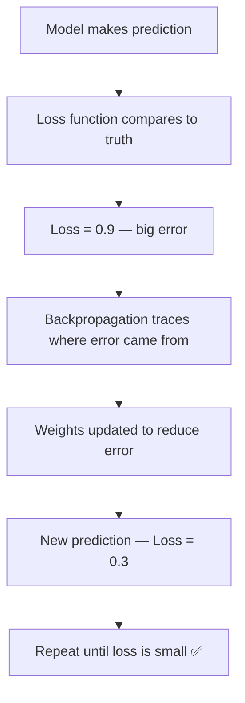

# Loss Functions — Theory

Your GPS makes small corrections for a small wrong turn, and urgent corrections when you're going the wrong direction entirely. The size of the correction depends on how wrong you are.

👉 This is why we need **loss functions** — they measure exactly how wrong the model's predictions are so the network knows how strongly to correct itself.

---

## 📌 Learning Priority

**Must Learn** — core concepts, needed to understand the rest of this file:
[What is a Loss Function](#what-is-a-loss-function) · [Classification Loss](#classification-loss-picking-a-category) · [How Loss Guides Training](#how-loss-guides-training)

**Should Learn** — important for real projects and interviews:
[Regression Loss](#regression-loss-predicting-a-number) · [Choosing the Right Loss](#choosing-the-right-loss)

---

## What is a Loss Function?

A loss function takes the model's prediction and the correct answer, then outputs a single number: **the loss**. Higher = more wrong. During training, the goal is to minimize it.

---

## The Two Main Families

### Regression Loss (predicting a number)

**MSE — Mean Squared Error**

```
MSE = (1/n) × Σ (predicted - actual)²
```

Squaring makes all errors positive and punishes large errors disproportionately:
- Error of 10 → penalty 100
- Error of 2 → penalty 4

**Example:**
- Predicted: 80, Actual: 75 → error = 5, squared = 25
- Predicted: 60, Actual: 75 → error = −15, squared = 225

**Use for:** House prices, temperatures, any continuous output.

---

### Classification Loss (picking a category)

**Binary Cross-Entropy (Log Loss)**

```
BCE = -( y × log(p) + (1-y) × log(1-p) )
```

Where y is the true label (0 or 1) and p is the predicted probability. If the true label is 1 and you predicted 0.99 → tiny loss. Predicted 0.01 → massive loss (log(0.01) is a large negative number).

**Use for:** Binary classification — spam/not spam, cancer/no cancer.

---

**Categorical Cross-Entropy**

```
CE = -Σ y_i × log(p_i)
```

For multiple classes. Only the true class contributes (all other y_i = 0), simplifying to `-log(probability assigned to correct class)`. Model 90% confident in right answer → small loss. 10% confident → large loss.

**Use for:** Multi-class classification — image recognition, language models.

---

## How Loss Guides Training



---

## Choosing the Right Loss

The loss function is determined by your task — it is not a free hyperparameter.

| Task | Loss Function |
|------|--------------|
| Regression | MSE or MAE |
| Binary classification | Binary Cross-Entropy |
| Multi-class classification | Categorical Cross-Entropy |
| Imbalanced classification | Focal Loss |

Getting this wrong causes silent failure — the model trains but never converges well.

---

✅ **What you just learned:** Loss functions quantify how wrong a model is — MSE penalizes large regression errors heavily, and cross-entropy heavily penalizes confident wrong predictions in classification.

🔨 **Build this now:** Manually compute MSE for (5, 3), (10, 10), (2, 8). Which pair contributed the most to total loss? Answer: (2, 8) — error of 6, squared to 36.

➡️ **Next step:** Forward Propagation — `./05_Forward_Propagation/Theory.md`

---

## 📂 Navigation

**In this folder:**
| File | |
|---|---|
| 📄 **Theory.md** | ← you are here |
| [📄 Cheatsheet.md](./Cheatsheet.md) | Quick reference |
| [📄 Interview_QA.md](./Interview_QA.md) | Interview prep |
| [📄 Comparison.md](./Comparison.md) | Loss functions comparison |

⬅️ **Prev:** [03 Activation Functions](../03_Activation_Functions/Theory.md) &nbsp;&nbsp;&nbsp; ➡️ **Next:** [05 Forward Propagation](../05_Forward_Propagation/Theory.md)
