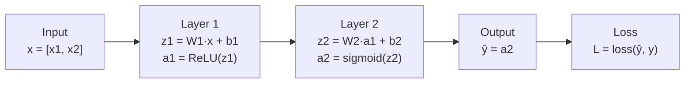

# Forward Propagation — Theory

A car factory assembly line: raw parts enter, each station transforms them — frame, engine, paint, wheels — until a finished car rolls out. Each station brings the work-in-progress closer to the final product.

👉 This is why we need **forward propagation** — raw input data is transformed layer by layer until a prediction rolls out the other end.

---

## What is Forward Propagation?

Forward propagation (or "forward pass") is the process of passing data through the network from input to output. Every prediction the network makes is a forward pass. Data moves in one direction: forward through the layers.

---

## What Happens at Each Layer?

**Step 1 — Linear transformation:**
```
z = W × input + b
```
Multiply inputs by the weight matrix, add bias.

**Step 2 — Activation:**
```
a = activation(z)
```
Pass z through an activation function. The output `a` becomes the input for the next layer.

---

## The Flow



The loss is computed at the end. Backpropagation takes over from there.

---

## Matrix Multiplication Intuition

Each layer processes all neurons simultaneously via matrix multiplication. Every neuron has different weights, so each gets a different answer from the same input vector:

```
Input x:    [x1, x2, x3]

Weight matrix W (one row per neuron):
    [w11, w12, w13]   ← neuron 1's weights
    [w21, w22, w23]   ← neuron 2's weights

z = W × x + b:
    z1 = w11×x1 + w12×x2 + w13×x3 + b1
    z2 = w21×x1 + w22×x2 + w23×x3 + b2
```

One matrix multiply. Both neurons computed at once.

---

## What Does Each Layer Learn?

| Layer | What it tends to detect |
|-------|------------------------|
| Layer 1 | Simple features: edges, specific words, raw patterns |
| Layer 2 | Combinations: corners, phrases, compound patterns |
| Layer 3+ | Abstract concepts: faces, sentences, semantic meaning |

---

## No Learning During Forward Prop

Forward propagation is pure computation — no weights change. Learning only happens during **backpropagation** (topic 06), which uses the loss to figure out how to update weights.

- Forward prop answers: "What does the network currently predict?"
- Backprop answers: "How should we change weights to predict better?"

---

✅ **What you just learned:** Forward propagation flows data from input to output through layers, each applying a linear transformation (weights + bias) then a non-linear activation — producing the network's prediction.

🔨 **Build this now:** Do a tiny forward pass by hand. Network: 2 inputs [1, 2], one hidden layer with 2 neurons, W=[[0.5, 0.3],[0.2, 0.8]], b=[0, 0]. Compute z = W × [1,2] + b, then apply ReLU.

➡️ **Next step:** Backpropagation — `./06_Backpropagation/Theory.md`

---

## 📂 Navigation

**In this folder:**
| File | |
|---|---|
| 📄 **Theory.md** | ← you are here |
| [📄 Cheatsheet.md](./Cheatsheet.md) | Quick reference |
| [📄 Interview_QA.md](./Interview_QA.md) | Interview prep |
| [📄 Math_Walkthrough.md](./Math_Walkthrough.md) | Step-by-step math walkthrough |

⬅️ **Prev:** [04 Loss Functions](../04_Loss_Functions/Theory.md) &nbsp;&nbsp;&nbsp; ➡️ **Next:** [06 Backpropagation](../06_Backpropagation/Theory.md)
