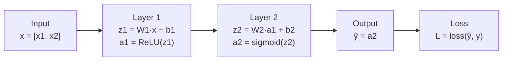

# Forward Propagation — Theory

Picture a car factory assembly line. Raw metal and parts come in one end. At station 1, the frame is assembled. At station 2, the engine is installed. At station 3, the body is painted. At station 4, the wheels are fitted. A finished car rolls out the other end. Each station transforms the work-in-progress into something closer to the final product.

👉 This is why we need **forward propagation** — it is the assembly line of a neural network, where raw input data is transformed layer by layer until a prediction rolls out the other end.

---

## What is Forward Propagation?

Forward propagation (or "forward pass") is the process of passing data through the network from input to output. Every time the network makes a prediction, it does a forward pass.

It is called "forward" because data moves in one direction — forward through the layers — from input to output.

---

## What Happens at Each Layer?

Two things happen at every layer:

**Step 1 — Linear transformation:**
```
z = W × input + b
```
Multiply the inputs by the weight matrix, add the bias. This is a weighted sum.

**Step 2 — Activation:**
```
a = activation(z)
```
Pass z through an activation function. This adds non-linearity.

The output `a` becomes the input for the next layer.

---

## The Flow



The loss is computed at the end. Then backpropagation takes over from there.

---

## Matrix Multiplication Intuition

At each layer, we do not process one neuron at a time. We do them all at once using matrix multiplication.

Think of it as asking every neuron in the layer a question simultaneously: "What is your weighted sum of the inputs?" Each neuron has different weights, so each gets a different answer. The result is a vector of answers — one per neuron.

```
Input x is a vector:    [x1, x2, x3]

Weight matrix W has one row per neuron:
    [w11, w12, w13]   ← neuron 1's weights
    [w21, w22, w23]   ← neuron 2's weights

z = W × x + b:
    z1 = w11×x1 + w12×x2 + w13×x3 + b1
    z2 = w21×x1 + w22×x2 + w23×x3 + b2
```

One matrix multiply. Both neurons computed at once. Efficient.

---

## What Does Each Layer Learn?

Layers are not equal. They learn different levels of abstraction:

| Layer | What it tends to detect |
|-------|------------------------|
| Layer 1 | Simple features: edges, specific words, raw patterns |
| Layer 2 | Combinations: corners, phrases, compound patterns |
| Layer 3+ | Abstract concepts: faces, sentences, semantic meaning |

The deeper the layer, the more abstract the representation it builds.

---

## No Learning Happens During Forward Prop

This is important. Forward propagation is just computation — no weights change. You are just running numbers through a formula.

Learning only happens during **backpropagation** (topic 06), which uses the loss computed at the end of the forward pass to figure out how to update the weights.

Forward prop answers: "What does the network currently predict?"
Backprop answers: "How should we change the weights to predict better?"

---

✅ **What you just learned:** Forward propagation is the process of data flowing from input to output through layers, where each layer applies a linear transformation (weights + bias) followed by a non-linear activation function — producing the network's prediction.

🔨 **Build this now:** Do a tiny forward pass by hand. Network: 2 inputs [1, 2], one hidden layer with 2 neurons, weights W=[[0.5, 0.3],[0.2, 0.8]], bias b=[0, 0]. Compute z = W × [1,2] + b, then apply ReLU. What does the hidden layer output?

➡️ **Next step:** Backpropagation — `./06_Backpropagation/Theory.md`

---

## 📂 Navigation

**In this folder:**
| File | |
|---|---|
| 📄 **Theory.md** | ← you are here |
| [📄 Cheatsheet.md](./Cheatsheet.md) | Quick reference |
| [📄 Interview_QA.md](./Interview_QA.md) | Interview prep |
| [📄 Math_Walkthrough.md](./Math_Walkthrough.md) | Step-by-step math walkthrough |

⬅️ **Prev:** [04 Loss Functions](../04_Loss_Functions/Theory.md) &nbsp;&nbsp;&nbsp; ➡️ **Next:** [06 Backpropagation](../06_Backpropagation/Theory.md)
