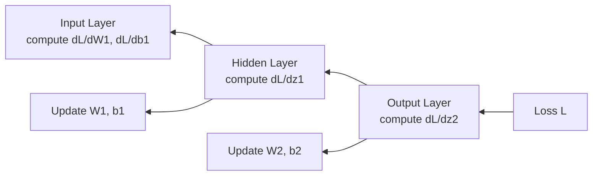
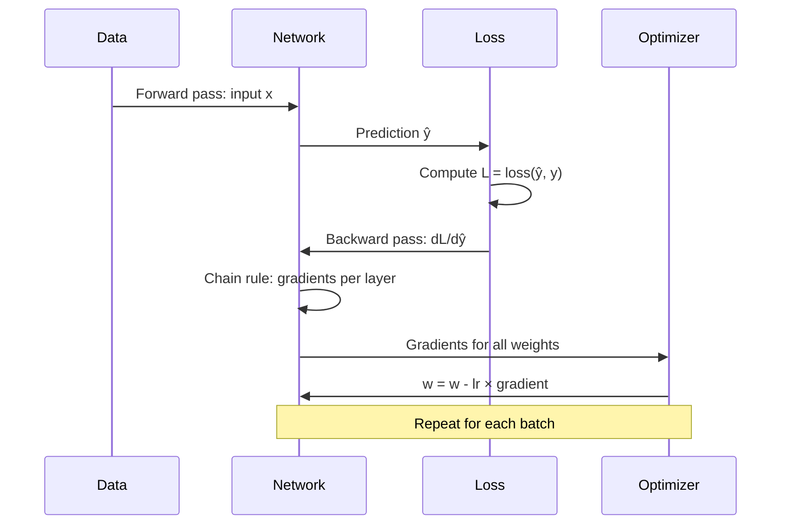

# Backpropagation — Theory

A relay race team finishes last. The coach reviews the video: runner 3 dropped the baton (−8 seconds), runner 1 had a slow start (−2 seconds), runner 2 was fine. Each runner gets feedback proportional to how much they caused the loss.

👉 This is why we need **backpropagation** — it distributes blame proportionally backward through the network so each weight is updated by exactly how much it contributed to the error.

---

## 📌 Learning Priority

**Must Learn** — core concepts, needed to understand the rest of this file:
[What is Backpropagation](#what-is-backpropagation) · [The Chain Rule](#the-chain-rule-intuition-only) · [Weight Update Rule](#weight-update-rule-gradient-descent)

**Should Learn** — important for real projects and interviews:
[The Flow](#the-flow) · [Why This Made Training Possible](#why-this-made-training-possible)

**Good to Know** — useful in specific situations, not needed daily:
[What Can Go Wrong](#what-can-go-wrong)

---

## What is Backpropagation?

After a forward pass produces a prediction and a loss, backpropagation:
1. Starts at the loss
2. Works backward through the network layer by layer
3. Calculates how much each weight contributed to the error
4. Updates each weight to reduce that error

---

## The Chain Rule (intuition only)

Backprop relies on the **chain rule** from calculus. To find "how does loss change if I tweak weight w1?" — w1 affects z1, which affects a1, which affects z2, which affects the output, which affects the loss.

The chain rule multiplies these smaller questions together:
```
dL/dw1 = (dL/d_output) × (d_output/d_z2) × (d_z2/d_a1) × (d_a1/d_z1) × (d_z1/d_w1)
```

Each factor is a small, easy-to-compute derivative. Multiply them all = exact gradient for w1.

---

## The Flow



Error flows backward; each layer computes its gradient and passes the signal further back.

---

## Weight Update Rule (Gradient Descent)

```
w_new = w_old - learning_rate × gradient
```

- Positive gradient → weight was making loss bigger → decrease it
- Negative gradient → weight was making loss smaller → increase it
- Learning rate controls step size

---

## Why This Made Training Possible

Before backpropagation (1986, Rumelhart, Hinton, Williams), training networks with hidden layers was infeasible — randomly nudging millions of weights hoping for improvement was not viable. Backpropagation computes the gradient of every weight in one backward pass at the same cost as a single forward pass.



---

## What Can Go Wrong

**Vanishing gradients:** Sigmoid/tanh derivatives become tiny at extremes. Multiplying many tiny numbers → gradient ≈ 0 at early layers. Fix: ReLU, batch normalization, residual connections.

**Exploding gradients:** Large weights cause gradients to multiply to huge numbers; weights jump wildly. Fix: gradient clipping, careful weight initialization.

---

✅ **What you just learned:** Backpropagation uses the chain rule to compute how much each weight contributed to the error, then updates every weight to reduce the loss — this is the mechanism by which neural networks learn.

🔨 **Build this now:** From topic 05 forward pass: prediction = 0.660, true label = 1. BCE gradient w.r.t. prediction = ŷ − y = 0.660 − 1 = −0.340. This negative value means "increase the prediction." That's the first step of backprop.

➡️ **Next step:** Optimizers — `./07_Optimizers/Theory.md`

---

## 🛠️ Practice Project

Apply what you just learned → **[B3: Neural Net from Scratch](../../22_Capstone_Projects/03_Neural_Net_from_Scratch/03_GUIDE.md)**
> This project uses: implementing backpropagation from scratch in numpy — computing gradients and updating weights manually


---

## 📝 Practice Questions

- 📝 [Q21 · backpropagation](../../ai_practice_questions_100.md#q21--normal--backpropagation)


---

## 📂 Navigation

**In this folder:**
| File | |
|---|---|
| 📄 **Theory.md** | ← you are here |
| [📄 Cheatsheet.md](./Cheatsheet.md) | Quick reference |
| [📄 Interview_QA.md](./Interview_QA.md) | Interview prep |
| [📄 Math_Walkthrough.md](./Math_Walkthrough.md) | Step-by-step math walkthrough |

⬅️ **Prev:** [05 Forward Propagation](../05_Forward_Propagation/Theory.md) &nbsp;&nbsp;&nbsp; ➡️ **Next:** [07 Optimizers](../07_Optimizers/Theory.md)
