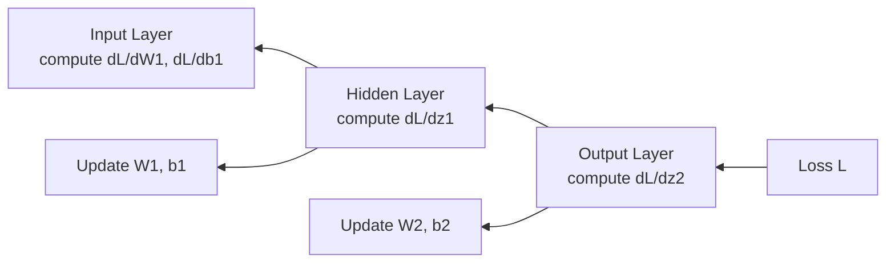

# Backpropagation — Theory

A relay race team finishes last. The coach is furious. But she does not yell at everyone equally. She reviews the video. Runner 3 dropped the baton — that cost 8 seconds. Runner 1 had a slow start — that cost 2 seconds. Runner 2 was fine. Each runner gets feedback proportional to how much they were responsible for the loss. The runner who dropped the baton gets most of the coaching attention.

👉 This is why we need **backpropagation** — it distributes blame proportionally backward through the network so each weight gets updated by exactly how much it contributed to the error.

---

## What is Backpropagation?

Backpropagation (short for "backward propagation of errors") is the algorithm that trains neural networks.

After a forward pass produces a prediction and a loss, backpropagation:
1. Starts at the loss
2. Works backward through the network layer by layer
3. Calculates how much each weight contributed to the error
4. Updates each weight to reduce that error

It is the answer to: "which knobs do I turn, and by how much?"

---

## The Chain Rule (no scary math, just intuition)

Backprop relies on the **chain rule** from calculus. Here is the intuition.

Say you want to know "how does the loss change if I tweak weight w1?" But w1 affects z1, which affects a1, which affects z2, which affects the output, which affects the loss.

The chain rule lets you multiply these smaller questions together:
```
dL/dw1 = (dL/d_output) × (d_output/d_z2) × (d_z2/d_a1) × (d_a1/d_z1) × (d_z1/d_w1)
```

Each factor is a small, easy-to-compute derivative. Multiply them all = you know exactly how the loss changes with w1.

---

## The Flow



Error flows backward. Each layer computes its own gradient and passes the signal further back.

---

## Weight Update Rule (Gradient Descent)

Once we know the gradient for each weight, we update it:

```
w_new = w_old - learning_rate × gradient
```

If the gradient is positive: the weight was making the loss bigger. We decrease it.
If the gradient is negative: the weight was making the loss smaller. We increase it.
The learning rate controls how big each step is.

---

## Why This Makes Training Possible

Before backpropagation was popularized (1986, Rumelhart, Hinton, Williams), nobody knew how to efficiently train networks with hidden layers. You could not just randomly nudge weights hoping to get lucky — there are millions of weights.

Backpropagation made it possible to compute the gradient of every weight in one backward pass. That is the same cost as a single forward pass. Suddenly training deep networks became computationally feasible.

---

## What Can Go Wrong

**Vanishing gradients:** If activation functions (like sigmoid) squash values heavily, their derivatives become tiny. Multiplying many tiny numbers = gradient that is essentially 0 at early layers. Early layers stop learning. Fix: use ReLU, batch normalization, residual connections.

**Exploding gradients:** If weights are large, gradients can multiply to astronomically large numbers. Weights jump wildly, loss blows up. Fix: gradient clipping, careful weight initialization.

---

✅ **What you just learned:** Backpropagation uses the chain rule to compute how much each weight contributed to the error, then updates every weight to reduce the loss — this is the mechanism by which neural networks learn.

🔨 **Build this now:** Take the forward pass result from topic 05 (loss = 0.415, prediction = 0.660, true label = 1). The gradient of BCE loss with respect to the prediction is `ŷ - y = 0.660 - 1 = -0.340`. This negative value means: "increase the prediction." That is the first step of backprop.

➡️ **Next step:** Optimizers — `./07_Optimizers/Theory.md`

---

## 📂 Navigation

**In this folder:**
| File | |
|---|---|
| 📄 **Theory.md** | ← you are here |
| [📄 Cheatsheet.md](./Cheatsheet.md) | Quick reference |
| [📄 Interview_QA.md](./Interview_QA.md) | Interview prep |
| [📄 Math_Walkthrough.md](./Math_Walkthrough.md) | Step-by-step math walkthrough |

⬅️ **Prev:** [05 Forward Propagation](../05_Forward_Propagation/Theory.md) &nbsp;&nbsp;&nbsp; ➡️ **Next:** [07 Optimizers](../07_Optimizers/Theory.md)
