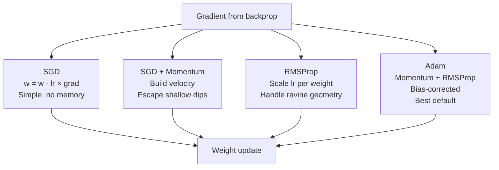
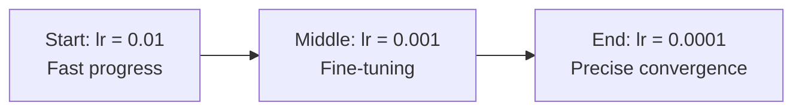

# Optimizers — Theory

Three hikers try to reach the valley bottom. The first takes tiny careful steps — never overshoots but gets stuck in shallow dips. The second builds momentum — rolls faster, escapes dips, reaches the bottom sooner. The third has a GPS that adapts step size per dimension — efficient without overshooting.

👉 This is why we need **optimizers** — they decide how to update weights, and the right one makes training dramatically faster.

---

## 📌 Learning Priority

**Must Learn** — core concepts, needed to understand the rest of this file:
[What is an Optimizer](#what-is-an-optimizer) · [Adam](#adam-adaptive-moment-estimation) · [SGD](#sgd----stochastic-gradient-descent)

**Should Learn** — important for real projects and interviews:
[SGD + Momentum](#sgd--momentum) · [Learning Rate Scheduling](#learning-rate-scheduling)

**Good to Know** — useful in specific situations, not needed daily:
[RMSProp](#rmsprop)

---

## What is an Optimizer?

An optimizer uses gradients from backpropagation to update weights. The basic rule: `w = w - lr × gradient`. Different optimizers do more sophisticated things with that gradient to converge faster and more reliably.

---

## SGD — Stochastic Gradient Descent

```
w = w - lr × gradient
```

The simplest optimizer. Uses a random mini-batch gradient each update — noisy but fast. Noise can help escape local minima.

**Problem:** Slow to converge, sensitive to learning rate, can get stuck at saddle points.

---

## SGD + Momentum

```
velocity = beta × velocity + (1 - beta) × gradient
w = w - lr × velocity
```

Adds a velocity term — like a ball building speed downhill. Escapes shallow dips and converges faster. **Beta** (typically 0.9) controls how much previous velocity to retain. In noisy dimensions, velocities cancel; in consistent directions, they build up.

---

## RMSProp

```
v = beta × v + (1 - beta) × gradient²
w = w - (lr / sqrt(v + epsilon)) × gradient
```

Adapts the learning rate per weight: large recent gradients → smaller step; small gradients → larger step. Useful in ravine-shaped loss landscapes where one dimension is steep and another is gentle.

**Good for:** RNNs and non-stationary problems.

---

## Adam (Adaptive Moment Estimation)

```
m = beta1 × m + (1 - beta1) × gradient        ← momentum
v = beta2 × v + (1 - beta2) × gradient²       ← RMSProp
m_hat = m / (1 - beta1^t)                      ← bias correction
v_hat = v / (1 - beta2^t)                      ← bias correction
w = w - lr × m_hat / (sqrt(v_hat) + epsilon)
```

Combines momentum and RMSProp. Adaptive learning rates per weight plus momentum. Works well out of the box on almost any problem.

**Default settings:** beta1=0.9, beta2=0.999, epsilon=1e-8, lr=0.001



---

## Learning Rate Scheduling

Start with a higher learning rate for fast initial progress, then reduce it for fine-tuning.



**Common schedules:**
- **Step decay:** Reduce by a factor every N epochs
- **Cosine annealing:** Smooth reduction following a cosine curve
- **Warm-up + decay:** Start tiny, increase, then decrease (common in transformers)

---

✅ **What you just learned:** Optimizers use gradients to update weights — SGD is the simplest, momentum adds speed, RMSProp adapts per-weight learning rates, and Adam combines both for the best default performance.

🔨 **Build this now:** Draw a U-shaped valley. Sketch how SGD takes tiny equal steps. Sketch how momentum overshoots slightly on first pass. Now imagine the valley is very narrow in one direction — that's where RMSProp helps.

➡️ **Next step:** Regularization — `./08_Regularization/Theory.md`


---

## 📝 Practice Questions

- 📝 [Q22 · optimizers](../../ai_practice_questions_100.md#q22--design--optimizers)


---

## 📂 Navigation

**In this folder:**
| File | |
|---|---|
| 📄 **Theory.md** | ← you are here |
| [📄 Cheatsheet.md](./Cheatsheet.md) | Quick reference |
| [📄 Interview_QA.md](./Interview_QA.md) | Interview prep |
| [📄 Comparison.md](./Comparison.md) | Optimizers comparison (SGD, Adam, RMSProp) |

⬅️ **Prev:** [06 Backpropagation](../06_Backpropagation/Theory.md) &nbsp;&nbsp;&nbsp; ➡️ **Next:** [08 Regularization](../08_Regularization/Theory.md)
