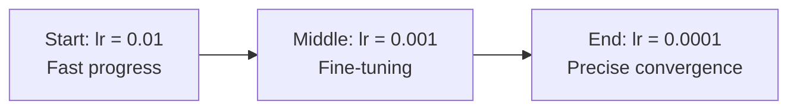

# Optimizers — Theory

Three hikers are all trying to reach the lowest point in the valley. They start at the same hilltop and want to reach the bottom.

The first hiker takes tiny, careful steps in the direction of the steepest downhill. She never overshoots, but she is agonizingly slow and sometimes gets stuck in a small dip that is not the true bottom.

The second hiker builds up momentum — rolling downhill faster and faster. He can overshoot the bottom slightly, but he escapes shallow dips and reaches the true bottom much faster.

The third hiker has a smart GPS that analyzes the terrain as she goes. On steep slopes, she shortens her step. On flat areas, she lengthens it. She adapts to each dimension of the terrain independently. She reaches the bottom efficiently without overshooting.

👉 This is why we need **optimizers** — they are the strategies that decide how to update weights, and the right one makes training dramatically faster.

---

## What is an Optimizer?

An optimizer uses the gradients computed by backpropagation to update weights.

The basic rule is: `w = w - lr × gradient`

But different optimizers do more sophisticated things with that gradient to converge faster and more reliably.

---

## SGD — Stochastic Gradient Descent

```
w = w - lr × gradient
```

The simplest optimizer. Uses the gradient from a mini-batch to update weights.

**"Stochastic"** means we use a random batch of data, not the whole dataset. This makes each update noisy, but fast. Noise can actually help escape local minima.

**Problem:** Can be slow to converge. Very sensitive to learning rate. Can get stuck in saddle points.

**Good for:** Simple problems, when you have a well-tuned learning rate, and when you want the most control.

---

## SGD + Momentum

```
velocity = beta × velocity + (1 - beta) × gradient
w = w - lr × velocity
```

Adds a "velocity" term. Like a ball rolling downhill — it builds up speed in the dominant direction. This helps the optimizer roll through small dips (shallow local minima) and converge faster.

**Beta** (typically 0.9) controls how much of the previous velocity to keep.

**Why it works:** In one dimension, if gradients consistently point in the same direction, velocity builds up. In a noisy dimension where gradients flip-flop, velocities cancel out, dampening oscillations.

---

## RMSProp

```
v = beta × v + (1 - beta) × gradient²
w = w - (lr / sqrt(v + epsilon)) × gradient
```

Adapts the learning rate for each weight independently. Weights with large recent gradients get a smaller effective learning rate. Weights with small gradients get a larger one.

**Why it works:** Imagine a ravine — steep sides, gentle slope along the bottom. Standard SGD oscillates wildly across the ravine. RMSProp damps the steep dimension and accelerates the shallow one.

**Good for:** RNNs and non-stationary problems where gradient magnitudes vary a lot.

---

## Adam (Adaptive Moment Estimation)

```
m = beta1 × m + (1 - beta1) × gradient        ← momentum
v = beta2 × v + (1 - beta2) × gradient²       ← RMSProp
m_hat = m / (1 - beta1^t)                      ← bias correction
v_hat = v / (1 - beta2^t)                      ← bias correction
w = w - lr × m_hat / (sqrt(v_hat) + epsilon)
```

Adam combines the best of momentum and RMSProp. It tracks both a running average of gradients (momentum) and a running average of squared gradients (RMSProp). The result is adaptive learning rates per weight, plus momentum.

**Default settings:** beta1=0.9, beta2=0.999, epsilon=1e-8, lr=0.001

**Why it is the default choice:** Works well out of the box on almost any problem. Not very sensitive to learning rate choice.

---

## Learning Rate Scheduling

Even the best optimizer struggles without the right learning rate. A common strategy: start with a higher learning rate (fast initial progress), then reduce it over time (fine-tune near the minimum).



**Common schedules:**
- **Step decay:** Reduce by a factor every N epochs
- **Cosine annealing:** Smooth reduction following a cosine curve
- **Warm-up + decay:** Start tiny, increase, then decrease (common in transformers)

---

✅ **What you just learned:** Optimizers use gradients to update weights — SGD is the simplest, momentum adds speed, RMSProp adapts per-weight learning rates, and Adam combines both for the best default performance.

🔨 **Build this now:** Think about the valley analogy. Draw a U-shaped valley on paper. Mark a starting point on one side. Sketch how SGD would take tiny equal steps. Sketch how momentum would overshoot the bottom slightly on first pass. Now imagine the valley is very narrow in one direction — that is where RMSProp helps.

➡️ **Next step:** Regularization — `./08_Regularization/Theory.md`

---

## 📂 Navigation

**In this folder:**
| File | |
|---|---|
| 📄 **Theory.md** | ← you are here |
| [📄 Cheatsheet.md](./Cheatsheet.md) | Quick reference |
| [📄 Interview_QA.md](./Interview_QA.md) | Interview prep |
| [📄 Comparison.md](./Comparison.md) | Optimizers comparison (SGD, Adam, RMSProp) |

⬅️ **Prev:** [06 Backpropagation](../06_Backpropagation/Theory.md) &nbsp;&nbsp;&nbsp; ➡️ **Next:** [08 Regularization](../08_Regularization/Theory.md)
