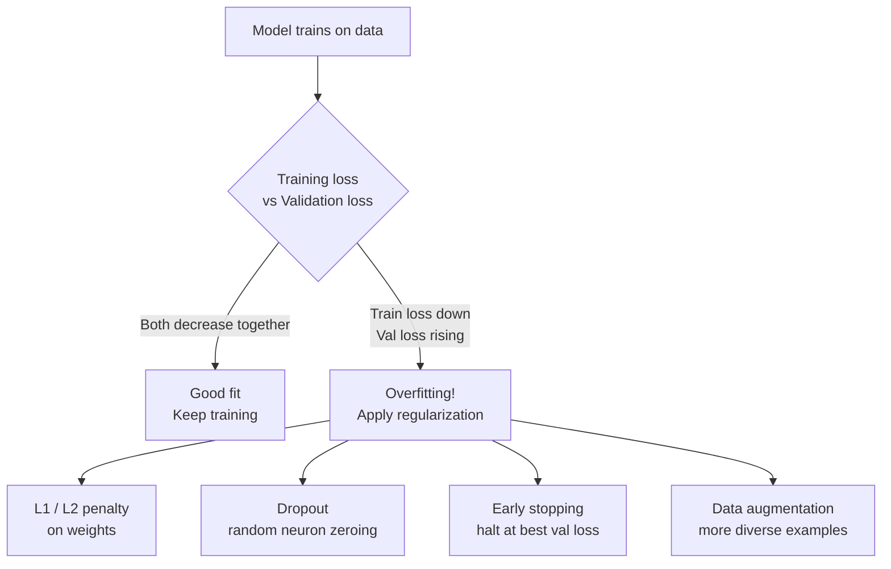
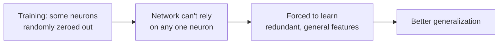

# Regularization — Theory

A student memorizes last year's sample test word for word. Perfect score on practice — fails the real exam. She memorized instead of learned.

👉 This is why we need **regularization** — it forces the model to learn general patterns instead of memorizing training examples.

---

## What is Overfitting?

Overfitting: model performs well on training data but fails on new data. It has memorized the training set — including its noise — instead of the underlying pattern.

Signs: training loss is low, validation loss is high and rising.



---

## L2 Regularization (Ridge)

```
New loss = original loss + λ × Σ(w²)
```

Adds sum of squared weights to the loss, penalizing large weights. Pushes all weights toward zero (but not exactly). Forces the model to spread attention across more features → smoother decision boundaries.

**Lambda (λ):** Controls strength. 0 = no regularization; too large = underfitting.

---

## L1 Regularization (Lasso)

```
New loss = original loss + λ × Σ|w|
```

Unlike L2, L1 can push weights to **exactly zero** (**sparsity**) — effectively removing features. Use L1 when you believe many features are irrelevant and want automatic feature selection.

---

## Dropout

During each forward pass, randomly zero some fraction of neurons.

**Why it works:** No single neuron can be relied upon, so the network can't memorize via specific pathways. Every neuron must be independently useful — creating an ensemble effect.

**At test time:** Dropout is off. All neurons active; weights scaled accordingly.



---

## Early Stopping

Monitor validation loss. When it stops improving (or worsens), stop training and save those weights.

```
Epoch 30: val_loss = 0.35
Epoch 40: val_loss = 0.36  ← getting worse! Stop here.
```

**Free regularization** — no extra computation, just good monitoring.

---

## Data Augmentation

Create new training examples by transforming existing ones:
- **Images:** flip, rotate, crop, adjust brightness, add noise
- **Text:** synonym replacement, back-translation, random word dropout
- **Audio:** time stretching, pitch shifting, background noise

The model can't memorize exact examples if it sees slightly different versions each time.

---

## Batch Normalization

Normalizes activations within each mini-batch to mean 0 and std 1. Primarily a training stability technique, but the noise introduced by normalizing over mini-batches also has a mild regularizing effect.

---

✅ **What you just learned:** Regularization prevents memorization by penalizing complexity (L1/L2), randomly disabling neurons (Dropout), stopping at the right time (Early Stopping), or expanding the dataset (Data Augmentation).

🔨 **Build this now:** Match each analogy: (a) studying from multiple textbooks → Data Augmentation. (b) covering some notes during each study session → Dropout. (c) stopping before over-memorizing → Early Stopping.

➡️ **Next step:** CNNs — `./09_CNNs/Theory.md`

---

## 📂 Navigation

**In this folder:**
| File | |
|---|---|
| 📄 **Theory.md** | ← you are here |
| [📄 Cheatsheet.md](./Cheatsheet.md) | Quick reference |
| [📄 Interview_QA.md](./Interview_QA.md) | Interview prep |

⬅️ **Prev:** [07 Optimizers](../07_Optimizers/Theory.md) &nbsp;&nbsp;&nbsp; ➡️ **Next:** [09 CNNs](../09_CNNs/Theory.md)
