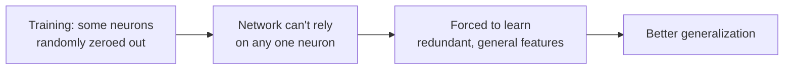

# Regularization — Theory

A student is preparing for a big exam. She gets hold of last year's sample test. She studies only those exact questions. She memorizes every answer word for word. On the practice test — perfect score. On the real exam — fails badly. The questions were different. She memorized instead of learned.

👉 This is why we need **regularization** — it forces the model to learn general patterns from the data instead of memorizing the training examples.

---

## What is Overfitting?

Overfitting happens when a model performs great on training data but fails on new, unseen data.

The model has memorized the training set — including its noise and quirks — instead of learning the underlying pattern.

Signs: training loss is low, validation loss is high and keeps growing.

---

## L2 Regularization (Ridge)

```
New loss = original loss + λ × Σ(w²)
```

Adds the sum of squared weights to the loss. This penalizes large weights.

**Why it works:** Large weights mean the model is relying heavily on specific features. L2 pushes all weights toward zero (but not exactly to zero). The model is forced to spread its attention across more features, making it more robust.

**Effect:** Smaller, more distributed weights. Smoother decision boundaries. Less overfitting.

**Lambda (λ):** Controls strength. 0 = no regularization. Too large = underfitting.

---

## L1 Regularization (Lasso)

```
New loss = original loss + λ × Σ|w|
```

Adds the sum of absolute weights to the loss.

**Key difference from L2:** L1 can push weights all the way to exactly zero. This is called **sparsity** — some weights become exactly 0, meaning those features are completely ignored.

**When to use L1:** When you believe many features are irrelevant and want automatic feature selection.

---

## Dropout

During each forward pass, randomly set some fraction of neurons to zero.

```
With 50% dropout: each neuron has a 50% chance of being zeroed out
```

**Why it works:** No single neuron can be relied upon. The network cannot memorize by forming specific pathways. Every neuron must learn to be useful independently. This creates an ensemble effect — the network learns to make predictions with different subsets of neurons active.

**At test time:** Dropout is turned off. All neurons are active. Weights are scaled accordingly.



---

## Early Stopping

Monitor validation loss during training. When it stops improving (or starts getting worse), stop training.

```
Epoch 10: val_loss = 0.45
Epoch 20: val_loss = 0.38
Epoch 30: val_loss = 0.35
Epoch 40: val_loss = 0.36  ← getting worse! Stop here.
```

The model was overfitting after epoch 30. Early stopping saves the weights from epoch 30.

**This is free regularization** — no extra computation, just good monitoring.

---

## Data Augmentation

Artificially create new training examples by transforming existing ones.

- **Images:** flip, rotate, crop, adjust brightness, zoom, add noise
- **Text:** synonym replacement, back-translation, random word dropout
- **Audio:** time stretching, pitch shifting, background noise

**Why it works:** The model sees slightly different versions of the same image. It cannot memorize "flip the exact pixel pattern." It must learn what a cat looks like from any angle, in any lighting.

---

## Batch Normalization

Normalize the activations within each mini-batch so they have mean 0 and standard deviation 1.

This is primarily a training stability technique, but it also has a regularizing effect — the noise introduced by normalizing over mini-batches acts similarly to dropout.

---

✅ **What you just learned:** Regularization prevents models from memorizing training data by penalizing complexity (L1/L2), randomly disabling neurons (Dropout), stopping training at the right time (Early Stopping), or expanding the dataset (Data Augmentation).

🔨 **Build this now:** Think of a model overfitting as a student memorizing answers. Which regularization technique is like: (a) making the student study from multiple different textbooks — Data Augmentation. (b) covering some of the student's notes during each study session — Dropout. (c) stopping the study session before they start over-memorizing — Early Stopping.

➡️ **Next step:** CNNs — `./09_CNNs/Theory.md`

---

## 📂 Navigation

**In this folder:**
| File | |
|---|---|
| 📄 **Theory.md** | ← you are here |
| [📄 Cheatsheet.md](./Cheatsheet.md) | Quick reference |
| [📄 Interview_QA.md](./Interview_QA.md) | Interview prep |

⬅️ **Prev:** [07 Optimizers](../07_Optimizers/Theory.md) &nbsp;&nbsp;&nbsp; ➡️ **Next:** [09 CNNs](../09_CNNs/Theory.md)
