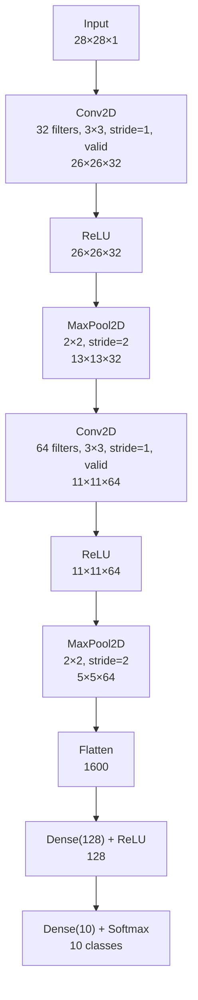

# CNNs — Architecture Deep Dive

## The Standard CNN Pipeline

We trace a 28×28 grayscale image (like MNIST) through a simple CNN step by step, tracking how dimensions change at each layer.



---

## Layer-by-Layer Breakdown

### Layer 1: Conv2D(32 filters, 3×3, valid padding)

**Input:** 28 × 28 × 1 (width × height × channels)

**What happens:** 32 different 3×3 filters each slide across the 28×28 image. Each filter computes one dot product per position. No padding → output shrinks by 2 in each dimension.

```
Output width  = (28 - 3) / 1 + 1 = 26
Output height = (28 - 3) / 1 + 1 = 26
Output depth  = 32 (one feature map per filter)
```

**Output:** 26 × 26 × 32

**Parameters:** 3 × 3 × 1 × 32 + 32 = 288 + 32 = **320 parameters**

Each filter detects a different low-level pattern: edges, dots, curves.

---

### Layer 2: ReLU

**Input:** 26 × 26 × 32
**Output:** 26 × 26 × 32 (same shape, values clipped at 0)

No parameters. Just applies `max(0, x)` element-wise. Negatives become 0.

---

### Layer 3: MaxPool2D(2×2)

**Input:** 26 × 26 × 32

**What happens:** The feature map is divided into 2×2 non-overlapping blocks. The maximum value in each block is kept.

```
Output width  = 26 / 2 = 13
Output height = 26 / 2 = 13
Output depth  = 32 (unchanged — pooling is spatial, not along depth)
```

**Output:** 13 × 13 × 32

**Parameters:** 0 (no learnable parameters)

**Effect:** Reduces spatial resolution by half. Provides slight translation invariance.

---

### Layer 4: Conv2D(64 filters, 3×3, valid)

**Input:** 13 × 13 × 32

**What happens:** 64 filters, each 3×3×32 (the depth must match the input depth), slide over the 13×13 spatial maps.

```
Output width  = (13 - 3) / 1 + 1 = 11
Output height = (13 - 3) / 1 + 1 = 11
Output depth  = 64
```

**Output:** 11 × 11 × 64

**Parameters:** 3 × 3 × 32 × 64 + 64 = 18,432 + 64 = **18,496 parameters**

Each filter now has access to all 32 feature maps from the previous layer — it can detect patterns that span multiple earlier features (combinations of edges = curves, etc.).

---

### Layer 5: ReLU → Layer 6: MaxPool2D(2×2)

**Input:** 11 × 11 × 64

After ReLU (unchanged shape): 11 × 11 × 64

After MaxPool:
```
Output width  = floor(11 / 2) = 5
Output height = floor(11 / 2) = 5
Output depth  = 64
```

**Output:** 5 × 5 × 64

---

### Layer 7: Flatten

**Input:** 5 × 5 × 64
**Output:** 5 × 5 × 64 = **1600** (one long vector)

This converts the 3D spatial feature maps into a 1D vector that can be fed into fully-connected layers.

---

### Layer 8: Dense(128) + ReLU

**Input:** 1600
**Output:** 128

**Parameters:** 1600 × 128 + 128 = 204,800 + 128 = **204,928 parameters**

This dense layer combines the spatial features into global predictions. At this point the network is asking: "given all these features, what object is this?"

---

### Layer 9: Dense(10) + Softmax

**Input:** 128
**Output:** 10 (one score per digit class: 0–9)

**Parameters:** 128 × 10 + 10 = 1,280 + 10 = **1,290 parameters**

Softmax converts the 10 raw scores into a probability distribution summing to 1.

---

## Total Parameter Count

| Layer | Parameters |
|-------|-----------|
| Conv2D(32, 3×3) | 320 |
| Conv2D(64, 3×3) | 18,496 |
| Dense(128) | 204,928 |
| Dense(10) | 1,290 |
| **Total** | **225,034** |

Compare: A fully-connected MLP with 28×28 input → 128 → 64 → 10 would have 784×128 + 128×64 + 64×10 = 108,416 params — but with **no spatial understanding at all**. Our CNN has more params but learns far better representations.

---

## What Each Layer "Sees"

```
Layer 1 conv filters — visualized, look like:
  - Edge detectors (horizontal, vertical, diagonal)
  - Blob detectors
  - Color contrast detectors

Layer 2 conv filters — visualized, look like:
  - Curves
  - T-junctions
  - Simple shapes

Dense layers — not directly visualizable
  - Combinations of all detected features
  - Class-relevant patterns
```

This progression from simple to complex is universal in CNNs. It was first confirmed by Zeiler & Fergus (2013) who visualized what AlexNet's filters were detecting.

---

## Dimension Summary

| Layer | Output Shape | Spatial | Depth |
|-------|-------------|---------|-------|
| Input | 28×28×1 | 28×28 | 1 |
| Conv1+ReLU | 26×26×32 | 26×26 | 32 |
| MaxPool1 | 13×13×32 | 13×13 | 32 |
| Conv2+ReLU | 11×11×64 | 11×11 | 64 |
| MaxPool2 | 5×5×64 | 5×5 | 64 |
| Flatten | 1600 | — | — |
| Dense1 | 128 | — | — |
| Dense2 | 10 | — | — |

---

## 📂 Navigation

**In this folder:**
| File | |
|---|---|
| [📄 Theory.md](./Theory.md) | Core concepts |
| [📄 Cheatsheet.md](./Cheatsheet.md) | Quick reference |
| [📄 Interview_QA.md](./Interview_QA.md) | Interview prep |
| [📄 Code_Example.md](./Code_Example.md) | Python code examples |
| 📄 **Architecture_Deep_Dive.md** | ← you are here |

⬅️ **Prev:** [08 Regularization](../08_Regularization/Theory.md) &nbsp;&nbsp;&nbsp; ➡️ **Next:** [10 RNNs](../10_RNNs/Theory.md)
