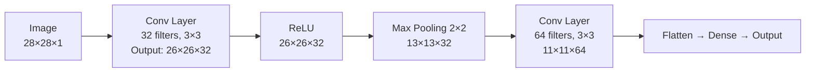
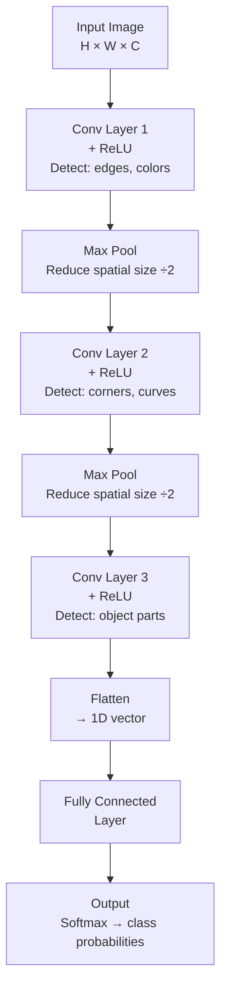

# CNNs — Theory

When you look at a face, your eye scans small patches — an edge here, a curve there — then your brain assembles them: "edges form an eye," "curve is a nose," "together they make a face." Your visual system works from simple local features upward to complex global understanding.

👉 This is why we need **CNNs** — they scan small patches to detect local features, then combine those features layer by layer into full image understanding.

---

## Why Not Just Use an MLP?

A 28×28 pixel image has 784 pixels. A dense layer with 256 neurons needs 200,704 weights — just for the first layer. A 224×224 RGB image would need 38.5 million weights for one layer.

More importantly, a dense layer ignores spatial structure completely — it treats pixel (1,1) and pixel (100,100) as fully independent. CNNs solve both problems.

---

## The Core Idea: Filters

A **filter** (or kernel) is a small grid of weights (e.g., 3×3) that slides across the image. At each position it computes a dot product with the underlying pixels. If designed to detect vertical edges, it produces high values wherever vertical edges appear.



---

## Key Concepts

### Filters / Kernels

A 3×3 filter sliding across a 28×28 image produces a 26×26 **feature map** — a spatial map of where that pattern was detected. You use many filters (32, 64, 128...), each detecting a different pattern.

**Weight sharing:** The same filter is used at every position. A vertical-edge filter detects vertical edges anywhere in the image — this is why CNNs need far fewer parameters than MLPs.

### Convolution

```
feature_map[i,j] = Σ (filter × image_patch_at_i_j)
```

How much does this image patch match this filter pattern?

### Pooling

After convolution, pooling reduces spatial dimensions.

**Max pooling:** Take a 2×2 region, keep the maximum. Halves width and height.
- Reduces computation for subsequent layers
- Provides slight translation invariance
- Summarizes "was this feature present in this region?"

### Depth

- **Early layers:** detect simple patterns — edges, textures, colors
- **Middle layers:** combine into parts — curves, corners, eyes, wheels
- **Deep layers:** combine into whole objects — faces, cars, animals



---

## Why CNNs Beat MLPs on Images

| Property | MLP | CNN |
|----------|-----|-----|
| Spatial awareness | None — treats pixels independently | Yes — filters process local patches |
| Parameter efficiency | Huge — all pixels connected to all neurons | Efficient — weight sharing across positions |
| Translation invariance | None | Built in via shared filters and pooling |
| Ability to detect local patterns | No | Yes — that's exactly what filters do |

---

✅ **What you just learned:** CNNs slide small filters over images to detect local patterns, build increasingly complex features layer by layer, and use weight sharing and pooling to stay computationally efficient.

🔨 **Build this now:** Draw a 5×5 image with a vertical line down the middle. Draw a 3×3 filter [[−1,1,0],[−1,1,0],[−1,1,0]]. Manually slide it across one row. Where is the value highest?

➡️ **Next step:** RNNs — `./10_RNNs/Theory.md`

---

## 📂 Navigation

**In this folder:**
| File | |
|---|---|
| 📄 **Theory.md** | ← you are here |
| [📄 Cheatsheet.md](./Cheatsheet.md) | Quick reference |
| [📄 Interview_QA.md](./Interview_QA.md) | Interview prep |
| [📄 Code_Example.md](./Code_Example.md) | Python code examples |
| [📄 Architecture_Deep_Dive.md](./Architecture_Deep_Dive.md) | CNN architecture deep dive |

⬅️ **Prev:** [08 Regularization](../08_Regularization/Theory.md) &nbsp;&nbsp;&nbsp; ➡️ **Next:** [10 RNNs](../10_RNNs/Theory.md)
