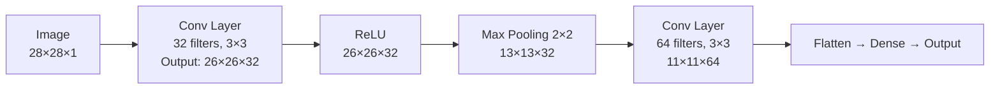

# CNNs — Theory

When you look at a photo of a face, your eye does not process the entire image at once. It scans small patches — an edge here, a curve there — then your brain assembles those into larger structures: "those edges form an eye," "that curve is a nose," "together these make a face." Your visual system works from simple local features upward to complex global understanding.

👉 This is why we need **CNNs** — they process images the same way, scanning small patches to detect local features, then combining those features layer by layer into a full understanding of the image.

---

## Why Not Just Use an MLP?

A 28×28 pixel image (tiny, like MNIST digits) has 784 pixels. A fully-connected layer with 256 neurons would need 784 × 256 = 200,704 weights — just for the first layer.

A 224×224 RGB image (like ImageNet) has 150,528 values. One dense layer would need 150,528 × 256 = 38.5 million weights.

And a dense layer ignores spatial structure completely. It treats pixel (1,1) and pixel (100,100) as completely independent — it has no idea they are far apart in the image. But that spatial relationship is the whole point.

CNNs solve both problems.

---

## The Core Idea: Filters

A **filter** (or kernel) is a small grid of weights — say 3×3. It slides across the image, covering one small patch at a time. At each position, it computes a dot product: multiply its weights by the underlying pixels, sum them up.

If the filter is designed to detect vertical edges, it will produce a high number wherever there is a vertical edge. A low number everywhere else.



---

## Key Concepts

### Filters / Kernels

A 3×3 filter slides across a 28×28 image. At each of the 26×26 positions, it computes one number. The result is a 26×26 **feature map** — a map of where that filter's pattern was detected.

You typically use many filters (32, 64, 128...). Each detects a different pattern. Together they form a rich description of the image.

**The crucial property:** The same filter is used everywhere. This is called **weight sharing**. A filter that detects vertical edges will detect vertical edges anywhere in the image — top-left or bottom-right. This is why a CNN needs far fewer parameters than an MLP.

### Convolution

The mathematical operation of sliding the filter across the image:
```
feature_map[i,j] = Σ (filter × image_patch_at_i_j)
```

You are essentially asking: "how much does this patch of the image match this filter pattern?"

### Pooling

After convolution, you apply pooling to reduce the spatial dimensions.

**Max pooling:** take a 2×2 region and keep only the maximum value. This halves the width and height.

**Why pool?**
- Reduces computation for subsequent layers
- Makes the representation slightly translation-invariant (a feature slightly shifted is still detected)
- Summarizes "was this feature present anywhere in this region?"

### Depth

As you go deeper in the network:
- **Early layers:** detect simple patterns — edges, textures, colors
- **Middle layers:** combine those into parts — curves, corners, eyes, wheels
- **Deep layers:** combine parts into whole objects — faces, cars, animals

The depth of CNNs is what makes them powerful for images.

---

## Why CNNs Beat MLPs on Images

| Property | MLP | CNN |
|----------|-----|-----|
| Spatial awareness | None — treats pixels independently | Yes — filters process local patches |
| Parameter efficiency | Huge — all pixels connected to all neurons | Efficient — weight sharing across positions |
| Translation invariance | None | Built in via shared filters and pooling |
| Ability to detect local patterns | No | Yes — that is exactly what filters do |

---

✅ **What you just learned:** CNNs process images by sliding small filters over the image to detect local patterns, building increasingly complex features layer by layer, while using weight sharing and pooling to stay computationally efficient.

🔨 **Build this now:** Draw a tiny 5×5 image with a vertical line down the middle. Draw a 3×3 filter that looks like [[−1,1,0],[−1,1,0],[−1,1,0]]. Manually slide it across one row of the image. What numbers do you get? Where is the value highest?

➡️ **Next step:** RNNs — `./10_RNNs/Theory.md`

---

## 📂 Navigation

**In this folder:**
| File | |
|---|---|
| 📄 **Theory.md** | ← you are here |
| [📄 Cheatsheet.md](./Cheatsheet.md) | Quick reference |
| [📄 Interview_QA.md](./Interview_QA.md) | Interview prep |
| [📄 Code_Example.md](./Code_Example.md) | Python code examples |
| [📄 Architecture_Deep_Dive.md](./Architecture_Deep_Dive.md) | CNN architecture deep dive |

⬅️ **Prev:** [08 Regularization](../08_Regularization/Theory.md) &nbsp;&nbsp;&nbsp; ➡️ **Next:** [10 RNNs](../10_RNNs/Theory.md)
