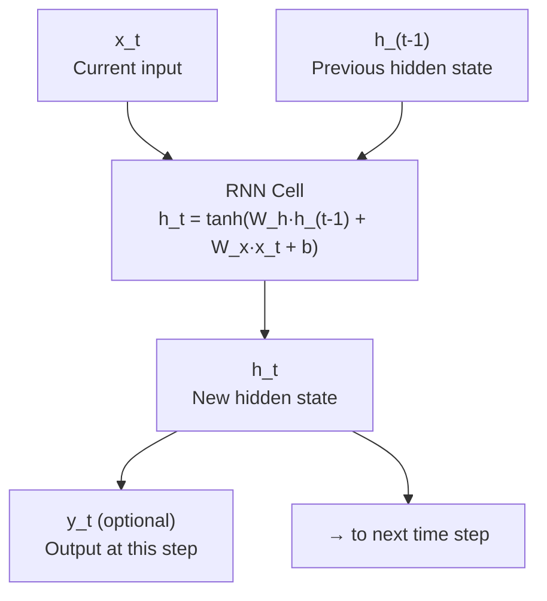
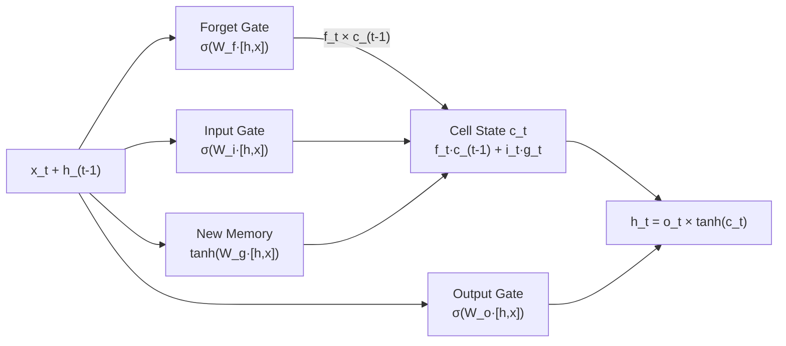

# RNNs — Architecture Deep Dive

## The Core RNN Cell

At every time step, the same cell is applied. Here is what happens inside it.



The hidden state h_t serves double duty: it is the output passed to subsequent layers AND the memory passed to the next time step.

---

## Unrolled View (Processing a 4-Word Sequence)

When we "unroll" an RNN, we see it as a chain of identical cells:

```
Time:      t=1           t=2           t=3           t=4
Input:     "The"         "cat"         "sat"         "down"
           ↓             ↓             ↓             ↓
h0 ──→ [RNN Cell] ─h1→ [RNN Cell] ─h2→ [RNN Cell] ─h3→ [RNN Cell] → h4
                                                               ↓
                                                          Prediction
```

**Key point:** All four cells are the SAME cell with the SAME weights. We are not using four different sets of parameters — we reuse the same transformation. This is weight sharing across time, analogous to how a CNN shares filter weights across space.

---

## LSTM Architecture

The LSTM cell is the standard solution to the vanishing gradient problem. It has two state vectors and three gates.



### The Three Gates

**Forget Gate:** `f_t = sigmoid(W_f · [h_(t-1), x_t] + b_f)`

Outputs values between 0 and 1. Multiplied with old cell state: 0 = forget completely, 1 = keep completely. Example: when reading a new subject, forget the old subject's context.

**Input Gate + New Memory:**
```
i_t = sigmoid(W_i · [h_(t-1), x_t] + b_i)   ← what to update
g_t = tanh(W_g · [h_(t-1), x_t] + b_g)       ← candidate new values
```
Controls what new information to write: `i_t × g_t` is added to the cell state.

**Cell State Update:**
```
c_t = f_t × c_(t-1) + i_t × g_t
```
The cell state is updated through addition (not multiplication), which is why gradients flow cleanly through the cell state pathway.

**Output Gate:**
```
o_t = sigmoid(W_o · [h_(t-1), x_t] + b_o)
h_t = o_t × tanh(c_t)
```
Controls what part of the cell state to expose as output.

---

## GRU Architecture (Simplified LSTM)

GRU merges the cell state and hidden state and uses only two gates:

```
Reset gate:  r_t = sigmoid(W_r · [h_(t-1), x_t])
Update gate: z_t = sigmoid(W_z · [h_(t-1), x_t])

Candidate:   h̃_t = tanh(W · [r_t × h_(t-1), x_t])
New state:   h_t = (1 - z_t) × h_(t-1) + z_t × h̃_t
```

The update gate z_t decides how much of the old hidden state to keep vs replace. When z_t ≈ 0: keep old state entirely (like an open forget gate). When z_t ≈ 1: replace with new candidate.

---

## Common RNN Configurations

### Many-to-One (Sentiment Classification)

```
"I love this movie" → positive

Input:  [I] [love] [this] [movie]
RNN:    h1   h2     h3     h4
                            ↓
                      Dense → Sigmoid
                            ↓
                     0.95 = positive
```

Only the final hidden state h4 is used for classification — it encodes the full sequence.

---

### Many-to-Many Equal (Sequence Labeling)

```
[I] [visited] [Paris] [yesterday]
 ↓       ↓       ↓        ↓
PRP     VBD     NNP       RB
(Pronoun) (Past Verb) (ProperNoun) (Adverb)
```

Output at every time step. Each h_t feeds into a classifier.

---

### Encoder-Decoder (Translation)

```
Encoder:  "Hello" "World"  → context vector c
                                    ↓
Decoder:  c → "Hola" → "Mundo"

The encoder reads the full input and produces a context vector.
The decoder generates one token at a time, conditioned on c.
```

---

## Dimension Reference

For a single LSTM layer:

| Parameter | Shape | Meaning |
|-----------|-------|---------|
| x_t | (batch, input_size) | Current input |
| h_t | (batch, hidden_size) | Hidden state |
| c_t | (batch, hidden_size) | Cell state |
| W_i, W_f, W_g, W_o | (hidden_size, input_size + hidden_size) | Gate weight matrices |
| Total LSTM params | 4 × hidden_size × (input_size + hidden_size + 1) | All 4 gate weights + biases |

Example: input_size=128, hidden_size=256: `4 × 256 × (128 + 256 + 1) = 4 × 256 × 385 = 394,240 parameters`

---

## 📂 Navigation

**In this folder:**
| File | |
|---|---|
| [📄 Theory.md](./Theory.md) | Core concepts |
| [📄 Cheatsheet.md](./Cheatsheet.md) | Quick reference |
| [📄 Interview_QA.md](./Interview_QA.md) | Interview prep |
| [📄 Code_Example.md](./Code_Example.md) | Python code examples |
| 📄 **Architecture_Deep_Dive.md** | ← you are here |

⬅️ **Prev:** [09 CNNs](../09_CNNs/Theory.md) &nbsp;&nbsp;&nbsp; ➡️ **Next:** [11 GANs](../11_GANs/Theory.md)
