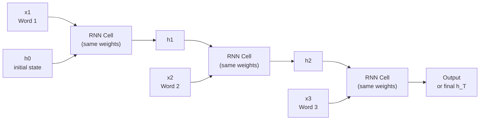

# RNNs — Theory

You are reading a detective novel. On page 150, the detective says "he grabbed the knife." You instantly know who "he" is — because you remembered it from page 120, where the detective's name was first introduced in the key scene. To understand the current sentence, you needed memory of what came before.

👉 This is why we need **RNNs** — they have memory across a sequence, so each step can use information from previous steps.

---

## What is an RNN?

A Recurrent Neural Network (RNN) is a neural network designed for sequential data — text, time series, audio, video frames — where the order and history of the data matters.

The key idea: after processing each element in the sequence, the RNN passes a **hidden state** to the next step. This hidden state is its memory.

---

## The Hidden State — Memory Across Time

At each time step t, the RNN:
1. Takes the current input x_t
2. Takes the hidden state from the previous step h_(t-1)
3. Combines them to compute a new hidden state h_t
4. Optionally produces an output y_t

```
h_t = tanh( W_h × h_(t-1) + W_x × x_t + b )
```

The hidden state carries information from all previous time steps. It is a compressed summary of "what has happened so far."

---

## The Loop

An RNN uses the **same weights** at every time step. This is like reading a book using the same "understanding machinery" for every word.



---

## The Vanishing Gradient Problem

RNNs struggle with long sequences. When the error is backpropagated through many time steps (BPTT — backpropagation through time), the gradient is multiplied by the same weight matrix at each step. If those gradients are small (< 1), multiplying 100 of them = gradient near 0. Early time steps get almost no learning signal.

In the detective novel: the model cannot connect a reference on page 150 to the introduction on page 120. It forgets.

---

## LSTMs — The Solution

Long Short-Term Memory networks (Hochreiter & Schmidhuber, 1997) solve the vanishing gradient problem with **gating mechanisms**.

An LSTM has two state vectors:
- **h_t** — short-term memory (hidden state)
- **c_t** — long-term memory (cell state)

And three gates that control what is remembered and what is forgotten:

| Gate | What it does |
|------|-------------|
| Forget gate | How much of the old memory to keep (0 = forget all, 1 = keep all) |
| Input gate | What new information to write into memory |
| Output gate | What part of the memory to use as output |

The cell state c_t flows through the network with almost no modification (when the forget gate is open) — this is the **constant error carousel** that allows gradients to flow over long distances.

---

## GRUs — Simpler Alternative

Gated Recurrent Units (GRU) are a simplified version of LSTM with two gates (reset and update) instead of three. Fewer parameters, similar performance, faster to train. Often preferred for smaller datasets.

---

## Types of RNN Problems

| Problem type | Example | Architecture |
|-------------|---------|-------------|
| One-to-one | Image classification | Not an RNN — use CNN/MLP |
| One-to-many | Image captioning | CNN encoder → RNN decoder |
| Many-to-one | Sentiment analysis | RNN → final hidden state → class |
| Many-to-many (same length) | POS tagging each word | RNN output at each step |
| Many-to-many (different length) | Translation | Encoder-decoder (Seq2Seq) |

---

✅ **What you just learned:** RNNs process sequential data by maintaining a hidden state that acts as memory across time steps — but they suffer from vanishing gradients on long sequences, which LSTMs solve through gating mechanisms.

🔨 **Build this now:** Write down this sentence: "The cat sat on the mat." Process it word by word. For each word, write what information from previous words is needed to understand it. "on" needs to know the action (sat). "mat" needs to know where (on). "the mat" needs to know what "the" refers to. That is what an RNN is tracking in its hidden state.

➡️ **Next step:** GANs — `./11_GANs/Theory.md`

---

## 📂 Navigation

**In this folder:**
| File | |
|---|---|
| 📄 **Theory.md** | ← you are here |
| [📄 Cheatsheet.md](./Cheatsheet.md) | Quick reference |
| [📄 Interview_QA.md](./Interview_QA.md) | Interview prep |
| [📄 Code_Example.md](./Code_Example.md) | Python code examples |
| [📄 Architecture_Deep_Dive.md](./Architecture_Deep_Dive.md) | RNN architecture deep dive |

⬅️ **Prev:** [09 CNNs](../09_CNNs/Theory.md) &nbsp;&nbsp;&nbsp; ➡️ **Next:** [11 GANs](../11_GANs/Theory.md)
