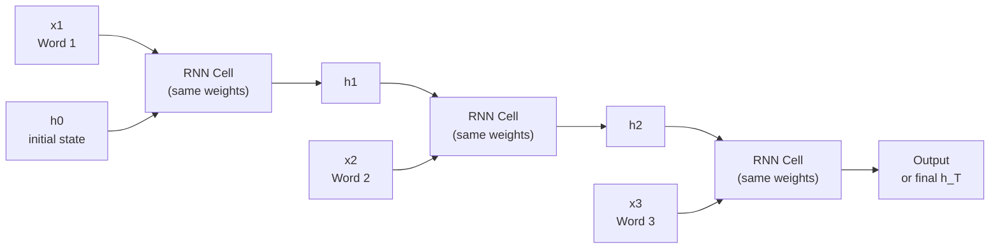
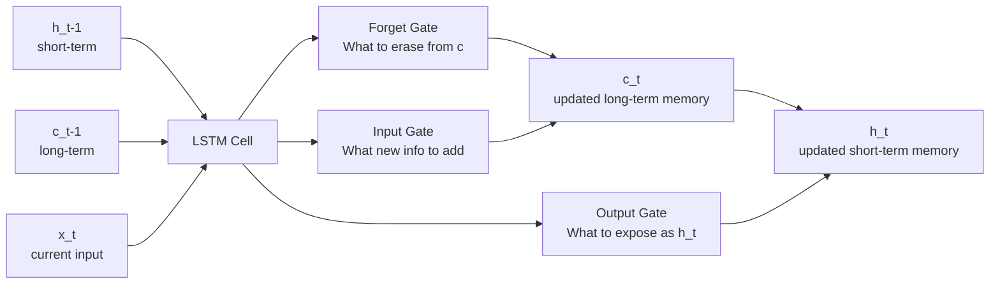

# RNNs — Theory

You're reading a detective novel. On page 150, "he grabbed the knife." You instantly know who "he" is — you remembered from page 120. To understand the current sentence you needed memory of what came before.

👉 This is why we need **RNNs** — they have memory across a sequence so each step can use information from previous steps.

---

## What is an RNN?

A Recurrent Neural Network (RNN) is designed for sequential data — text, time series, audio, video — where order and history matter. After processing each element, it passes a **hidden state** to the next step. The hidden state is its memory.

---

## The Hidden State — Memory Across Time

At each time step t, the RNN:
1. Takes current input x_t and previous hidden state h_(t-1)
2. Computes new hidden state h_t
3. Optionally produces output y_t

```
h_t = tanh( W_h × h_(t-1) + W_x × x_t + b )
```

The hidden state carries a compressed summary of everything that has happened so far. The **same weights** are used at every time step.



---

## The Vanishing Gradient Problem

During BPTT (backpropagation through time), the gradient is multiplied by the same weight matrix at each step. If gradients are small (< 1), multiplying 100 of them → gradient ≈ 0 at early steps. The model can't connect page 150 references back to page 120 introductions.

---

## LSTMs — The Solution

Long Short-Term Memory networks (Hochreiter & Schmidhuber, 1997) solve vanishing gradients with **gating mechanisms**.

An LSTM has two state vectors:
- **h_t** — short-term memory (hidden state)
- **c_t** — long-term memory (cell state)

And three gates:

| Gate | What it does |
|------|-------------|
| Forget gate | How much of old memory to keep (0 = forget all, 1 = keep all) |
| Input gate | What new information to write into memory |
| Output gate | What part of memory to expose as h_t |

The cell state c_t flows through with almost no modification (when forget gate is open) — the **constant error carousel** allowing gradients to flow over long distances.



---

## GRUs — Simpler Alternative

Gated Recurrent Units (GRU) use two gates (reset and update) instead of three. Fewer parameters, similar performance, faster to train. Often preferred for smaller datasets.

---

## Types of RNN Problems

| Problem type | Example | Architecture |
|-------------|---------|-------------|
| One-to-one | Image classification | Not an RNN — use CNN/MLP |
| One-to-many | Image captioning | CNN encoder → RNN decoder |
| Many-to-one | Sentiment analysis | RNN → final hidden state → class |
| Many-to-many (same length) | POS tagging | RNN output at each step |
| Many-to-many (different length) | Translation | Encoder-decoder (Seq2Seq) |

---

✅ **What you just learned:** RNNs process sequential data by maintaining a hidden state as memory across time steps — but suffer from vanishing gradients on long sequences, which LSTMs solve through gating.

🔨 **Build this now:** Process "The cat sat on the mat" word by word. For each word, write what information from previous words is needed. "on" needs the action (sat). "mat" needs where. That's what the hidden state tracks.

➡️ **Next step:** GANs — `./11_GANs/Theory.md`

---

## 📂 Navigation

**In this folder:**
| File | |
|---|---|
| 📄 **Theory.md** | ← you are here |
| [📄 Cheatsheet.md](./Cheatsheet.md) | Quick reference |
| [📄 Interview_QA.md](./Interview_QA.md) | Interview prep |
| [📄 Code_Example.md](./Code_Example.md) | Python code examples |
| [📄 Architecture_Deep_Dive.md](./Architecture_Deep_Dive.md) | RNN architecture deep dive |

⬅️ **Prev:** [09 CNNs](../09_CNNs/Theory.md) &nbsp;&nbsp;&nbsp; ➡️ **Next:** [11 GANs](../11_GANs/Theory.md)
