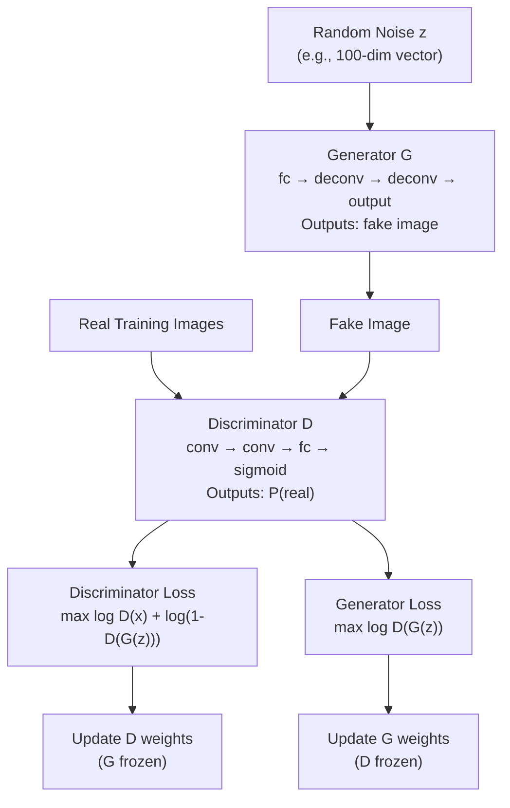
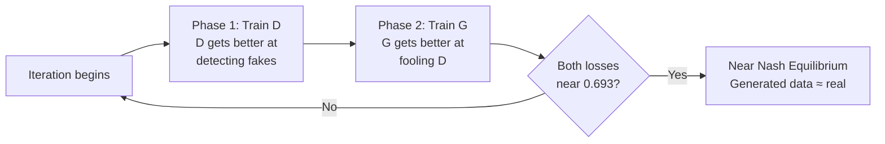

# GANs — Architecture Deep Dive

## Overview: Two Competing Networks



---

## Generator Architecture

The generator takes a random noise vector and transforms it into a fake image.

For image generation, the generator uses **transposed convolutions** (sometimes called "deconvolutions") to progressively upscale from a small latent vector to a full image.

**Example: DCGAN Generator (64×64 output)**

```
Input: z ~ N(0, 1)  shape: (batch, 100)
         ↓
Dense(100 → 4×4×512) + reshape to (batch, 512, 4, 4)
         ↓
TransposeConv(512→256, kernel=4, stride=2) → (batch, 256, 8, 8)
+ BatchNorm + ReLU
         ↓
TransposeConv(256→128, kernel=4, stride=2) → (batch, 128, 16, 16)
+ BatchNorm + ReLU
         ↓
TransposeConv(128→64, kernel=4, stride=2) → (batch, 64, 32, 32)
+ BatchNorm + ReLU
         ↓
TransposeConv(64→3, kernel=4, stride=2) → (batch, 3, 64, 64)
+ Tanh activation (output range: -1 to 1)
```

**Why Tanh at the end?** Real images are normalized to [-1, 1]. Tanh matches this range.

**Why BatchNorm?** Stabilizes GAN training — without it, generators often fail to learn.

---

## Discriminator Architecture

The discriminator is essentially a standard binary classifier CNN.

**Example: DCGAN Discriminator**

```
Input: Real or Fake image, shape: (batch, 3, 64, 64)
         ↓
Conv(3→64, kernel=4, stride=2) → (batch, 64, 32, 32)
+ LeakyReLU(0.2)  [not ReLU — LeakyReLU allows gradient to flow for negatives]
         ↓
Conv(64→128, kernel=4, stride=2) → (batch, 128, 16, 16)
+ BatchNorm + LeakyReLU(0.2)
         ↓
Conv(128→256, kernel=4, stride=2) → (batch, 256, 8, 8)
+ BatchNorm + LeakyReLU(0.2)
         ↓
Conv(256→512, kernel=4, stride=2) → (batch, 512, 4, 4)
+ BatchNorm + LeakyReLU(0.2)
         ↓
Flatten → Dense(512×4×4 → 1) → Sigmoid
         ↓
P(real): 0.0 = fake, 1.0 = real
```

**Why LeakyReLU in D?** Standard ReLU can cause dead neurons in the discriminator. LeakyReLU (slope 0.2 for negatives) provides gradients even for negative activations, stabilizing D training.

---

## The Training Loop (Step by Step)

### Phase 1: Train Discriminator

```
1. Sample batch of real images x_real from training data
2. Sample batch of noise z, generate fakes: x_fake = G(z)
3. Forward pass x_real through D → D(x_real)  should be ≈ 1
4. Forward pass x_fake through D → D(x_fake)  should be ≈ 0
5. Compute D loss: BCE(D(x_real), 1) + BCE(D(x_fake), 0)
6. Backprop and update D weights
   [G weights are NOT updated here]
```

### Phase 2: Train Generator

```
1. Sample new batch of noise z
2. Generate fakes: x_fake = G(z)
3. Forward pass x_fake through D → D(G(z))
4. Compute G loss: BCE(D(G(z)), 1)
   [G wants D to say "real" about its fakes]
5. Backprop through D and into G
6. Update ONLY G weights — D weights are frozen
```

---

## Monitoring Training

Watching losses alone is not enough — standard GAN losses do not have a simple "lower is better" meaning.

| Signal | What to look for |
|--------|-----------------|
| D_real_loss | Should stay near log(2) ≈ 0.693 at equilibrium |
| D_fake_loss | Should stay near log(2) ≈ 0.693 at equilibrium |
| G_loss | Should stay near log(2) — not go to 0 or diverge |
| Generated samples (visual inspection) | Quality and diversity |
| FID score (Fréchet Inception Distance) | Quantitative measure of real vs generated distribution similarity |

**Red flags:**
- D_loss → 0: discriminator is winning completely — G gets no gradient
- G_loss → 0: generator is dominating — likely mode collapse
- Generated samples are all nearly identical: mode collapse confirmed

---

## Generator vs Discriminator Training Loop (Competing)



---

## Key DCGAN Architecture Rules (Radford et al., 2015)

These rules dramatically stabilize GAN training for images:
1. Use strided convolutions in D instead of pooling layers
2. Use transposed convolutions in G instead of upsampling
3. Use BatchNorm in both G and D (except G output layer and D input layer)
4. Remove fully connected hidden layers for deeper architectures
5. Use ReLU in G for all layers except the output (use Tanh)
6. Use LeakyReLU in D for all layers (never ReLU)

---

## 📂 Navigation

**In this folder:**
| File | |
|---|---|
| [📄 Theory.md](./Theory.md) | Core concepts |
| [📄 Cheatsheet.md](./Cheatsheet.md) | Quick reference |
| [📄 Interview_QA.md](./Interview_QA.md) | Interview prep |
| 📄 **Architecture_Deep_Dive.md** | ← you are here |

⬅️ **Prev:** [10 RNNs](../10_RNNs/Theory.md) &nbsp;&nbsp;&nbsp; ➡️ **Next:** [12 Training Techniques](../12_Training_Techniques/Theory.md)
