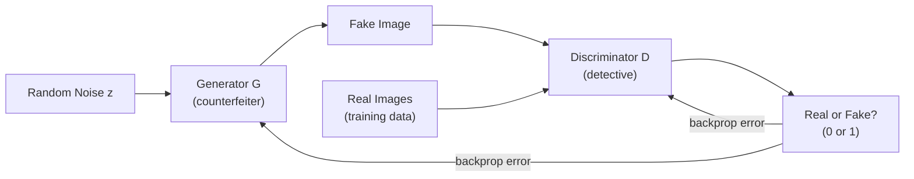

# GANs — Theory

A skilled counterfeiter is trying to forge currency. The central bank has a detective whose only job is to spot fakes. At first, the fakes are terrible — wrong color, wrong size. The detective easily catches them all. So the counterfeiter studies the detective's feedback and improves. The new fakes are better. The detective learns to spot those too. The counterfeiter improves again. This cycle continues, with each side getting better and better, until the fakes are completely indistinguishable from the real thing.

👉 This is why we need **GANs** — two networks competing against each other until the generator produces data so realistic that even an expert cannot tell it apart from real data.

---

## The Two Networks

A GAN (Generative Adversarial Network) consists of two neural networks playing a game against each other:

**The Generator (the counterfeiter):**
- Input: random noise z (a vector of random numbers)
- Output: a fake image (or text, audio, etc.)
- Goal: generate fakes that fool the discriminator

**The Discriminator (the detective):**
- Input: an image — either real (from the training set) or fake (from the generator)
- Output: a probability — "is this real or fake?"
- Goal: correctly classify real vs fake

---

## The Adversarial Game



The loss function captures the competition:
```
D wants to maximize: log(D(real)) + log(1 - D(G(z)))
G wants to maximize: log(D(G(z)))   [equivalently: minimize log(1 - D(G(z)))]
```

When D sees a real image, it wants D(real) close to 1.
When D sees a fake, it wants D(G(z)) close to 0.
G wants D(G(z)) close to 1 — it wants D to mistake the fake for real.

---

## The Training Loop

The key: you alternate between training D and G.

**Step 1 — Train the Discriminator:**
- Show D some real images → it should output ~1
- Show D some fakes from G → it should output ~0
- Update D's weights to improve at telling real from fake

**Step 2 — Train the Generator:**
- Generate fakes from G
- Pass them through D (D's weights are FROZEN in this step)
- D says "fake" → G gets a high error
- Update G's weights to make D say "real"

Repeat thousands of times. Both get better.

---

## Nash Equilibrium

The theoretical ideal endpoint is a **Nash Equilibrium**: the generator produces perfectly realistic data, and the discriminator can do no better than random guessing (50/50) because the generated data is indistinguishable from real. In practice, this is never perfectly achieved — but you aim to get close.

---

## Mode Collapse — The Main Problem

**Mode collapse** is when the generator finds one type of output that fools the discriminator and just keeps generating that one thing. For example, in a dataset of human faces, the generator might only produce faces of one gender or one ethnicity — because those fakes were successful, it keeps doing them.

The generator has "collapsed" to a single mode of the data distribution instead of covering the full diversity.

**Signs:** Generated samples all look very similar to each other. High quality but zero variety.

**Fixes:** Minibatch discrimination (show D groups of generated samples), Wasserstein GAN (better loss function), spectral normalization.

---

## Applications

| Application | What is generated |
|-------------|------------------|
| Deepfakes | Realistic fake video of people |
| AI art | Images from text descriptions (early models) |
| Data augmentation | Synthetic training data |
| Image-to-image translation | Photo → painting style (CycleGAN) |
| Super-resolution | Low-res → high-res images (SRGAN) |
| Drug discovery | Novel molecular structures |

---

✅ **What you just learned:** A GAN is two neural networks — a generator that creates fake data and a discriminator that distinguishes real from fake — trained adversarially until the generator produces data that fools even the discriminator.

🔨 **Build this now:** Think of three real-world examples of the counterfeiter-detective dynamic (where two competing systems improve each other). Examples: spam filters and spammers, immune system and pathogens, captcha and bots. How does the GAN metaphor apply to each?

➡️ **Next step:** Training Techniques — `./12_Training_Techniques/Theory.md`

---

## 📂 Navigation

**In this folder:**
| File | |
|---|---|
| 📄 **Theory.md** | ← you are here |
| [📄 Cheatsheet.md](./Cheatsheet.md) | Quick reference |
| [📄 Interview_QA.md](./Interview_QA.md) | Interview prep |
| [📄 Architecture_Deep_Dive.md](./Architecture_Deep_Dive.md) | GAN architecture deep dive |

⬅️ **Prev:** [10 RNNs](../10_RNNs/Theory.md) &nbsp;&nbsp;&nbsp; ➡️ **Next:** [12 Training Techniques](../12_Training_Techniques/Theory.md)
