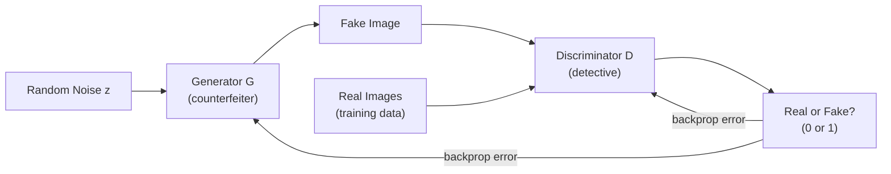
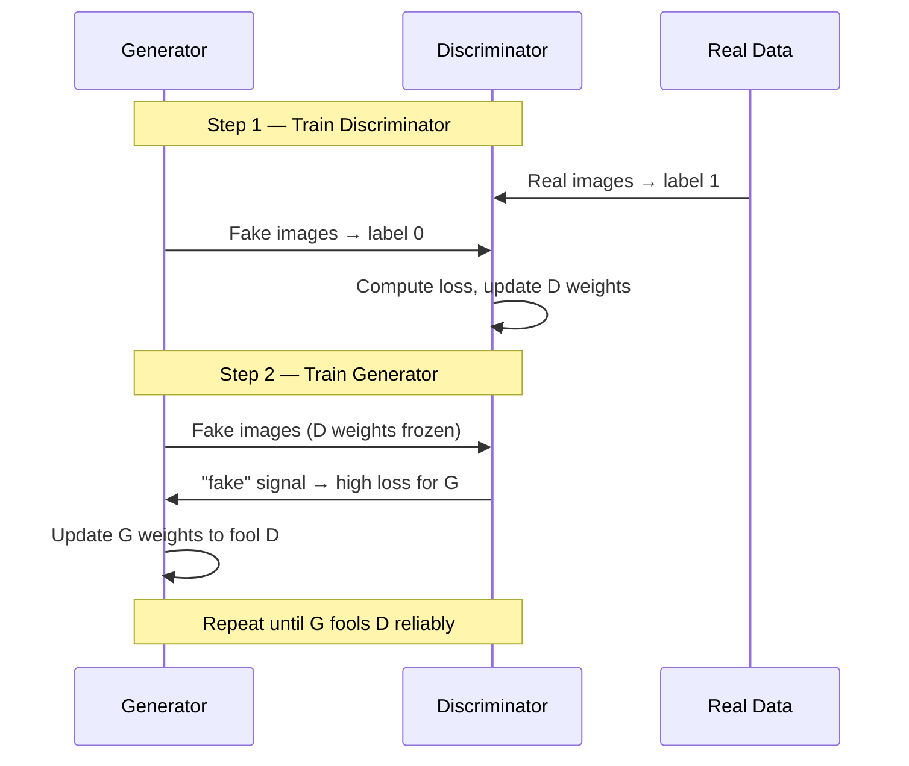

# GANs — Theory

A counterfeiter forges currency. A detective spots the fakes. The counterfeiter studies the feedback and improves. The detective learns to spot those too. The cycle continues until the fakes are indistinguishable from real.

👉 This is why we need **GANs** — two networks competing until the generator produces data so realistic even an expert can't tell it apart from real.

---

## The Two Networks

**The Generator (counterfeiter):**
- Input: random noise z
- Output: fake image (or text, audio, etc.)
- Goal: generate fakes that fool the discriminator

**The Discriminator (detective):**
- Input: real image (from training data) or fake (from generator)
- Output: probability — "is this real or fake?"
- Goal: correctly classify real vs fake

---

## The Adversarial Game



```
D wants to maximize: log(D(real)) + log(1 - D(G(z)))
G wants to maximize: log(D(G(z)))
```

D wants D(real) ≈ 1 and D(G(z)) ≈ 0. G wants D(G(z)) ≈ 1.

---

## The Training Loop

Alternate between training D and G:

**Step 1 — Train the Discriminator:**
- Show D real images → should output ~1
- Show D fakes from G → should output ~0
- Update D's weights

**Step 2 — Train the Generator:**
- Generate fakes from G
- Pass through D (D's weights frozen)
- D says "fake" → G gets high error
- Update G's weights to make D say "real"



---

## Nash Equilibrium

The theoretical ideal endpoint: the generator produces perfectly realistic data and the discriminator can do no better than random guessing (50/50). In practice never perfectly achieved, but the aim.

---

## Mode Collapse — The Main Problem

**Mode collapse:** the generator finds one type of output that fools the discriminator and only generates that. For a face dataset, it might only produce one gender or ethnicity.

**Signs:** Samples all look similar — high quality but zero variety.

**Fixes:** Minibatch discrimination, Wasserstein GAN (better loss), spectral normalization.

---

## Applications

| Application | What is generated |
|-------------|------------------|
| Deepfakes | Realistic fake video of people |
| AI art | Images from text descriptions (early models) |
| Data augmentation | Synthetic training data |
| Image-to-image translation | Photo → painting style (CycleGAN) |
| Super-resolution | Low-res → high-res images (SRGAN) |
| Drug discovery | Novel molecular structures |

---

✅ **What you just learned:** A GAN is two networks — a generator creating fake data and a discriminator distinguishing real from fake — trained adversarially until the generator produces data that fools the discriminator.

🔨 **Build this now:** Think of three real-world counterfeiter-detective dynamics (spam filters vs spammers, immune system vs pathogens, captcha vs bots). How does the GAN dynamic apply to each?

➡️ **Next step:** Training Techniques — `./12_Training_Techniques/Theory.md`

---

## 📂 Navigation

**In this folder:**
| File | |
|---|---|
| 📄 **Theory.md** | ← you are here |
| [📄 Cheatsheet.md](./Cheatsheet.md) | Quick reference |
| [📄 Interview_QA.md](./Interview_QA.md) | Interview prep |
| [📄 Architecture_Deep_Dive.md](./Architecture_Deep_Dive.md) | GAN architecture deep dive |

⬅️ **Prev:** [10 RNNs](../10_RNNs/Theory.md) &nbsp;&nbsp;&nbsp; ➡️ **Next:** [12 Training Techniques](../12_Training_Techniques/Theory.md)
