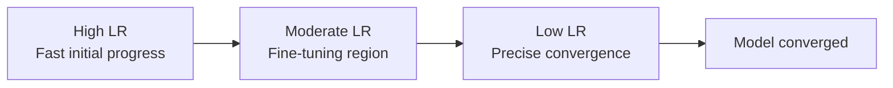

# Training Techniques — Theory

Training a dog takes skill. You do not just repeat the same trick forever until the dog collapses. You mix short sessions with breaks (early stopping). You vary the difficulty — easy tricks first, harder ones later. You adjust how many treats you give based on progress. You occasionally revisit old lessons so the dog doesn't forget. And sometimes you get a dog that already knows basic commands (transfer learning) and just teach it the new specific ones.

👉 This is why we need **training techniques** — the raw optimization algorithms are just tools; knowing how to use them well is what separates a model that trains in 2 hours from one that fails for 2 days.

---

## Batch Size

When training, you do not show the model all the data at once — you show it small batches.

**Small batch (8–32):**
- Noisy gradients — updates are rough estimates of the true gradient
- Noise helps escape sharp minima → often better generalization
- Slower wall-clock time per epoch (more updates, but each is cheap)

**Large batch (256–2048):**
- Accurate gradients — nearly the true gradient
- Fast wall-clock time (few updates, each is expensive but parallelized well on GPU)
- Risk of converging to sharp, less-general minima

**Common default:** 32–256. Start here. If you increase batch size, increase learning rate proportionally.

---

## Epochs

One epoch = one full pass through the training data.

Too few epochs = underfitting. Too many = overfitting. Use early stopping (covered in topic 08) to find the right number automatically.

---

## Weight Initialization

Weights cannot start at zero — every neuron would compute the same thing and stay symmetric forever. They cannot be too large or too small — gradients explode or vanish immediately.

**He initialization** (for ReLU): `w ~ N(0, sqrt(2 / n_in))`

**Xavier/Glorot initialization** (for Sigmoid/Tanh): `w ~ N(0, sqrt(1 / n_in))` or `w ~ Uniform(-sqrt(6/(n_in+n_out)), sqrt(6/(n_in+n_out)))`

Modern frameworks (PyTorch, Keras) apply the right initialization automatically. You rarely need to set this manually — but understand why it matters.

---

## Learning Rate Scheduling

The learning rate is not fixed. A good schedule:
1. Start slightly warm (or with warmup from zero)
2. Train at full learning rate
3. Reduce progressively as loss converges

**Common schedules:** Step decay, cosine annealing, linear warmup + cosine decay (transformers).

---

## Transfer Learning

Training a model from scratch needs massive data. Transfer learning reuses a model already trained on a large dataset.

**How it works:**
1. Take a pretrained model (e.g., ResNet-50 trained on ImageNet — 1.2M images)
2. Remove the final classification layer
3. Add a new output layer for your task
4. Either: freeze the pretrained weights and only train the new layer ("feature extraction"), OR unfreeze them gradually ("fine-tuning")

**When to use:** Any time you have limited data. Pre-trained vision models, BERT/GPT for NLP.

---

## Mixed Precision Training

Modern GPUs support float16 (half precision) in addition to float32.

**float32:** Standard. High precision. Uses 4 bytes per value.
**float16:** Half precision. Uses 2 bytes. Operations are 2–8× faster on modern GPUs.

**Mixed precision:** Keep model weights in float32 (for numerical stability) but compute forward/backward passes in float16 (for speed). A "loss scaler" prevents float16 underflow for small gradients.

**Result:** 2–3× training speedup with minimal accuracy impact.

---

## Batch Normalization (Training Behavior)

Batch normalization normalizes activations within each mini-batch during training. This stabilizes training dramatically — allows higher learning rates, is less sensitive to initialization, and provides mild regularization.

**Important:** BatchNorm behaves differently in training mode (uses batch statistics) vs eval mode (uses running statistics collected during training). Always call `model.train()` before training and `model.eval()` before inference in PyTorch.

---

✅ **What you just learned:** Successful training combines the right batch size, learning rate schedule, weight initialization, and techniques like transfer learning and mixed precision — these are the practical knobs that determine whether a model trains successfully.

🔨 **Build this now:** Think of the last project you worked on (code, sport, skill). Which of these training techniques has an analogy in how you learned that skill? Examples: curriculum learning = starting easy, early stopping = taking a break when stuck, transfer learning = applying existing knowledge to a new domain.

➡️ **Next step:** You have completed the Neural Networks and Deep Learning section. Next up: 05_NLP_Foundations.

---

## 📂 Navigation

**In this folder:**
| File | |
|---|---|
| 📄 **Theory.md** | ← you are here |
| [📄 Cheatsheet.md](./Cheatsheet.md) | Quick reference |
| [📄 Interview_QA.md](./Interview_QA.md) | Interview prep |
| [📄 Troubleshooting_Guide.md](./Troubleshooting_Guide.md) | Training troubleshooting guide |

⬅️ **Prev:** [11 GANs](../11_GANs/Theory.md) &nbsp;&nbsp;&nbsp; ➡️ **Next:** [01 Text Preprocessing](../../05_NLP_Foundations/01_Text_Preprocessing/Theory.md)
