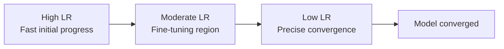
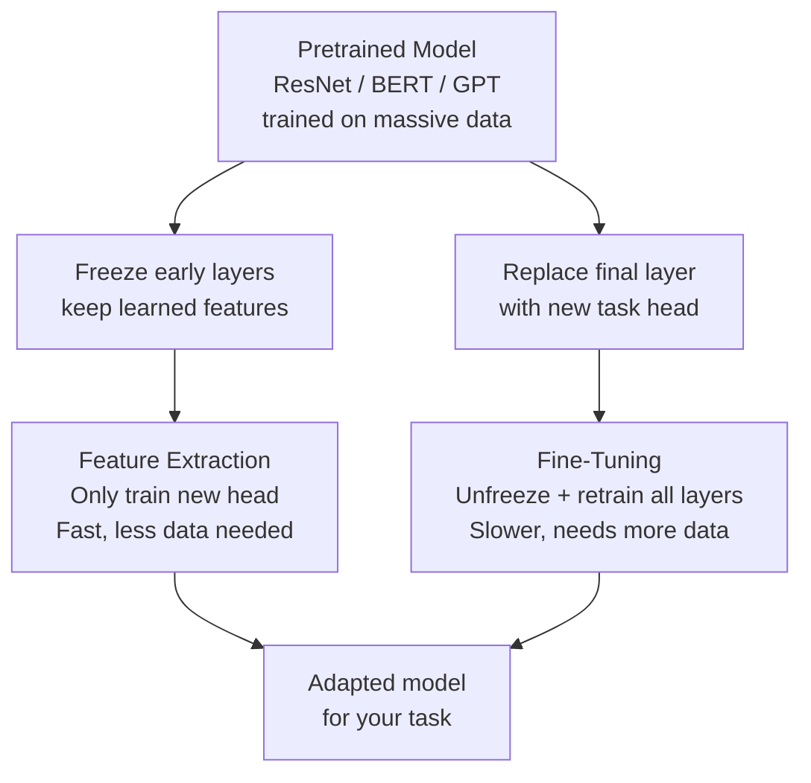

# Training Techniques — Theory

Training a dog well takes skill: short sessions with breaks, variable difficulty, adjusting rewards based on progress, revisiting old lessons, starting with a dog that already knows basic commands (transfer learning).

👉 This is why we need **training techniques** — the right combination separates a model that trains in 2 hours from one that fails for 2 days.

---

## Batch Size

You show the model small batches of data, not all at once.

**Small batch (8–32):**
- Noisy gradients — rough estimates of the true gradient
- Noise helps escape sharp minima → often better generalization
- Slower wall-clock time per epoch

**Large batch (256–2048):**
- Accurate gradients — nearly the true gradient
- Fast wall-clock time (well-parallelized on GPU)
- Risk of converging to sharp, less-general minima

**Common default:** 32–256. If you increase batch size, increase learning rate proportionally.

---

## Epochs

One epoch = one full pass through training data. Too few = underfitting. Too many = overfitting. Use early stopping (topic 08) to find the right number automatically.

---

## Weight Initialization

Weights can't start at zero — every neuron would compute the same thing and stay symmetric. They can't be too large or too small — gradients explode or vanish immediately.

**He initialization** (for ReLU): `w ~ N(0, sqrt(2 / n_in))`

**Xavier/Glorot initialization** (for Sigmoid/Tanh): `w ~ N(0, sqrt(1 / n_in))`

Modern frameworks (PyTorch, Keras) apply the right initialization automatically.

---

## Learning Rate Scheduling

**Common schedules:** Step decay, cosine annealing, linear warmup + cosine decay (transformers).

---

## Transfer Learning

Take a model pretrained on massive data and adapt it to your task.

**How it works:**
1. Take a pretrained model (e.g., ResNet-50 on ImageNet — 1.2M images)
2. Remove the final classification layer
3. Add a new output layer for your task
4. Either freeze pretrained weights ("feature extraction") or unfreeze them ("fine-tuning")

**Use when:** You have limited data. Works for vision (ResNet) and NLP (BERT/GPT).

---

## Mixed Precision Training

**float32:** Standard, 4 bytes per value. **float16:** Half precision, 2 bytes, 2–8× faster on modern GPUs.

**Mixed precision:** Keep weights in float32 (numerical stability), compute forward/backward in float16 (speed). A loss scaler prevents float16 underflow.

**Result:** 2–3× training speedup with minimal accuracy impact.

---

## Batch Normalization (Training Behavior)

Normalizes activations within each mini-batch: stabilizes training, allows higher learning rates, less sensitive to initialization, mild regularization.

**Critical:** BatchNorm behaves differently in training mode (batch statistics) vs eval mode (running statistics). Always call `model.train()` before training and `model.eval()` before inference in PyTorch.

---

✅ **What you just learned:** Successful training combines the right batch size, learning rate schedule, weight initialization, and techniques like transfer learning and mixed precision — these are the knobs that determine whether a model trains successfully.

🔨 **Build this now:** Think of the last skill you learned. Which training technique has an analogy? Curriculum learning = starting easy. Early stopping = taking a break when stuck. Transfer learning = applying existing knowledge to a new domain.

➡️ **Next step:** You have completed the Neural Networks and Deep Learning section. Next up: 05_NLP_Foundations.

---

## 📂 Navigation

**In this folder:**
| File | |
|---|---|
| 📄 **Theory.md** | ← you are here |
| [📄 Cheatsheet.md](./Cheatsheet.md) | Quick reference |
| [📄 Interview_QA.md](./Interview_QA.md) | Interview prep |
| [📄 Troubleshooting_Guide.md](./Troubleshooting_Guide.md) | Training troubleshooting guide |

⬅️ **Prev:** [11 GANs](../11_GANs/Theory.md) &nbsp;&nbsp;&nbsp; ➡️ **Next:** [01 Text Preprocessing](../../05_NLP_Foundations/01_Text_Preprocessing/Theory.md)
