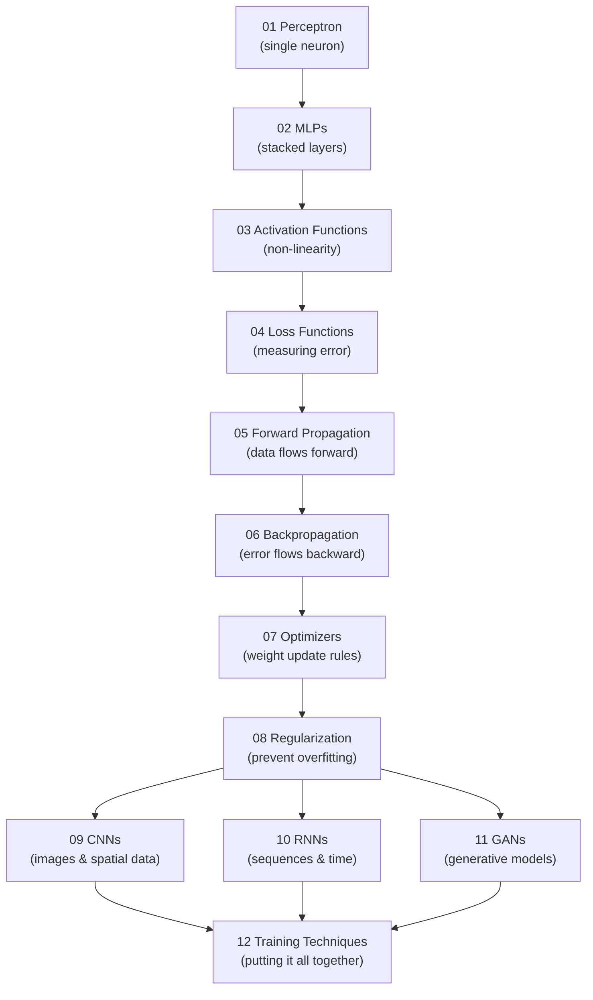

# 🧠 Neural Networks & Deep Learning

⬅️ [03 Classical ML Algorithms](../03_Classical_ML_Algorithms/Readme.md) &nbsp;|&nbsp; [🏠 Home](../00_Learning_Guide/Readme.md) &nbsp;|&nbsp; [05 NLP Foundations ➡️](../05_NLP_Foundations/Readme.md)

> From a single artificial neuron to convolutional image recognizers, recurrent sequence models, and generative adversarial networks — this section is where machine learning becomes deep learning.

**[▶ Start here → Perceptron Theory](./01_Perceptron/Theory.md)**

---

## At a Glance

| | |
|---|---|
| 📚 Topics | 12 topics |
| ⏱️ Est. Time | 6–8 hours |
| 📋 Prerequisites | [03 Classical ML Algorithms](../03_Classical_ML_Algorithms/Readme.md) |
| 🔓 Unlocks | [05 NLP Foundations](../05_NLP_Foundations/Readme.md) |

---

## What's in This Section

---

## Topics

| # | Topic | What You'll Learn | Files |
|---|---|---|---|
| 01 | [Perceptron](./01_Perceptron/Theory.md) | Single neuron, weights, bias, step function, linear separability | [📖 Theory](./01_Perceptron/Theory.md) · [⚡ Cheatsheet](./01_Perceptron/Cheatsheet.md) · [🎯 Interview Q&A](./01_Perceptron/Interview_QA.md) |
| 02 | [MLPs](./02_MLPs/Theory.md) | Multiple layers, hidden layers, non-linearity, fully connected nets | [📖 Theory](./02_MLPs/Theory.md) · [⚡ Cheatsheet](./02_MLPs/Cheatsheet.md) · [🎯 Interview Q&A](./02_MLPs/Interview_QA.md) · [💻 Code](./02_MLPs/Code_Example.md) |
| 03 | [Activation Functions](./03_Activation_Functions/Theory.md) | ReLU, Sigmoid, Tanh, Softmax — when and why to use each | [📖 Theory](./03_Activation_Functions/Theory.md) · [⚡ Cheatsheet](./03_Activation_Functions/Cheatsheet.md) · [🎯 Interview Q&A](./03_Activation_Functions/Interview_QA.md) · [🔀 Comparison](./03_Activation_Functions/Comparison.md) |
| 04 | [Loss Functions](./04_Loss_Functions/Theory.md) | MSE, Cross-Entropy — measuring exactly how wrong the model is | [📖 Theory](./04_Loss_Functions/Theory.md) · [⚡ Cheatsheet](./04_Loss_Functions/Cheatsheet.md) · [🎯 Interview Q&A](./04_Loss_Functions/Interview_QA.md) · [🔀 Comparison](./04_Loss_Functions/Comparison.md) |
| 05 | [Forward Propagation](./05_Forward_Propagation/Theory.md) | How input data flows through every layer to produce a prediction | [📖 Theory](./05_Forward_Propagation/Theory.md) · [⚡ Cheatsheet](./05_Forward_Propagation/Cheatsheet.md) · [🎯 Interview Q&A](./05_Forward_Propagation/Interview_QA.md) · [🔢 Math](./05_Forward_Propagation/Math_Walkthrough.md) |
| 06 | [Backpropagation](./06_Backpropagation/Theory.md) | Chain rule, gradients, how error flows backward to update weights | [📖 Theory](./06_Backpropagation/Theory.md) · [⚡ Cheatsheet](./06_Backpropagation/Cheatsheet.md) · [🎯 Interview Q&A](./06_Backpropagation/Interview_QA.md) · [🔢 Math](./06_Backpropagation/Math_Walkthrough.md) |
| 07 | [Optimizers](./07_Optimizers/Theory.md) | SGD, Momentum, RMSProp, Adam — the algorithms that actually update weights | [📖 Theory](./07_Optimizers/Theory.md) · [⚡ Cheatsheet](./07_Optimizers/Cheatsheet.md) · [🎯 Interview Q&A](./07_Optimizers/Interview_QA.md) · [🔀 Comparison](./07_Optimizers/Comparison.md) |
| 08 | [Regularization](./08_Regularization/Theory.md) | L1, L2, Dropout, Early Stopping — techniques to prevent overfitting | [📖 Theory](./08_Regularization/Theory.md) · [⚡ Cheatsheet](./08_Regularization/Cheatsheet.md) · [🎯 Interview Q&A](./08_Regularization/Interview_QA.md) |
| 09 | [CNNs](./09_CNNs/Theory.md) | Convolutional networks for images — filters, pooling, feature maps | [📖 Theory](./09_CNNs/Theory.md) · [⚡ Cheatsheet](./09_CNNs/Cheatsheet.md) · [🎯 Interview Q&A](./09_CNNs/Interview_QA.md) · [🏗️ Architecture](./09_CNNs/Architecture_Deep_Dive.md) · [💻 Code](./09_CNNs/Code_Example.md) |
| 10 | [RNNs](./10_RNNs/Theory.md) | Recurrent networks for sequences — hidden state, LSTM, GRU | [📖 Theory](./10_RNNs/Theory.md) · [⚡ Cheatsheet](./10_RNNs/Cheatsheet.md) · [🎯 Interview Q&A](./10_RNNs/Interview_QA.md) · [🏗️ Architecture](./10_RNNs/Architecture_Deep_Dive.md) · [💻 Code](./10_RNNs/Code_Example.md) |
| 11 | [GANs](./11_GANs/Theory.md) | Generator vs discriminator, adversarial training, synthetic data | [📖 Theory](./11_GANs/Theory.md) · [⚡ Cheatsheet](./11_GANs/Cheatsheet.md) · [🎯 Interview Q&A](./11_GANs/Interview_QA.md) · [🏗️ Architecture](./11_GANs/Architecture_Deep_Dive.md) |
| 12 | [Training Techniques](./12_Training_Techniques/Theory.md) | Batch size, epochs, LR schedules, transfer learning, debugging | [📖 Theory](./12_Training_Techniques/Theory.md) · [⚡ Cheatsheet](./12_Training_Techniques/Cheatsheet.md) · [🎯 Interview Q&A](./12_Training_Techniques/Interview_QA.md) · [🔧 Troubleshooting](./12_Training_Techniques/Troubleshooting_Guide.md) |

---

## Key Concepts at a Glance

| Concept | Why It Matters in AI |
|---|---|
| The core training loop is Forward Prop → Loss → Backprop → Optimizer update | Topics 01–07 build this loop piece by piece; understanding each step lets you debug any network |
| Activation functions give networks power over linear models | Without them, a 100-layer network collapses to a single linear transformation — non-linearity is what makes depth meaningful |
| Backpropagation is just the chain rule applied systematically | Understanding it once unlocks everything else — it is the mechanism by which all gradient-based learning works |
| CNNs exploit spatial structure; RNNs exploit temporal structure | Nearby pixels are related (CNNs); earlier tokens affect later ones (RNNs) — each architecture is matched to its data type |
| Regularization is not optional | Any network powerful enough to learn will overfit without it; dropout, weight decay, and early stopping are the first line of defence |

---

## 📂 Navigation

⬅️ **Prev:** [03 Classical ML Algorithms](../03_Classical_ML_Algorithms/Readme.md) &nbsp;&nbsp; ➡️ **Next:** [05 NLP Foundations](../05_NLP_Foundations/Readme.md)
