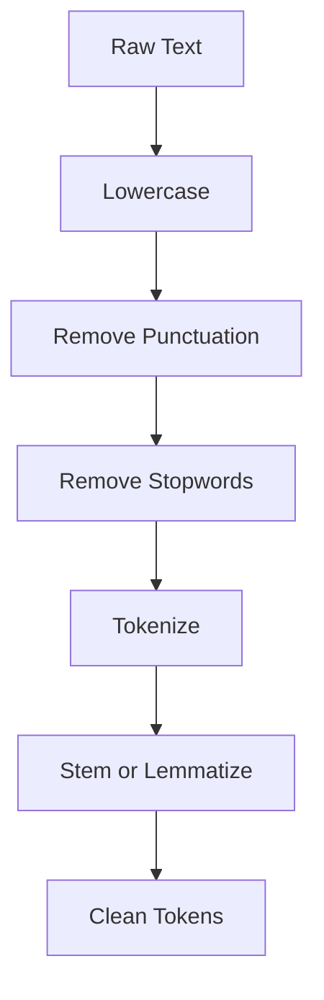

# Text Preprocessing

Imagine you're baking a cake. Before you mix anything, you wash the vegetables, peel off the skin, and chop them into the right size. You can't throw a muddy carrot straight into the batter — it would ruin everything. Raw text is exactly like that muddy carrot. It's messy, inconsistent, and full of stuff a model doesn't need.

👉 This is why we need **Text Preprocessing** — to clean raw text into a form models can actually learn from.

---

## The problem with raw text

Imagine you collect tweets for a sentiment analysis model. Here's what you get:

```
"OMG I LOVE this product!!! 😍😍 sooo good #bestever"
"i love this product"
"I LOVE THIS PRODUCT."
```

To a human, all three say the same thing. To a model working on raw text, they look completely different. Preprocessing makes them consistent.

---

## The full preprocessing pipeline



---

## Step by step

### 1. Lowercasing

Turn everything to lowercase. "Apple", "APPLE", and "apple" are the same word.

```
"I Love NLP" → "i love nlp"
```

### 2. Remove punctuation

Punctuation adds noise for most tasks. Strip it out.

```
"Hello, world!" → "Hello world"
```

### 3. Remove stopwords

Stopwords are very common words that carry little meaning: "the", "is", "a", "and", "of". Removing them reduces noise and shrinks your vocabulary.

```
"the cat sat on the mat" → "cat sat mat"
```

### 4. Tokenization

Split the text into individual tokens (usually words). This is covered in depth in Topic 02.

```
"clean text here" → ["clean", "text", "here"]
```

### 5. Stemming vs Lemmatization

Both reduce words to their root form. But they work differently.

**Stemming** chops off the end of a word. It's fast but crude.

```
"running" → "run"
"runs"    → "run"
"studies" → "studi"   ← not a real word!
```

**Lemmatization** uses a dictionary to find the actual base form. It's slower but smarter.

```
"running" → "run"
"studies" → "study"   ← real word
"better"  → "good"    ← knows it's an adjective
```

**Which to use?** Lemmatization for anything that needs accuracy. Stemming for quick prototypes or when speed matters.

---

## Do you always need all steps?

No. The pipeline depends on your task:

| Task | Skip what? |
|---|---|
| Sentiment analysis | Maybe keep punctuation (! matters) |
| Topic classification | Remove stopwords aggressively |
| Machine translation | Don't remove anything — structure matters |
| Search | Light preprocessing — preserve intent |

---

## Quick comparison: Stemming vs Lemmatization

| Feature | Stemming | Lemmatization |
|---|---|---|
| Speed | Fast | Slower |
| Output | May not be real word | Always real word |
| Uses dictionary? | No | Yes |
| Example | "studies" → "studi" | "studies" → "study" |
| Best for | Quick tasks | Accuracy-critical tasks |

---

✅ **What you just learned:** Text preprocessing is the cleaning pipeline that turns messy raw text into consistent tokens a model can work with.

🔨 **Build this now:** Take 5 random tweets or product reviews. Run them through the full pipeline manually — lowercase, strip punctuation, remove stopwords, lemmatize. Compare before and after.

➡️ **Next step:** Tokenization → `05_NLP_Foundations/02_Tokenization/Theory.md`

---

## 📂 Navigation

**In this folder:**
| File | |
|---|---|
| 📄 **Theory.md** | ← you are here |
| [📄 Cheatsheet.md](./Cheatsheet.md) | Quick reference |
| [📄 Interview_QA.md](./Interview_QA.md) | Interview prep |
| [📄 Code_Example.md](./Code_Example.md) | Python code examples |

⬅️ **Prev:** [12 Training Techniques](../../04_Neural_Networks_and_Deep_Learning/12_Training_Techniques/Theory.md) &nbsp;&nbsp;&nbsp; ➡️ **Next:** [02 Tokenization](../02_Tokenization/Theory.md)
