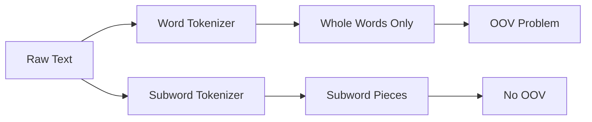
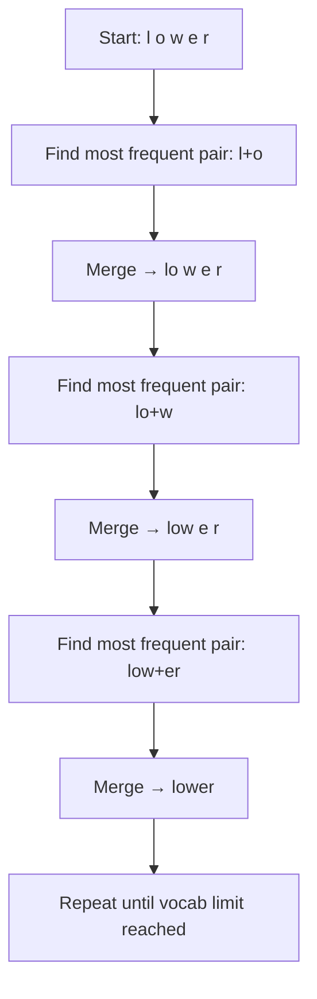

# Tokenization

You find a recipe in a language you're learning. Before translating you break it into pieces you can handle one at a time: "Add 2 cups of flour" → ["Add", "2", "cups", "of", "flour"].

👉 This is why we need **Tokenization** — to split text into pieces a model can process one at a time.

---

## 📌 Learning Priority

**Must Learn** — core concepts, needed to understand the rest of this file:
[What is a token](#what-is-a-token) · [Subword tokenization -- the solution](#subword-tokenization----the-solution) · [Byte Pair Encoding (BPE)](#byte-pair-encoding-bpe)

**Should Learn** — important for real projects and interviews:
[The OOV problem](#the-oov-problem-out-of-vocabulary) · [Token is not Word](#token--word)

**Good to Know** — useful in specific situations, not needed daily:
[Word tokenization](#word-tokenization) · [Tokenization types compared](#tokenization-types-compared)

---

## What is a token?

A token is the basic unit of text a model works with. It might be a whole word, part of a word, a character, or punctuation. **A token is not always the same as a word.**

- `"hello"` → 1 token (whole word)
- `"unbelievable"` → `["un", "believ", "able"]` (subword pieces)
- `"hi"` → `["h", "i"]` (characters)

---

## Word tokenization

Split on spaces and punctuation. Easy, but breaks down fast.

```
"The cat sat on the mat."
→ ["The", "cat", "sat", "on", "the", "mat", "."]
```

**Problems:**
- "New York" is one concept but two words
- "don't" — one token or two ("do" + "n't")?
- Languages like Chinese have no spaces

---

## The OOV problem (Out-of-Vocabulary)

If a word in test data wasn't in training data, the model has no idea what to do. New words, slang, and jargon are invented constantly. Word tokenization makes this worse: one new word = one OOV hit.

---

## Subword tokenization — the solution

Split into subword pieces. Unknown words can usually be built from smaller known pieces.

```
"unbelievable" → ["un", "believ", "able"]
"ChatGPT"      → ["Chat", "G", "PT"]
"tokenization" → ["token", "ization"]
```



---

## Byte Pair Encoding (BPE)

The most popular subword algorithm. Used by GPT, RoBERTa, and many others.

**How it works:**
1. Start with all individual characters as vocabulary
2. Find the most common adjacent token pair
3. Merge that pair into a new token
4. Repeat until vocabulary size limit is reached



---

## Token ≠ Word

| Input | Word count | Token count (GPT-2) |
|---|---|---|
| "Hello world" | 2 | 2 |
| "ChatGPT is amazing" | 3 | 5 |
| "Supercalifragilistic" | 1 | 6 |
| "I love AI" | 3 | 4 |

When an LLM has a "4096 token context window" that's not 4096 words — roughly 3000 words. Rule of thumb: 1 token ≈ 0.75 words in English.

---

## Tokenization types compared

| Type | How it splits | Good for | Bad for |
|---|---|---|---|
| Word | Spaces + punctuation | Simple tasks | OOV, morphology |
| Subword (BPE) | Frequent subword pieces | LLMs, modern NLP | Interpretability |
| Character | Single characters | Any language | Very long sequences |
| SentencePiece | Data-driven, no spaces needed | Multilingual | Needs lots of data |

---

✅ **What you just learned:** Tokenization splits text into units a model processes, and subword tokenization solves the OOV problem by breaking unknown words into known pieces.

🔨 **Build this now:** Take "The unbelievable transformation surprised everyone." Tokenize with NLTK's word tokenizer and with HuggingFace's GPT-2 tokenizer. Count the tokens. Are they different?

➡️ **Next step:** Bag of Words & TF-IDF → `05_NLP_Foundations/03_Bag_of_Words_and_TF_IDF/Theory.md`


---

## 📝 Practice Questions

- 📝 [Q26 · tokenization](../../ai_practice_questions_100.md#q26--normal--tokenization)


---

## 📂 Navigation

**In this folder:**
| File | |
|---|---|
| 📄 **Theory.md** | ← you are here |
| [📄 Cheatsheet.md](./Cheatsheet.md) | Quick reference |
| [📄 Interview_QA.md](./Interview_QA.md) | Interview prep |
| [📄 Code_Example.md](./Code_Example.md) | Python code examples |

⬅️ **Prev:** [01 Text Preprocessing](../01_Text_Preprocessing/Theory.md) &nbsp;&nbsp;&nbsp; ➡️ **Next:** [03 Bag of Words and TF-IDF](../03_Bag_of_Words_and_TF_IDF/Theory.md)
