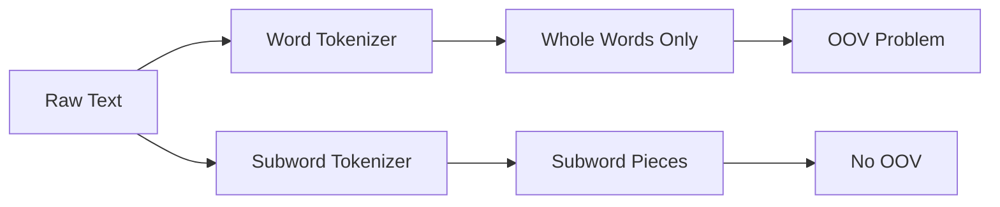

# Tokenization

You find a recipe written in a language you're learning. Before you can even start translating it, you have to break it into pieces you can handle one at a time. "Add 2 cups of flour" becomes ["Add", "2", "cups", "of", "flour"]. You can't translate a whole sentence at once — you start with the smallest meaningful units.

👉 This is why we need **Tokenization** — to split text into pieces that a model can process one at a time.

---

## What is a token?

A token is the basic unit of text a model works with. It might be:

- A whole word: `"hello"` → 1 token
- Part of a word: `"unbelievable"` → `["un", "believ", "able"]`
- A character: `"hi"` → `["h", "i"]`
- A punctuation mark

The important thing: **a token is not always the same as a word.**

---

## Word tokenization

The simplest approach. Split on spaces and punctuation.

```
"The cat sat on the mat."
→ ["The", "cat", "sat", "on", "the", "mat", "."]
```

Easy and intuitive. But it breaks down fast.

**Problems with word tokenization:**

- "New York" is one concept but two words
- "don't" → is it one token or two? ("do" + "n't")
- "color" vs "colour" — same word, different spellings
- Languages like Chinese have no spaces at all

---

## The OOV problem (Out-of-Vocabulary)

If a word in the test data wasn't in the training data, the model has no idea what to do with it. This is the OOV problem.

New words are invented constantly. Names, slang, technical jargon — they'll never all be in your vocabulary. Word tokenization makes this worse: one new word means one OOV hit.

---

## Subword tokenization — the solution

Instead of whole words, split into subword pieces. Unknown words can usually be built from smaller known pieces.

```
"unbelievable" → ["un", "believ", "able"]
"ChatGPT"      → ["Chat", "G", "PT"]
"tokenization" → ["token", "ization"]
```

This way, even completely new words get a reasonable representation.



---

## Byte Pair Encoding (BPE)

BPE is the most popular subword tokenization algorithm. Used by GPT, RoBERTa, and many others.

**How it works:**

1. Start with all individual characters as the vocabulary
2. Find the most common pair of tokens in the training data
3. Merge that pair into a new token
4. Repeat until you hit your vocabulary size limit

**Example:**

Training corpus contains lots of "low", "lower", "lowest". BPE might learn to merge:
- `l` + `o` → `lo`
- `lo` + `w` → `low`
- `low` + `er` → `lower`

---

## Token ≠ Word

This is critical for understanding LLMs.

| Input | Word count | Token count (GPT-2) |
|---|---|---|
| "Hello world" | 2 | 2 |
| "ChatGPT is amazing" | 3 | 5 |
| "Supercalifragilistic" | 1 | 6 |
| "I love AI" | 3 | 4 |

When an LLM says it has a "4096 token context window", that's not 4096 words — it's roughly 3000 words. Rule of thumb: 1 token ≈ 0.75 words in English.

---

## Tokenization types compared

| Type | How it splits | Good for | Bad for |
|---|---|---|---|
| Word | Spaces + punctuation | Simple tasks | OOV, morphology |
| Subword (BPE) | Frequent subword pieces | LLMs, modern NLP | Interpretability |
| Character | Single characters | Any language | Very long sequences |
| SentencePiece | Data-driven, no spaces needed | Multilingual | Needs lots of data |

---

✅ **What you just learned:** Tokenization splits text into units a model processes, and subword tokenization solves the OOV problem by breaking unknown words into known pieces.

🔨 **Build this now:** Take the sentence "The unbelievable transformation surprised everyone." Tokenize it with NLTK's word tokenizer and then with HuggingFace's GPT-2 tokenizer. Count the tokens. Are they different?

➡️ **Next step:** Bag of Words & TF-IDF → `05_NLP_Foundations/03_Bag_of_Words_and_TF_IDF/Theory.md`

---

## 📂 Navigation

**In this folder:**
| File | |
|---|---|
| 📄 **Theory.md** | ← you are here |
| [📄 Cheatsheet.md](./Cheatsheet.md) | Quick reference |
| [📄 Interview_QA.md](./Interview_QA.md) | Interview prep |
| [📄 Code_Example.md](./Code_Example.md) | Python code examples |

⬅️ **Prev:** [01 Text Preprocessing](../01_Text_Preprocessing/Theory.md) &nbsp;&nbsp;&nbsp; ➡️ **Next:** [03 Bag of Words and TF-IDF](../03_Bag_of_Words_and_TF_IDF/Theory.md)
