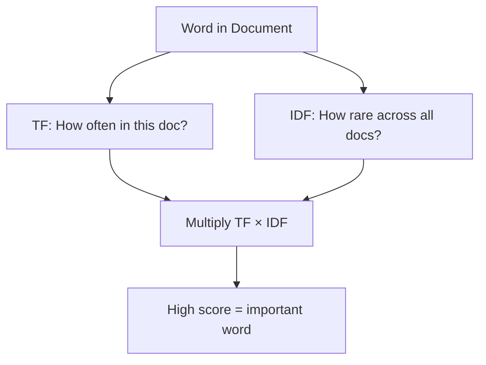

# Bag of Words & TF-IDF

A librarian needs to categorize thousands of books but hasn't read any of them. So she counts the words. The book with "war", "battle", and "soldier" appearing hundreds of times is probably a history book. The one full of "love", "heart", and "kiss" is probably a romance. She ignores word order, ignores grammar — just counts.

👉 This is why we need **Bag of Words** — to turn text into numbers by counting what words appear, so a model can work with it mathematically.

---

## Bag of Words (BoW)

BoW turns a document into a vector of word counts. Every word in your vocabulary gets a column. Every document gets a row. The value is how many times that word appears.

**Example corpus:**

```
Doc 1: "the cat sat on the mat"
Doc 2: "the dog sat on the log"
Doc 3: "cats and dogs are great pets"
```

**BoW matrix:**

| | the | cat | sat | on | mat | dog | log | cats | dogs | great | pets |
|---|---|---|---|---|---|---|---|---|---|---|---|
| Doc 1 | 2 | 1 | 1 | 1 | 1 | 0 | 0 | 0 | 0 | 0 | 0 |
| Doc 2 | 2 | 0 | 1 | 1 | 0 | 1 | 1 | 0 | 0 | 0 | 0 |
| Doc 3 | 0 | 0 | 0 | 0 | 0 | 0 | 0 | 1 | 1 | 1 | 1 |

Each document is now just a row of numbers. A model can work with numbers.

---

## Limitations of BoW

**1. No word order**

"Dog bites man" and "Man bites dog" produce the exact same BoW vector.

**2. No meaning**

"Great" and "terrible" are just two different columns. BoW doesn't know they're opposites.

**3. Common words dominate**

"the", "is", "a" appear in everything. They'll have huge counts and drown out the important words — unless you remove them first.

---

## TF-IDF — smarter weighting

TF-IDF (Term Frequency — Inverse Document Frequency) fixes the "common words dominate" problem. It rewards words that are frequent in *this* document but rare across *all* documents.



### Term Frequency (TF)

How often does this word appear in this document?

```
TF = (count of word in document) / (total words in document)
```

"cat" appears 1 time in a 6-word document → TF = 1/6 ≈ 0.167

### Inverse Document Frequency (IDF)

How rare is this word across all documents?

```
IDF = log(total documents / documents containing the word)
```

"the" appears in every document → IDF ≈ 0 (not useful)
"blockchain" appears in 1 of 1000 documents → IDF is high (very useful)

### TF-IDF score

```
TF-IDF = TF × IDF
```

A word that's frequent in this document AND rare everywhere else gets a high score. That's what makes it useful.

---

## BoW vs TF-IDF at a glance

| | Bag of Words | TF-IDF |
|---|---|---|
| What it measures | Raw word counts | Weighted word importance |
| Handles common words? | No — they dominate | Yes — penalized by IDF |
| Captures meaning? | No | No |
| Good for | Baseline, simple tasks | Classification, search, IR |
| Complexity | Very simple | Simple but smarter |

---

## Real use cases

- **Spam detection:** "free", "win", "prize" in spam → high TF-IDF score
- **Document search:** find documents most relevant to a query
- **Topic classification:** which category does this news article belong to?
- **Document similarity:** compare two documents as vectors

---

✅ **What you just learned:** Bag of Words converts text to word-count vectors; TF-IDF improves this by giving higher weight to words that are distinctive for a document rather than just common everywhere.

🔨 **Build this now:** Take 3 sentences of your choice. Build a BoW matrix by hand. Then note which words would get a low TF-IDF score (appear in all 3) vs a high one (appear in only one).

➡️ **Next step:** Word Embeddings → `05_NLP_Foundations/04_Word_Embeddings/Theory.md`

---

## 📂 Navigation

**In this folder:**
| File | |
|---|---|
| 📄 **Theory.md** | ← you are here |
| [📄 Cheatsheet.md](./Cheatsheet.md) | Quick reference |
| [📄 Interview_QA.md](./Interview_QA.md) | Interview prep |
| [📄 Code_Example.md](./Code_Example.md) | Python code examples |

⬅️ **Prev:** [02 Tokenization](../02_Tokenization/Theory.md) &nbsp;&nbsp;&nbsp; ➡️ **Next:** [04 Word Embeddings](../04_Word_Embeddings/Theory.md)
