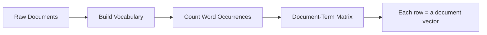
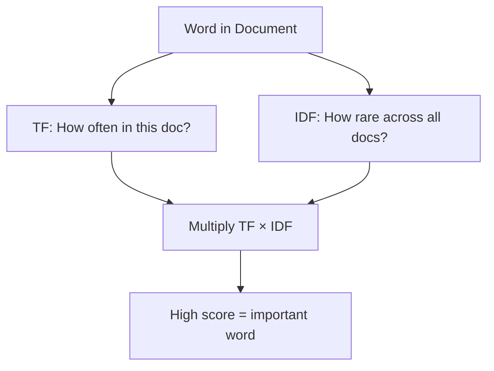

# Bag of Words & TF-IDF

A librarian categorizes thousands of books without reading them — she counts words. The book full of "war", "battle", "soldier" is probably history. The one full of "love", "heart", "kiss" is probably romance. She ignores word order, ignores grammar, just counts.

👉 This is why we need **Bag of Words** — to turn text into numbers by counting word occurrences so a model can work with it mathematically.

---

## 📌 Learning Priority

**Must Learn** — core concepts, needed to understand the rest of this file:
[Bag of Words (BoW)](#bag-of-words-bow) · [TF-IDF -- smarter weighting](#tf-idf----smarter-weighting) · [Limitations of BoW](#limitations-of-bow)

**Should Learn** — important for real projects and interviews:
[BoW vs TF-IDF at a glance](#bow-vs-tf-idf-at-a-glance) · [Real use cases](#real-use-cases)

---

## Bag of Words (BoW)

BoW turns a document into a vector of word counts. Every vocabulary word gets a column; every document gets a row; values are occurrence counts.



**Example corpus:**
```
Doc 1: "the cat sat on the mat"
Doc 2: "the dog sat on the log"
Doc 3: "cats and dogs are great pets"
```

**BoW matrix:**

| | the | cat | sat | on | mat | dog | log | cats | dogs | great | pets |
|---|---|---|---|---|---|---|---|---|---|---|---|
| Doc 1 | 2 | 1 | 1 | 1 | 1 | 0 | 0 | 0 | 0 | 0 | 0 |
| Doc 2 | 2 | 0 | 1 | 1 | 0 | 1 | 1 | 0 | 0 | 0 | 0 |
| Doc 3 | 0 | 0 | 0 | 0 | 0 | 0 | 0 | 1 | 1 | 1 | 1 |

---

## Limitations of BoW

1. **No word order** — "Dog bites man" and "Man bites dog" produce the same vector.
2. **No meaning** — "great" and "terrible" are just two different columns.
3. **Common words dominate** — "the", "is", "a" appear everywhere and drown out important words unless removed first.

---

## TF-IDF — smarter weighting

TF-IDF (Term Frequency — Inverse Document Frequency) rewards words that are frequent in *this* document but rare across *all* documents.



**Term Frequency (TF):**
```
TF = (count of word in document) / (total words in document)
```
"cat" appears 1 time in a 6-word document → TF = 1/6 ≈ 0.167

**Inverse Document Frequency (IDF):**
```
IDF = log(total documents / documents containing the word)
```
"the" appears in every document → IDF ≈ 0. "blockchain" in 1 of 1000 docs → high IDF.

**TF-IDF = TF × IDF** — high score = frequent in this doc AND rare everywhere else.

---

## BoW vs TF-IDF at a glance

| | Bag of Words | TF-IDF |
|---|---|---|
| What it measures | Raw word counts | Weighted word importance |
| Handles common words? | No — they dominate | Yes — penalized by IDF |
| Captures meaning? | No | No |
| Good for | Baseline, simple tasks | Classification, search, IR |

---

## Real use cases

- **Spam detection:** "free", "win", "prize" in spam → high TF-IDF score
- **Document search:** find documents most relevant to a query
- **Topic classification:** which category does this article belong to?
- **Document similarity:** compare two documents as vectors

---

✅ **What you just learned:** Bag of Words converts text to word-count vectors; TF-IDF improves this by weighting words that are distinctive for a document rather than just common everywhere.

🔨 **Build this now:** Take 3 sentences. Build a BoW matrix by hand. Which words would get a low TF-IDF score (appear in all 3) vs a high one (appear in only one)?

➡️ **Next step:** Word Embeddings → `05_NLP_Foundations/04_Word_Embeddings/Theory.md`


---

## 📝 Practice Questions

- 📝 [Q28 · tf-idf](../../ai_practice_questions_100.md#q28--normal--tf-idf)


---

## 📂 Navigation

**In this folder:**
| File | |
|---|---|
| 📄 **Theory.md** | ← you are here |
| [📄 Cheatsheet.md](./Cheatsheet.md) | Quick reference |
| [📄 Interview_QA.md](./Interview_QA.md) | Interview prep |
| [📄 Code_Example.md](./Code_Example.md) | Python code examples |

⬅️ **Prev:** [02 Tokenization](../02_Tokenization/Theory.md) &nbsp;&nbsp;&nbsp; ➡️ **Next:** [04 Word Embeddings](../04_Word_Embeddings/Theory.md)
