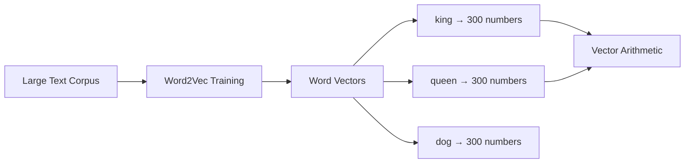

# Word Embeddings

"Dad" in your contacts isn't just a label — it carries invisible metadata: family, trust, emergency calls, late-night chats. Words are similar. "King" carries meaning about power, royalty, gender, and history. Word embeddings capture that invisible profile for every word.

👉 This is why we need **Word Embeddings** — to give every word a rich numerical profile that captures its meaning and relationships.

---

## The problem with BoW and TF-IDF

In a BoW vector, "happy" and "joyful" look completely unrelated — just two different columns. Word embeddings fix this: words with similar meanings end up close together in embedding space.

---

## What is a word embedding?

A dense vector of numbers learned automatically from patterns in large text. Each word maps to ~300 numbers:

```
"king"  → [0.12, -0.45, 0.89, 0.03, ...]   (300 numbers)
"queen" → [0.11, -0.43, 0.87, 0.05, ...]   (similar!)
"dog"   → [-0.34, 0.72, -0.12, 0.91, ...]  (very different)
```

"King" and "queen" are close in vector space because they appear in similar contexts.

---

## The key idea: distributional hypothesis

> Words that appear in similar contexts have similar meanings.

"I fed my ___" — if many texts fill this with "cat", "dog", "fish", those words are semantically similar. Word2Vec learns this by watching which words appear near each other.

---

## Word2Vec

The algorithm that made embeddings famous (Google, 2013). Two training approaches:

**CBOW:** Predict the center word from surrounding words.
```
Context: ["I", "fed", "my", "_", "today"] → Predict: "cat"
```

**Skip-gram:** Predict surrounding words from the center word.
```
Center: "cat" → Predict: ["I", "fed", "my", "today"]
```



---

## The famous king-queen example

```
king - man + woman ≈ queen
paris - france + italy ≈ rome
```

The "royalty" direction and the "gender" direction are encoded as vector dimensions. The model learned these relationships purely from text patterns.

---

## Cosine similarity

Measures whether two words are similar — the angle between their vectors:
- Cosine similarity = 1 → identical direction → very similar
- Cosine similarity = 0 → perpendicular → unrelated
- Cosine similarity = −1 → opposite direction → antonyms

```python
from numpy.linalg import norm
import numpy as np

def cosine_sim(v1, v2):
    return np.dot(v1, v2) / (norm(v1) * norm(v2))
```

---

## Why embeddings beat BoW

| | BoW / TF-IDF | Word Embeddings |
|---|---|---|
| "happy" vs "joyful" | Completely different | Very close |
| Dimensionality | Vocab size (50k+) | Fixed (100–300) |
| Captures meaning? | No | Yes |
| Vector density | Sparse | Dense |
| Can do math? | No | Yes (king − man) |

---

## Types of embeddings

| Type | Year | Key property |
|---|---|---|
| Word2Vec | 2013 | Fast, context-free |
| GloVe | 2014 | Global co-occurrence statistics |
| FastText | 2016 | Handles subwords, good for OOV |
| ELMo | 2018 | Context-dependent (same word, different meanings) |
| BERT embeddings | 2018 | Deep contextual, state of the art |

---

✅ **What you just learned:** Word embeddings are dense vectors capturing word meaning from context in large corpora, enabling semantic similarity and vector arithmetic.

🔨 **Build this now:** Load a pretrained Word2Vec model (gensim) and find the 5 most similar words to "king". Then try: king − man + woman. What do you get?

➡️ **Next step:** Semantic Similarity → `05_NLP_Foundations/05_Semantic_Similarity/Theory.md`

---

## 📂 Navigation

**In this folder:**
| File | |
|---|---|
| 📄 **Theory.md** | ← you are here |
| [📄 Cheatsheet.md](./Cheatsheet.md) | Quick reference |
| [📄 Interview_QA.md](./Interview_QA.md) | Interview prep |
| [📄 Code_Example.md](./Code_Example.md) | Python code examples |

⬅️ **Prev:** [03 Bag of Words and TF-IDF](../03_Bag_of_Words_and_TF_IDF/Theory.md) &nbsp;&nbsp;&nbsp; ➡️ **Next:** [05 Semantic Similarity](../05_Semantic_Similarity/Theory.md)
