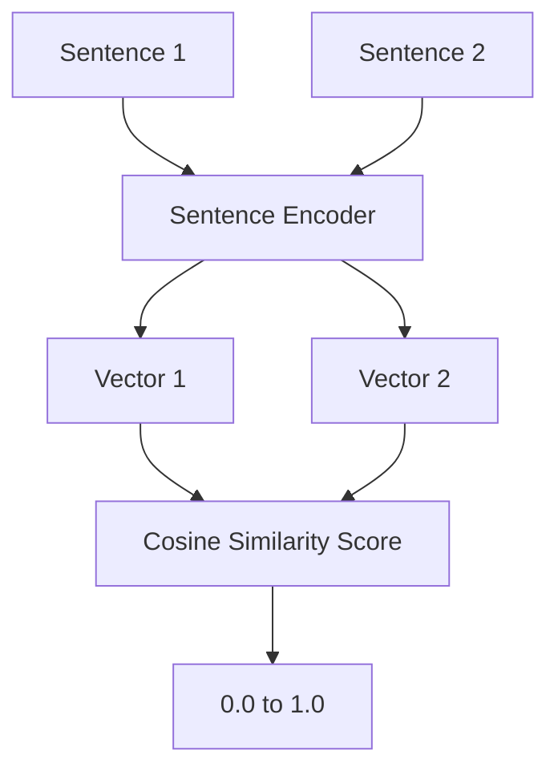

# Semantic Similarity

You've just finished an incredible novel and you want to find more books like it. You go to a librarian and she doesn't just search for books with the same title words — she finds books with the same themes, the same emotional tone, the same kind of story. "You loved a slow-burn historical mystery with a female detective? Try these three." She's matching by meaning, not by words.

👉 This is why we need **Semantic Similarity** — to measure how close two pieces of text are in meaning, not just in the words they share.

---

## The problem with keyword matching

"The car broke down." and "My vehicle stopped working." have zero words in common. A keyword search would say these sentences are completely unrelated.

But they mean the same thing. Semantic similarity captures this.

---

## Word overlap approaches (the old way)

**Jaccard similarity** — count shared words over total unique words.

```
"I love cats"  → {I, love, cats}
"I love dogs"  → {I, love, dogs}

Jaccard = |intersection| / |union| = 2 / 4 = 0.5
```

Fast and simple, but misses synonyms and meaning entirely.

---

## Cosine similarity on TF-IDF vectors (the classic way)

Represent each sentence as a TF-IDF vector, then measure the angle between them.

Better than Jaccard, but still breaks down when synonyms are used.

---

## Sentence embeddings — the modern way

Instead of comparing word lists, convert each sentence into a single dense vector that captures its overall meaning. Then compare those vectors with cosine similarity.



---

## SBERT — Sentence BERT

SBERT (Sentence Transformers) is the most popular tool for generating sentence embeddings. It's a BERT model fine-tuned specifically to produce good sentence-level representations.

Key properties:
- Produces a single 768-dimensional vector per sentence
- Semantically similar sentences have high cosine similarity
- Handles paraphrases, synonyms, and different phrasings

```
"The car broke down."         → [0.23, -0.14, 0.87, ...]
"My vehicle stopped working." → [0.21, -0.12, 0.85, ...]

cosine_similarity = 0.94  ← very similar!
```

---

## Real-world use cases

| Use case | How semantic similarity helps |
|---|---|
| Search engines | Match queries to documents by meaning, not keywords |
| FAQ deduplication | Find which support tickets are asking the same question |
| Recommendation | "Users who liked this also liked..." |
| Plagiarism detection | Find paraphrased content that keyword matching misses |
| Chatbot intent matching | Map "How do I reset my password?" to the right FAQ answer |

---

## Similarity score interpretation

| Score | Meaning |
|---|---|
| 0.95 – 1.0 | Near-duplicate or paraphrase |
| 0.80 – 0.95 | Very similar topic/meaning |
| 0.60 – 0.80 | Related but not the same |
| 0.30 – 0.60 | Somewhat related |
| 0.0 – 0.30 | Unrelated |

---

## Approaches ranked by quality

| Method | Handles synonyms | Speed | Quality |
|---|---|---|---|
| Jaccard (word overlap) | No | Very fast | Low |
| TF-IDF cosine | Partial | Fast | Medium |
| Word2Vec average | Some | Fast | Medium |
| SBERT | Yes | Medium | High |
| GPT embeddings | Yes | Slower | Very high |

---

✅ **What you just learned:** Semantic similarity measures how close two texts are in meaning using sentence embeddings and cosine similarity — going far beyond simple keyword matching.

🔨 **Build this now:** Use sentence-transformers to compute similarity between "I need help with my bill" and three different phrasings: "billing support needed", "how much do I owe", and "I want to buy a product." Rank them by similarity score.

➡️ **Next step:** Hidden Markov Models → `05_NLP_Foundations/06_Hidden_Markov_Models/Theory.md`

---

## 📂 Navigation

**In this folder:**
| File | |
|---|---|
| 📄 **Theory.md** | ← you are here |
| [📄 Cheatsheet.md](./Cheatsheet.md) | Quick reference |
| [📄 Interview_QA.md](./Interview_QA.md) | Interview prep |
| [📄 Code_Example.md](./Code_Example.md) | Python code examples |

⬅️ **Prev:** [04 Word Embeddings](../04_Word_Embeddings/Theory.md) &nbsp;&nbsp;&nbsp; ➡️ **Next:** [06 Hidden Markov Models](../06_Hidden_Markov_Models/Theory.md)
