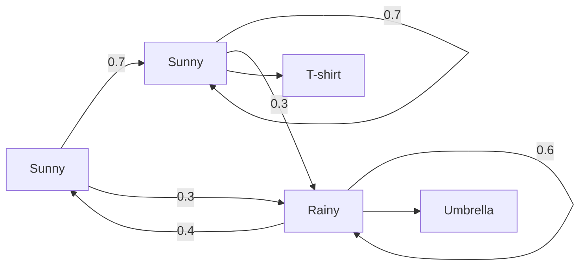

# Hidden Markov Models

Imagine you're a doctor and your patient just walked in. You can't directly observe the weather outside — but you can observe what they're wearing. T-shirt → probably sunny. Umbrella and wet shoes → definitely rainy. Puffy jacket → cold. You can't see the weather (hidden), but you can reason about it from what you can see (visible). And you know that if it was sunny yesterday, it's probably sunny today too.

👉 This is why we need **Hidden Markov Models** — to reason about hidden states (like weather, grammar tags) from observable evidence, when states follow a predictable sequence.

---

## Two kinds of things in an HMM

**Hidden states** — what you can't observe directly.

In the weather example: Sunny, Rainy, Cloudy. You never see these directly.

In NLP: Parts of speech — Noun, Verb, Adjective. You can't see the tag directly; you see the word.

**Observable outputs** — what you can see.

In the weather example: T-shirt, Jacket, Umbrella. You see the outfit.

In NLP: The actual words — "run", "dog", "beautiful".

---

## The chain structure

HMMs model a sequence of states over time. At each step, you move to a new hidden state, then emit an observable output.



---

## Three components

**1. Initial probabilities (π)**

What state do we start in?

```
P(start=Sunny) = 0.6
P(start=Rainy) = 0.4
```

**2. Transition probabilities (A)**

Given the current state, what's the probability of moving to each next state?

```
P(Sunny → Sunny) = 0.7
P(Sunny → Rainy) = 0.3
P(Rainy → Sunny) = 0.4
P(Rainy → Rainy) = 0.6
```

**3. Emission probabilities (B)**

Given the current hidden state, what's the probability of observing each output?

```
P(T-shirt | Sunny) = 0.8
P(Umbrella | Sunny) = 0.1
P(T-shirt | Rainy) = 0.2
P(Umbrella | Rainy) = 0.7
```

---

## The Markov assumption

The key simplification that makes HMMs tractable:

> The next state depends only on the current state, not on all previous states.

This is called the **Markov assumption** or the "memoryless" property. You don't need to remember the whole history — just the current state.

---

## POS tagging with HMM

Part-of-speech tagging is a classic HMM task.

Sentence: "Dogs bark loudly"

- Hidden states: [NOUN, VERB, ADV]
- Observable outputs: ["Dogs", "bark", "loudly"]

The HMM learns:
- Transition: NOUN → VERB is common. VERB → ADV is common. NOUN → NOUN is less common.
- Emission: "dogs" is likely a NOUN. "bark" can be NOUN or VERB. "loudly" is likely ADV.

Given the observations ["Dogs", "bark", "loudly"], the HMM finds the most likely sequence of hidden tags.

---

## Viterbi algorithm — finding the best path

Given a sequence of observations, Viterbi finds the most likely sequence of hidden states.

It works by dynamic programming: instead of calculating every possible path (exponential), it fills a table step by step — at each position keeping only the best way to reach each state.

Think of it as: "Given I'm in state X at step t, what's the best path that got me here?"

---

✅ **What you just learned:** HMMs model sequences where you observe visible outputs and need to infer hidden states, using transition probabilities (state to state) and emission probabilities (state to observation).

🔨 **Build this now:** Draw the HMM for weather from above. For the observation sequence [T-shirt, Umbrella, T-shirt], trace through which hidden state sequence is most likely. Don't use code — do it by hand.

➡️ **Next step:** Conditional Random Fields → `05_NLP_Foundations/07_Conditional_Random_Fields/Theory.md`

---

## 📂 Navigation

**In this folder:**
| File | |
|---|---|
| 📄 **Theory.md** | ← you are here |
| [📄 Cheatsheet.md](./Cheatsheet.md) | Quick reference |
| [📄 Interview_QA.md](./Interview_QA.md) | Interview prep |
| [📄 Math_Intuition.md](./Math_Intuition.md) | Math intuition behind HMMs |

⬅️ **Prev:** [05 Semantic Similarity](../05_Semantic_Similarity/Theory.md) &nbsp;&nbsp;&nbsp; ➡️ **Next:** [07 Conditional Random Fields](../07_Conditional_Random_Fields/Theory.md)
