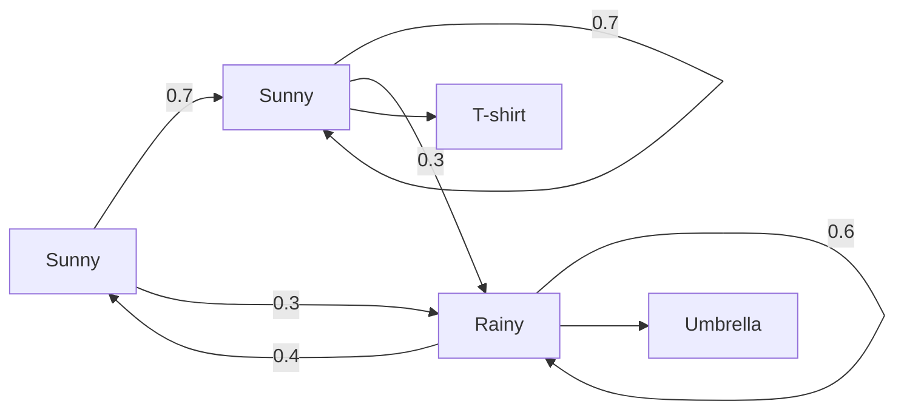
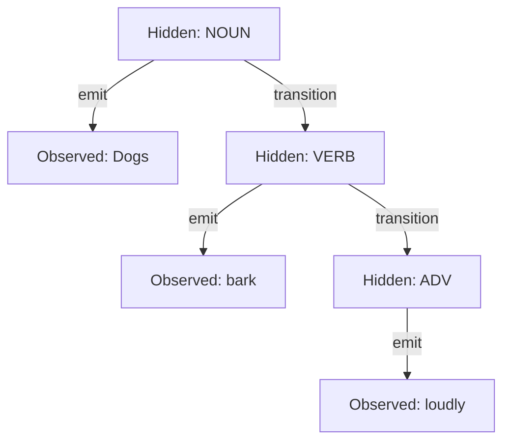
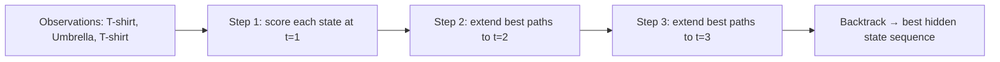

# Hidden Markov Models

You're a doctor and your patient just walked in. You can't see the weather outside, but you can observe what they're wearing. T-shirt → probably sunny. Umbrella and wet shoes → definitely rainy. You reason about hidden states from visible evidence, knowing today's weather likely resembles yesterday's.

👉 This is why we need **Hidden Markov Models** — to reason about hidden states from observable evidence when those states follow a predictable sequence.

---

## Two kinds of things in an HMM

**Hidden states** — what you can't observe directly.
- Weather example: Sunny, Rainy, Cloudy
- NLP: Parts of speech — Noun, Verb, Adjective (you see the word, not the tag)

**Observable outputs** — what you can see.
- Weather example: T-shirt, Jacket, Umbrella
- NLP: The actual words — "run", "dog", "beautiful"

---

## The chain structure

At each step you move to a new hidden state, then emit an observable output.



---

## Three components

**1. Initial probabilities (π)** — what state do we start in?
```
P(start=Sunny) = 0.6,  P(start=Rainy) = 0.4
```

**2. Transition probabilities (A)** — given current state, probability of each next state:
```
P(Sunny → Sunny) = 0.7,  P(Sunny → Rainy) = 0.3
P(Rainy → Sunny) = 0.4,  P(Rainy → Rainy) = 0.6
```

**3. Emission probabilities (B)** — given hidden state, probability of each observable:
```
P(T-shirt | Sunny) = 0.8,  P(Umbrella | Sunny) = 0.1
P(T-shirt | Rainy) = 0.2,  P(Umbrella | Rainy) = 0.7
```

---

## The Markov assumption

> The next state depends only on the current state, not on all previous history.

This "memoryless" property makes HMMs tractable.

---

## POS tagging with HMM

Sentence: "Dogs bark loudly" — hidden states: [NOUN, VERB, ADV], observables: ["Dogs", "bark", "loudly"]

The HMM learns:
- Transition: NOUN → VERB is common; VERB → ADV is common
- Emission: "dogs" is likely NOUN; "bark" can be NOUN or VERB; "loudly" is likely ADV



---

## Viterbi algorithm — finding the best path

Given a sequence of observations, Viterbi finds the most likely hidden state sequence using dynamic programming: instead of calculating every path (exponential), it fills a table step by step keeping only the best way to reach each state.



---

✅ **What you just learned:** HMMs model sequences where you observe visible outputs and infer hidden states, using transition probabilities (state to state) and emission probabilities (state to observation).

🔨 **Build this now:** Draw the weather HMM above. For observation sequence [T-shirt, Umbrella, T-shirt], trace the most likely hidden state sequence by hand.

➡️ **Next step:** Conditional Random Fields → `05_NLP_Foundations/07_Conditional_Random_Fields/Theory.md`

---

## 📂 Navigation

**In this folder:**
| File | |
|---|---|
| 📄 **Theory.md** | ← you are here |
| [📄 Cheatsheet.md](./Cheatsheet.md) | Quick reference |
| [📄 Interview_QA.md](./Interview_QA.md) | Interview prep |
| [📄 Math_Intuition.md](./Math_Intuition.md) | Math intuition behind HMMs |

⬅️ **Prev:** [05 Semantic Similarity](../05_Semantic_Similarity/Theory.md) &nbsp;&nbsp;&nbsp; ➡️ **Next:** [07 Conditional Random Fields](../07_Conditional_Random_Fields/Theory.md)
