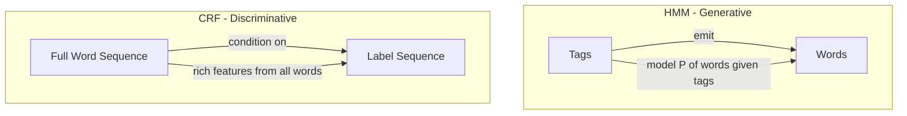
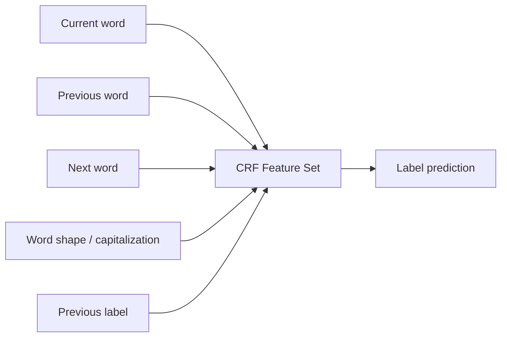
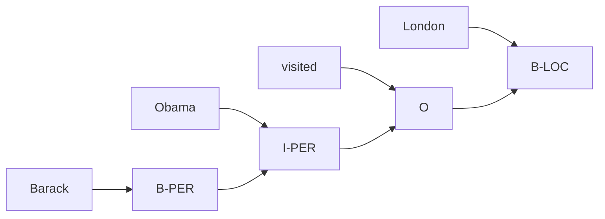

# Conditional Random Fields

A teacher labeling every word in an essay doesn't work word by word in isolation — she reads the whole sentence first. "bank" in "sitting by the bank of the river" → location. "bank" in "robbed the bank" → financial institution. The label depends on context.

👉 This is why we need **Conditional Random Fields** — to label sequences where each label depends on all surrounding context, not just the current word.

---

## What's wrong with labeling words in isolation?

"bank" alone → no answer. HMMs improve on this but have a key limitation: they compute P(word | tag), forcing them to model the distribution of words — complex and often unnecessary.

---

## CRF vs HMM: the key difference

**HMM** is a **generative model**:
```
P(words, tags) = P(tags) × P(words | tags)
```
Models both word generation and tag transitions — indirect and constrained.

**CRF** is a **discriminative model**:
```
P(tags | words)
```
Directly learns the conditional probability of the label sequence given the entire word sequence. No need to model word generation.



---

## What makes CRFs powerful

CRFs can use arbitrary features from the whole input:
- Current word: `word="bank"`
- Surrounding words: `next_word="robbery"`, `prev_word="river"`
- Word shape: `is_capitalized=True`
- Prefix/suffix: `ends_with="-tion"`, `starts_with="un-"`
- Previous label: `prev_tag=NOUN`

HMMs can only use the current word and previous tag. CRFs use a rich feature set from the entire input.



---

## Named Entity Recognition (NER) with CRF

NER labels entities in text: person names, organizations, locations.

```
"Barack  Obama  visited  London  yesterday"
 B-PER   I-PER  O        B-LOC   O
```

BIO labeling scheme:
- **B-XXX** = beginning of entity type XXX
- **I-XXX** = inside (continuation) of entity XXX
- **O** = outside (not an entity)

CRF is ideal because:
- "Barack Obama" spans two words — the model needs to link them
- Capitalization is a direct feature
- Context ("visited" before "London") confirms it's a location



---

## Why CRFs still matter

CRFs were the gold standard for sequence labeling before deep learning. Even today:
- Used inside BERT-based NER systems as the final layer (BiLSTM-CRF, BERT-CRF)
- Lightweight and interpretable
- Work well with domain-specific features
- Used in medical NLP, legal document processing, and specialized domains

---

✅ **What you just learned:** CRFs are discriminative sequence labeling models that directly predict label sequences given the full input, using rich contextual features — more flexible than HMMs for NLP tasks like NER.

🔨 **Build this now:** Label each word in "Apple launched a new iPhone in Cupertino." with NER tags (B-ORG, I-ORG, O, B-PROD, B-LOC etc.). Which words were ambiguous and what context resolved them?

➡️ **Next step:** Section 06 — Transformers → `06_Transformers/Readme.md`

---

## 📂 Navigation

**In this folder:**
| File | |
|---|---|
| 📄 **Theory.md** | ← you are here |
| [📄 Cheatsheet.md](./Cheatsheet.md) | Quick reference |
| [📄 Interview_QA.md](./Interview_QA.md) | Interview prep |

⬅️ **Prev:** [06 Hidden Markov Models](../06_Hidden_Markov_Models/Theory.md) &nbsp;&nbsp;&nbsp; ➡️ **Next:** [01 Sequence Models Before Transformers](../../06_Transformers/01_Sequence_Models_Before_Transformers/Theory.md)
