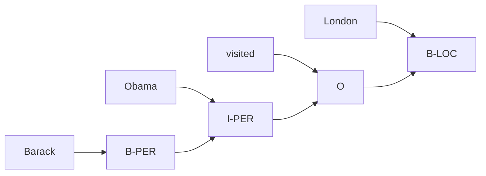

# Conditional Random Fields

A teacher is grading an essay and needs to label every word. She doesn't label each word in isolation — she reads the whole sentence first. When she sees "bank" she glances at the surrounding words. "Sitting by the bank of the river" → she labels it as a location. "Robbed the bank and escaped" → she labels it as a financial institution. The label depends on context.

👉 This is why we need **Conditional Random Fields** — to label sequences where each label depends not just on the current word, but on all the surrounding context.

---

## What's wrong with labeling words in isolation?

Imagine you try to label each word independently: just look at the word and assign a tag.

"bank" → ???

Is it a noun referring to money? Or a noun referring to geography? Looking at one word alone gives you no answer. You need to look at what's nearby.

HMMs improve on this, but they have a limitation: they compute P(word | tag). That forces them to model the distribution of words — which is complex and often unnecessary.

---

## CRF vs HMM: the key difference

**HMM** is a **generative model**. It models:
```
P(words, tags) = P(tags) × P(words | tags)
```
It models both how words are generated AND how tags transition. This is indirect — you want to predict tags, but you're also forced to model word generation.

**CRF** is a **discriminative model**. It models:
```
P(tags | words)
```
It directly learns the conditional probability of the label sequence given the entire word sequence. No need to model word generation.

---

## What makes CRFs powerful

CRFs can use arbitrary features. Not just the current word, but:

- The word itself: `word="bank"`
- Surrounding words: `next_word="robbery"`, `prev_word="river"`
- Word shape: `is_capitalized=True`, `is_all_caps=False`
- Prefix/suffix: `ends_with="-tion"`, `starts_with="un-"`
- Previous labels: `prev_tag=NOUN`

HMMs can only use the current word and the previous tag. CRFs can use a rich feature set from the whole input.

---

## Named Entity Recognition (NER) with CRF

NER labels entities in text: person names, organizations, locations.

```
"Barack  Obama  visited  London  yesterday"
 B-PER   I-PER  O        B-LOC   O
```

BIO labeling scheme:
- B-XXX = beginning of entity type XXX
- I-XXX = inside (continuation) of entity XXX
- O = outside (not an entity)

A CRF is perfect for this because:
- "Barack Obama" are two words — the model needs to know "Obama" continues the person entity
- Capitalization is a strong feature (CRFs use it directly)
- Context matters: "London" after "visited" is almost certainly a location



---

## Why CRFs still matter

CRFs were the gold standard for sequence labeling before deep learning. Even today:

- They're used inside BERT-based NER systems as the final layer (BiLSTM-CRF, BERT-CRF)
- They're lightweight and interpretable
- They work well when you have domain-specific features
- They're used in medical NLP, legal document processing, and other specialized domains

---

✅ **What you just learned:** CRFs are discriminative sequence labeling models that directly predict label sequences given the full input, using rich contextual features — making them more flexible than HMMs for NLP tasks like NER.

🔨 **Build this now:** Take the sentence "Apple launched a new iPhone in Cupertino." Label each word with NER tags manually (B-ORG, I-ORG, O, B-PROD, B-LOC etc.). Think about which words were ambiguous and what context you used to decide.

➡️ **Next step:** Section 06 — Transformers → `06_Transformers/Readme.md`

---

## 📂 Navigation

**In this folder:**
| File | |
|---|---|
| 📄 **Theory.md** | ← you are here |
| [📄 Cheatsheet.md](./Cheatsheet.md) | Quick reference |
| [📄 Interview_QA.md](./Interview_QA.md) | Interview prep |

⬅️ **Prev:** [06 Hidden Markov Models](../06_Hidden_Markov_Models/Theory.md) &nbsp;&nbsp;&nbsp; ➡️ **Next:** [01 Sequence Models Before Transformers](../../06_Transformers/01_Sequence_Models_Before_Transformers/Theory.md)
