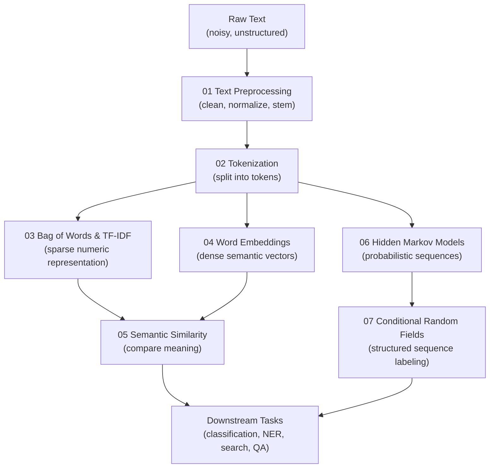

# 📝 NLP Foundations

⬅️ [04 Neural Networks](../04_Neural_Networks_and_Deep_Learning/Readme.md) &nbsp;|&nbsp; [🏠 Home](../00_Learning_Guide/Readme.md) &nbsp;|&nbsp; [06 Transformers ➡️](../06_Transformers/Readme.md)

> Before any model can understand language, it needs tools to handle raw text — this section covers every step from messy string to meaningful vector representation.

**[▶ Start here → Text Preprocessing Theory](./01_Text_Preprocessing/Theory.md)**

---

## At a Glance

| | |
|---|---|
| 📚 Topics | 7 topics |
| ⏱️ Est. Time | 3–4 hours |
| 📋 Prerequisites | [04 Neural Networks](../04_Neural_Networks_and_Deep_Learning/Readme.md) |
| 🔓 Unlocks | [06 Transformers](../06_Transformers/Readme.md) |

---

## What's in This Section

---

## Topics

| # | Topic | What You'll Learn | Files |
|---|---|---|---|
| 01 | [Text Preprocessing](./01_Text_Preprocessing/Theory.md) | Lowercasing, punctuation removal, stopwords, stemming, lemmatization | [📖 Theory](./01_Text_Preprocessing/Theory.md) · [⚡ Cheatsheet](./01_Text_Preprocessing/Cheatsheet.md) · [🎯 Interview Q&A](./01_Text_Preprocessing/Interview_QA.md) · [💻 Code](./01_Text_Preprocessing/Code_Example.md) |
| 02 | [Tokenization](./02_Tokenization/Theory.md) | Word, subword, and character tokenization — how models split text into pieces | [📖 Theory](./02_Tokenization/Theory.md) · [⚡ Cheatsheet](./02_Tokenization/Cheatsheet.md) · [🎯 Interview Q&A](./02_Tokenization/Interview_QA.md) · [💻 Code](./02_Tokenization/Code_Example.md) |
| 03 | [Bag of Words & TF-IDF](./03_Bag_of_Words_and_TF_IDF/Theory.md) | Turning text into sparse count vectors, weighting by term importance | [📖 Theory](./03_Bag_of_Words_and_TF_IDF/Theory.md) · [⚡ Cheatsheet](./03_Bag_of_Words_and_TF_IDF/Cheatsheet.md) · [🎯 Interview Q&A](./03_Bag_of_Words_and_TF_IDF/Interview_QA.md) · [💻 Code](./03_Bag_of_Words_and_TF_IDF/Code_Example.md) |
| 04 | [Word Embeddings](./04_Word_Embeddings/Theory.md) | Word2Vec, GloVe, FastText — dense vectors that capture semantic meaning | [📖 Theory](./04_Word_Embeddings/Theory.md) · [⚡ Cheatsheet](./04_Word_Embeddings/Cheatsheet.md) · [🎯 Interview Q&A](./04_Word_Embeddings/Interview_QA.md) · [💻 Code](./04_Word_Embeddings/Code_Example.md) |
| 05 | [Semantic Similarity](./05_Semantic_Similarity/Theory.md) | Cosine similarity, distance metrics, finding related text in vector space | [📖 Theory](./05_Semantic_Similarity/Theory.md) · [⚡ Cheatsheet](./05_Semantic_Similarity/Cheatsheet.md) · [🎯 Interview Q&A](./05_Semantic_Similarity/Interview_QA.md) · [💻 Code](./05_Semantic_Similarity/Code_Example.md) |
| 06 | [Hidden Markov Models](./06_Hidden_Markov_Models/Theory.md) | Probabilistic state machines for sequence modeling — POS tagging, speech | [📖 Theory](./06_Hidden_Markov_Models/Theory.md) · [⚡ Cheatsheet](./06_Hidden_Markov_Models/Cheatsheet.md) · [🎯 Interview Q&A](./06_Hidden_Markov_Models/Interview_QA.md) · [🔢 Math](./06_Hidden_Markov_Models/Math_Intuition.md) |
| 07 | [Conditional Random Fields](./07_Conditional_Random_Fields/Theory.md) | Discriminative sequence labeling with full context — NER, chunking | [📖 Theory](./07_Conditional_Random_Fields/Theory.md) · [⚡ Cheatsheet](./07_Conditional_Random_Fields/Cheatsheet.md) · [🎯 Interview Q&A](./07_Conditional_Random_Fields/Interview_QA.md) |

---

## Key Concepts at a Glance

| Concept | Why It Matters in AI |
|---|---|
| Preprocessing and tokenization are not optional boilerplate | The choices made here (which tokenizer, which normalization) directly affect what the model can and cannot learn — garbage in, garbage out |
| BoW and TF-IDF treat words as independent counts | This loses all word order and context, but the tradeoff is speed and interpretability — they are still competitive for many classification tasks |
| Word embeddings solved the semantic gap | "king" and "queen" end up near each other in vector space, and arithmetic like `king − man + woman ≈ queen` actually works |
| Semantic similarity is the engine behind search and RAG | Comparing query and document embeddings to find relevant content is foundational to every retrieval system built today |
| HMMs and CRFs model sequence structure | They were the backbone of NLP (POS tagging, NER, speech) before neural approaches took over — understanding them clarifies what transformers replaced and why |

---

## 📂 Navigation

⬅️ **Prev:** [04 Neural Networks & Deep Learning](../04_Neural_Networks_and_Deep_Learning/Readme.md) &nbsp;&nbsp; ➡️ **Next:** [06 Transformers](../06_Transformers/Readme.md)
