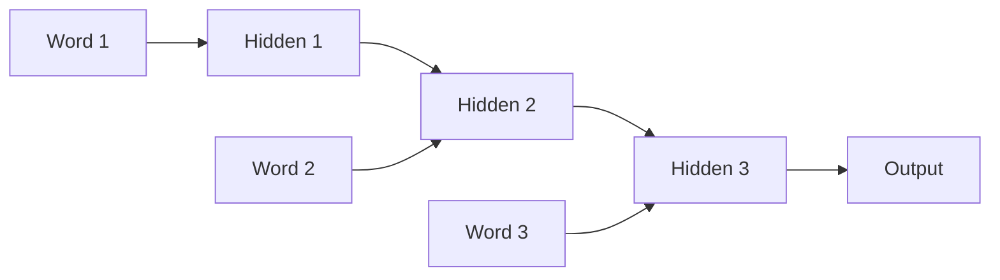

# Sequence Models Before Transformers

Imagine you're reading a very long novel — 400 pages. On page 400, the story references a character who was introduced on page 1. You might still remember them, but only if you've been keeping mental notes the whole time. If the book was dense and complicated, you've probably forgotten the page-1 details entirely.

This is exactly the problem RNNs had. They read text word by word, passing a single "memory" forward. By the time they reached word 400, almost everything from word 1 was gone.

👉 This is why we need **sequence models** — to process ordered text — and why they ultimately weren't enough for long-range understanding.

---

## Recurrent Neural Networks (RNNs)

An RNN processes a sequence one step at a time. At each step, it takes:
1. The current word (as an embedding)
2. The hidden state from the previous step

And outputs:
1. A new hidden state
2. (Optionally) a prediction

The hidden state is the RNN's "memory." It carries information from earlier in the sequence forward.

---

## The vanishing gradient problem

During training, neural networks update weights using gradients — signals that propagate backward through the network.

In RNNs, these gradients have to travel backward through every time step. Each step multiplies the gradient by a small number. After 50 steps... the gradient becomes essentially zero.

The model stops learning long-range connections. It can only learn from the last few words.

**This is called the vanishing gradient problem.**

---

## LSTMs — the partial fix

Long Short-Term Memory networks (LSTMs) were invented to fix this. They add a dedicated "cell state" — a long-term memory track that can hold information over many time steps without losing it.

LSTMs use three gates:
- **Forget gate:** what to erase from memory
- **Input gate:** what new information to add
- **Output gate:** what to pass forward as the hidden state

This made LSTMs much better at long-range dependencies. Sequence-to-sequence models for translation, speech recognition, and summarization all used LSTMs.

**But LSTMs still struggled with very long sequences.** And they were slow — sequential processing means no parallelization on modern GPU hardware.

---

## Why LSTMs weren't enough

| Problem | Description |
|---|---|
| Sequential bottleneck | Word 100 must pass through all 99 previous steps |
| Long-range dependencies | Even with LSTM, very distant context is hard to retain |
| No parallelism | Can't process steps simultaneously — slow training |
| Fixed-size hidden state | Must compress entire history into one vector |

---

## What came next

The breakthrough was **attention**. Instead of passing a fixed memory vector forward step by step, attention lets any position directly look at any other position.

"The animal didn't cross the street because it was too tired."

What does "it" refer to? The RNN would have to carry "animal" all the way to "it" through 8 steps. Attention directly connects "it" to "animal" in one lookup.

Transformers eliminated the recurrent structure entirely and built everything around attention. They're faster, better, and scalable to billions of parameters.

---

✅ **What you just learned:** RNNs process sequences step by step and struggle with long-range memory; LSTMs improved this with gating mechanisms but were still limited by sequential processing and scale.

🔨 **Build this now:** Draw a diagram of an RNN processing the sentence "The cat sat on the mat." Show the hidden state being passed forward at each step. Then identify: which step would carry the most information about "cat" by the time you reach "mat"?

➡️ **Next step:** Attention Mechanism → `06_Transformers/02_Attention_Mechanism/Theory.md`

---

## 📂 Navigation

**In this folder:**
| File | |
|---|---|
| 📄 **Theory.md** | ← you are here |
| [📄 Cheatsheet.md](./Cheatsheet.md) | Quick reference |
| [📄 Interview_QA.md](./Interview_QA.md) | Interview prep |
| [📄 Timeline.md](./Timeline.md) | Historical timeline of sequence models |

⬅️ **Prev:** [07 Conditional Random Fields](../../05_NLP_Foundations/07_Conditional_Random_Fields/Theory.md) &nbsp;&nbsp;&nbsp; ➡️ **Next:** [02 Attention Mechanism](../02_Attention_Mechanism/Theory.md)
