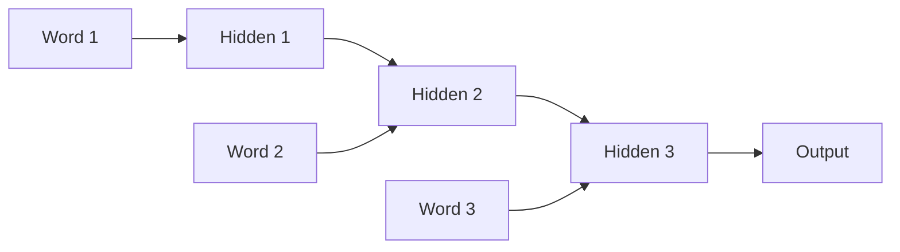
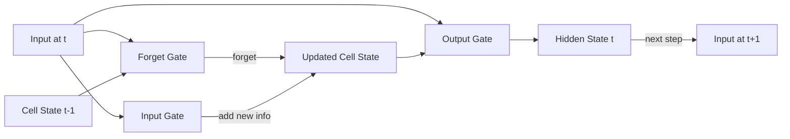
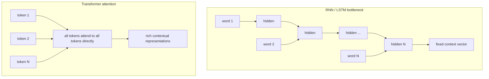

# Sequence Models Before Transformers

Reading a 400-page novel, on page 400 the story references a character introduced on page 1. If the book was dense, you've probably forgotten the page-1 details. This is exactly the problem RNNs had — reading word by word, passing a single "memory" forward, almost everything from early words was gone by the end.

👉 This is why we need **sequence models** — to process ordered text — and why they ultimately weren't enough for long-range understanding.

---

## 📌 Learning Priority

**Must Learn** — core concepts, needed to understand the rest of this file:
[Recurrent Neural Networks](#recurrent-neural-networks-rnns) · [Vanishing Gradient Problem](#the-vanishing-gradient-problem) · [LSTMs](#lstms--the-partial-fix)

**Should Learn** — important for real projects and interviews:
[Why LSTMs Fell Short](#why-lstms-werent-enough) · [What Came Next](#what-came-next)

**Good to Know** — useful in specific situations, not needed daily:
[LSTM Gates Detail](#lstms--the-partial-fix)

**Reference** — skim once, look up when needed:
[Sequential vs Parallel Tradeoff](#why-lstms-werent-enough)

---

## Recurrent Neural Networks (RNNs)

An RNN processes one step at a time. At each step it takes the current word embedding and the hidden state from the previous step, producing a new hidden state and optionally a prediction.

---

## The vanishing gradient problem

Gradients must travel backward through every time step. Each step multiplies by a small number. After 50 steps the gradient becomes essentially zero — the model stops learning long-range connections. Early words can't influence weights responsible for late predictions.

---

## LSTMs — the partial fix

Long Short-Term Memory networks added a dedicated cell state — a long-term memory track that holds information over many steps without losing it. Three gates control the flow:
- **Forget gate:** what to erase from memory
- **Input gate:** what new information to add
- **Output gate:** what to pass forward as the hidden state

LSTMs made sequence-to-sequence models (translation, speech, summarization) practical. But they still struggled with very long sequences and were slow — sequential processing can't be parallelized on GPU.

---

## Why LSTMs weren't enough

| Problem | Description |
|---|---|
| Sequential bottleneck | Word 100 must pass through all 99 previous steps |
| Long-range dependencies | Very distant context still hard to retain |
| No parallelism | Can't process steps simultaneously — slow training |
| Fixed-size hidden state | Must compress entire history into one vector |

---

## What came next

The breakthrough was **attention** — instead of passing fixed memory forward step by step, any position can directly look at any other position.

"The animal didn't cross the street because it was too tired." — What does "it" refer to? An RNN carries "animal" through 8 steps. Attention directly connects "it" to "animal" in one lookup.

Transformers eliminated the recurrent structure entirely, building everything around attention — faster, better, and scalable to billions of parameters.

---

✅ **What you just learned:** RNNs process sequences step by step and struggle with long-range memory; LSTMs improved this with gating but were still limited by sequential processing and scale.

🔨 **Build this now:** Draw an RNN processing "The cat sat on the mat." Show the hidden state passed forward at each step. Which step carries the most information about "cat" by the time you reach "mat"?

➡️ **Next step:** Attention Mechanism → `06_Transformers/02_Attention_Mechanism/Theory.md`

---

## 📂 Navigation

**In this folder:**
| File | |
|---|---|
| 📄 **Theory.md** | ← you are here |
| [📄 Cheatsheet.md](./Cheatsheet.md) | Quick reference |
| [📄 Interview_QA.md](./Interview_QA.md) | Interview prep |
| [📄 Timeline.md](./Timeline.md) | Historical timeline of sequence models |

⬅️ **Prev:** [07 Conditional Random Fields](../../05_NLP_Foundations/07_Conditional_Random_Fields/Theory.md) &nbsp;&nbsp;&nbsp; ➡️ **Next:** [02 Attention Mechanism](../02_Attention_Mechanism/Theory.md)
