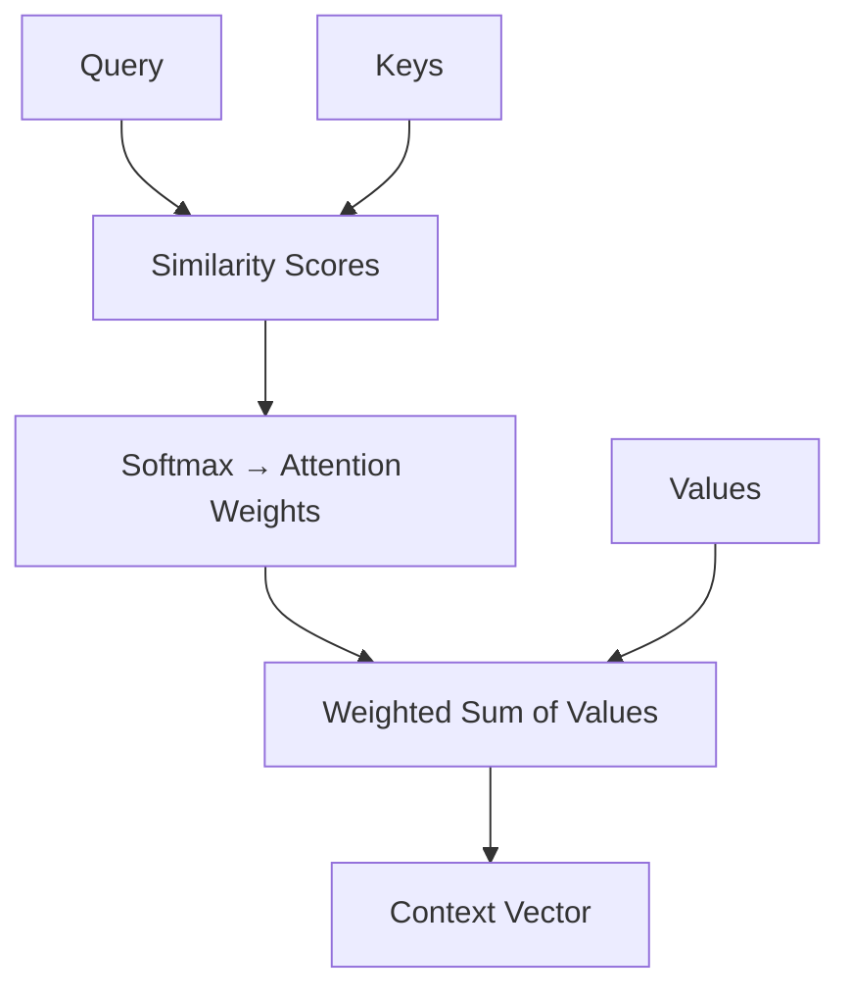

# Attention Mechanism

You're translating a sentence: "The bank was closed." You get to "bank" and you need to decide — is this a financial institution or a river bank? You glance left, glance right. You see "was closed." That's more consistent with a building than a riverbank. You've just performed attention: you looked at the relevant surrounding words to understand the ambiguous one.

👉 This is why we need **Attention** — to let models dynamically focus on the most relevant parts of the input when processing each word, instead of relying on a compressed memory.

---

## The bottleneck attention was designed to solve

In old RNN-based translation:
1. Encoder reads the whole source sentence → produces one context vector
2. Decoder uses that one vector to generate the translation

For long sentences, that one vector must compress everything. Information is lost.

Attention says: why not let the decoder look at all encoder states at each step? Give it a soft "spotlight" that can highlight whichever parts are most relevant.

---

## The Query, Key, Value framework

Attention is modeled as a database lookup. You have:

- **Query (Q):** "What am I looking for?" — the decoder's current state
- **Keys (K):** "What does each memory slot contain?" — encoder states labeled
- **Values (V):** "The actual content to retrieve" — encoder states' content

The process:
1. Compute similarity between the Query and each Key
2. Normalize with softmax → get attention weights (probabilities summing to 1)
3. Multiply each Value by its weight → weighted sum = context vector



---

## A simple analogy

Imagine a library with labeled drawers (Keys). You have a search request (Query). You check how well your request matches each label, get a relevance score for each drawer, then take a weighted mix from all drawers (Values).

"I want books about space exploration."
- Astronomy drawer: 70% match
- Physics drawer: 20% match
- Cooking drawer: 1% match

You pull 70% content from astronomy, 20% from physics — that's your context.

---

## Attention scores

To measure similarity between a Query and a Key, use the **dot product**:

```
score(Q, K_i) = Q · K_i
```

A high dot product means the Query and Key are pointing in similar directions → high relevance.

Then scale by √d (where d is the vector dimension) to prevent scores from becoming too large:

```
scaled_score = Q · K_i / √d
```

Then **softmax** to convert scores to probabilities:

```
attention_weight_i = softmax(scaled_score_i)
```

Finally, compute the context vector:

```
context = Σ (attention_weight_i × V_i)
```

---

## Why this is better than a fixed context vector

With attention, the decoder can focus on different parts of the input for each output word.

Translating "The students who passed the exam celebrated":
- Generating "celebrated" → attention focuses on "students" (who celebrated)
- If generating "passed" → attention focuses on "exam" (what was passed)

No single compressed vector needed. The decoder always has access to the full source.

---

✅ **What you just learned:** Attention is a soft, learnable lookup mechanism where a query matches against keys to produce weighted attention scores, then retrieves a context vector as a weighted sum of values.

🔨 **Build this now:** For the sentence "The bank was closed", manually decide: when processing "bank", which other words would get high attention weights? When processing "was", which words would get high weights?

➡️ **Next step:** Self-Attention → `06_Transformers/03_Self_Attention/Theory.md`

---

## 📂 Navigation

**In this folder:**
| File | |
|---|---|
| 📄 **Theory.md** | ← you are here |
| [📄 Cheatsheet.md](./Cheatsheet.md) | Quick reference |
| [📄 Interview_QA.md](./Interview_QA.md) | Interview prep |
| [📄 Math_Walkthrough.md](./Math_Walkthrough.md) | Step-by-step math walkthrough |

⬅️ **Prev:** [01 Sequence Models Before Transformers](../01_Sequence_Models_Before_Transformers/Theory.md) &nbsp;&nbsp;&nbsp; ➡️ **Next:** [03 Self Attention](../03_Self_Attention/Theory.md)
