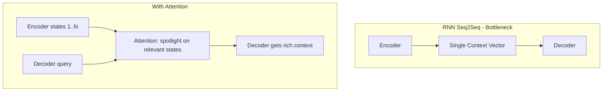
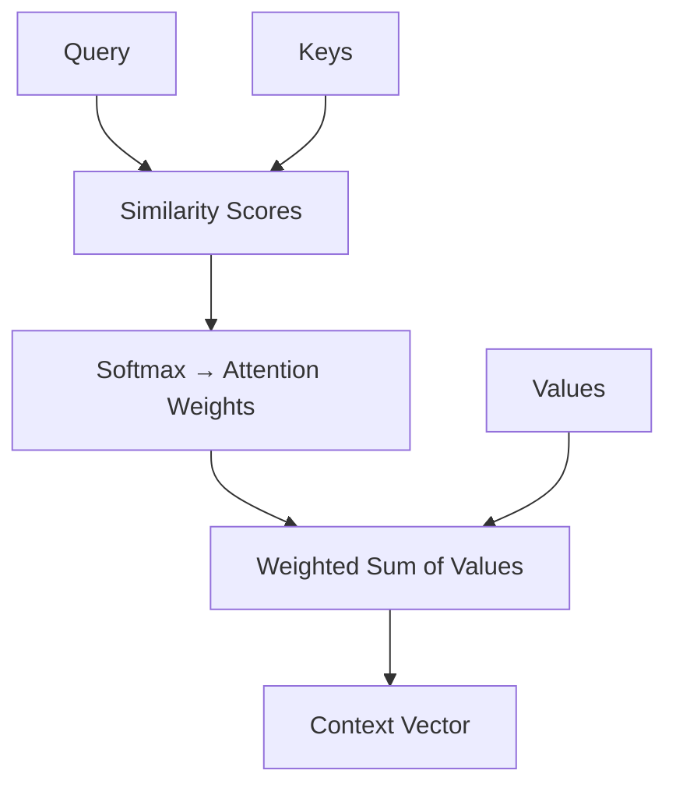

# Attention Mechanism

You're translating "The bank was closed." You reach "bank" and need to decide — financial institution or river bank? You glance at "was closed." That's more consistent with a building. You've just performed attention: looking at relevant surrounding words to understand an ambiguous one.

👉 This is why we need **Attention** — to let models dynamically focus on the most relevant parts of the input when processing each word, instead of relying on a compressed memory.

---

## The bottleneck attention was designed to solve

In old RNN-based translation:
1. Encoder reads the whole source sentence → produces one context vector
2. Decoder uses that vector to generate the translation

For long sentences, that one vector must compress everything — information is lost.

Attention gives the decoder a soft "spotlight" to highlight whichever encoder states are most relevant at each decoding step.



---

## The Query, Key, Value framework

Attention is modeled as a database lookup:

- **Query (Q):** "What am I looking for?" — the decoder's current state
- **Keys (K):** "What does each memory slot contain?" — encoder state labels
- **Values (V):** "The actual content to retrieve" — encoder state content

The process:
1. Compute similarity between Query and each Key
2. Normalize with softmax → attention weights (probabilities summing to 1)
3. Weighted sum of Values → context vector



---

## A simple analogy

A library with labeled drawers (Keys). You have a search request (Query). Check how well your request matches each label, get relevance scores, take a weighted mix from all drawers (Values).

"I want books about space exploration."
- Astronomy drawer: 70% match → pull 70% content
- Physics drawer: 20% match → pull 20% content
- Cooking drawer: 1% match → almost nothing

---

## Attention scores

```
score(Q, K_i) = Q · K_i          # dot product
scaled_score = Q · K_i / √d       # scale to prevent large values
attention_weight_i = softmax(scaled_score_i)
context = Σ (attention_weight_i × V_i)
```

---

## Why this beats a fixed context vector

With attention, the decoder focuses on different input parts for each output word:
- Generating "celebrated" → attention focuses on "students"
- Generating "passed" → attention focuses on "exam"

No single compressed vector needed. The decoder always has full access to the source.

---

✅ **What you just learned:** Attention is a soft, learnable lookup where a query matches against keys to produce weighted attention scores, then retrieves a context vector as a weighted sum of values.

🔨 **Build this now:** For "The bank was closed", manually decide: when processing "bank", which words get high attention weights? When processing "was", which words get high weights?

➡️ **Next step:** Self-Attention → `06_Transformers/03_Self_Attention/Theory.md`

---

## 📂 Navigation

**In this folder:**
| File | |
|---|---|
| 📄 **Theory.md** | ← you are here |
| [📄 Cheatsheet.md](./Cheatsheet.md) | Quick reference |
| [📄 Interview_QA.md](./Interview_QA.md) | Interview prep |
| [📄 Math_Walkthrough.md](./Math_Walkthrough.md) | Step-by-step math walkthrough |

⬅️ **Prev:** [01 Sequence Models Before Transformers](../01_Sequence_Models_Before_Transformers/Theory.md) &nbsp;&nbsp;&nbsp; ➡️ **Next:** [03 Self Attention](../03_Self_Attention/Theory.md)
